# Base

> God node · 32 connections · [/Users/kodjododjango/Downloads/dev_projects/synca_conf_back/app/core/database.py](file:///Users/kodjododjango/Downloads/dev_projects/synca_conf_back/app/core/database.py#L13)

## Call Trace Diagram

```mermaid
sequenceDiagram
    participant P0 as Base
    participant P1 as PassType
    participant P2 as PromoCode
    participant P3 as test_stats_computed_from_payments_tickets_and_applications()
    participant P4 as test_webhook_increments_promo_usage_count_on_completion()
    participant P5 as test_register_valid_promo_code_accepted()
    participant P6 as test_promo_code_payment_ticket_waitlist_read()
    participant P7 as generate_ambassador_promo_code()
    participant P8 as test_create_payment_applies_percent_discount()
    participant P9 as test_create_payment_applies_fixed_discount()
    participant P10 as test_promo_code_and_waitlist_unique()
    participant P11 as test_promo_validate_success()
    participant P12 as test_promo_validate_inactive_400()
    participant P13 as test_promo_validate_expired_400()
    participant P14 as test_promo_validate_exhausted_400()
    participant P15 as test_promo_validate_fixed_discount()
    participant P16 as Payment
    participant P17 as Ticket
    participant P18 as make_pending_payment()
    participant P19 as Waitlist
    participant P20 as make_ticket()
    participant P21 as make_payment()
    participant P22 as make_payment()
    participant P23 as make_ticket_for()
    participant P24 as make_user_and_pass()
    participant P25 as test_register_duplicate_email_conflict()
    participant P26 as test_register_success()
    participant P27 as test_register_sends_confirmation_email()
    participant P28 as test_register_inactive_pass_type_400()
    participant P29 as test_register_invalid_promo_code_400()
    participant P30 as make_user_and_pass_type()
    participant P31 as test_create_payment_success_no_promo()
    participant P32 as test_create_payment_invalid_promo_400()
    participant P33 as create_pass_type()
    participant P34 as test_list_pass_types_excludes_inactive()
    participant P35 as test_pass_type_defaults()
    participant P36 as test_create_payment_invalid_user_400()
    participant P37 as test_pass_type_read()
    participant P38 as User
    participant P39 as Role
    participant P40 as AdminUser
    participant P41 as PartnerLevel
    participant P42 as RolePermission
    participant P43 as Permission
    participant P44 as Speaker
    participant P45 as Partner
    participant P46 as Day
    participant P47 as FaqCategory
    participant P48 as Session
    participant P49 as Exhibitor
    participant P50 as ContactMessage
    participant P51 as Ambassador
    participant P52 as Faq
    participant P53 as UserProfile
    participant P54 as OtpCode
    participant P55 as AuditLog
    participant P56 as CampaignWindow
    participant P57 as NewsletterSubscriber
    participant P58 as EventSettings
    participant P59 as Login code for the participant OTP flow (app/api/participant_auth.py).      Sepa
    participant P60 as Run migrations in 'offline' mode.      This configures the context with just a U
    participant P61 as In this scenario we need to create an Engine     and associate a connection with
    participant P62 as Run migrations in 'online' mode.
    P0->>+ P1: uses
    P1-->>- P0: return
    P1->>+ P0: uses
    P0-->>- P1: return
    P1->>+ P2: uses
    P2-->>- P1: return
    P2->>+ P0: uses
    P0-->>- P2: return
    P2->>+ P1: uses
    P1-->>- P2: return
    P2->>+ P3: calls
    P3-->>- P2: return
    P2->>+ P4: calls
    P4-->>- P2: return
    P2->>+ P5: calls
    P5-->>- P2: return
    P2->>+ P6: calls
    P6-->>- P2: return
    P2->>+ P7: calls
    P7-->>- P2: return
    P2->>+ P8: calls
    P8-->>- P2: return
    P2->>+ P9: calls
    P9-->>- P2: return
    P2->>+ P10: calls
    P10-->>- P2: return
    P2->>+ P11: calls
    P11-->>- P2: return
    P2->>+ P12: calls
    P12-->>- P2: return
    P2->>+ P13: calls
    P13-->>- P2: return
    P2->>+ P14: calls
    P14-->>- P2: return
    P2->>+ P15: calls
    P15-->>- P2: return
    P1->>+ P16: uses
    P16-->>- P1: return
    P1->>+ P17: uses
    P17-->>- P1: return
    P1->>+ P18: calls
    P18-->>- P1: return
    P1->>+ P19: uses
    P19-->>- P1: return
    P1->>+ P20: calls
    P20-->>- P1: return
    P1->>+ P21: calls
    P21-->>- P1: return
    P1->>+ P22: calls
    P22-->>- P1: return
    P1->>+ P4: calls
    P4-->>- P1: return
    P1->>+ P23: calls
    P23-->>- P1: return
    P1->>+ P24: calls
    P24-->>- P1: return
    P1->>+ P5: calls
    P5-->>- P1: return
    P1->>+ P25: calls
    P25-->>- P1: return
    P1->>+ P26: calls
    P26-->>- P1: return
    P1->>+ P27: calls
    P27-->>- P1: return
    P1->>+ P28: calls
    P28-->>- P1: return
    P1->>+ P29: calls
    P29-->>- P1: return
    P1->>+ P30: calls
    P30-->>- P1: return
    P1->>+ P8: calls
    P8-->>- P1: return
    P1->>+ P9: calls
    P9-->>- P1: return
    P1->>+ P31: calls
    P31-->>- P1: return
    P1->>+ P32: calls
    P32-->>- P1: return
    P1->>+ P33: calls
    P33-->>- P1: return
    P1->>+ P34: calls
    P34-->>- P1: return
    P1->>+ P35: calls
    P35-->>- P1: return
    P1->>+ P36: calls
    P36-->>- P1: return
    P1->>+ P37: calls
    P37-->>- P1: return
    P0->>+ P38: uses
    P38-->>- P0: return
    P0->>+ P39: uses
    P39-->>- P0: return
    P0->>+ P40: uses
    P40-->>- P0: return
    P0->>+ P2: uses
    P2-->>- P0: return
    P0->>+ P16: uses
    P16-->>- P0: return
    P0->>+ P41: uses
    P41-->>- P0: return
    P0->>+ P42: uses
    P42-->>- P0: return
    P0->>+ P43: uses
    P43-->>- P0: return
    P0->>+ P44: uses
    P44-->>- P0: return
    P0->>+ P17: uses
    P17-->>- P0: return
    P0->>+ P45: uses
    P45-->>- P0: return
    P0->>+ P46: uses
    P46-->>- P0: return
    P0->>+ P47: uses
    P47-->>- P0: return
    P0->>+ P48: uses
    P48-->>- P0: return
    P0->>+ P49: uses
    P49-->>- P0: return
    P0->>+ P50: uses
    P50-->>- P0: return
    P0->>+ P51: uses
    P51-->>- P0: return
    P0->>+ P52: uses
    P52-->>- P0: return
    P0->>+ P19: uses
    P19-->>- P0: return
    P0->>+ P53: uses
    P53-->>- P0: return
    P0->>+ P54: uses
    P54-->>- P0: return
    P0->>+ P55: uses
    P55-->>- P0: return
    P0->>+ P56: uses
    P56-->>- P0: return
    P0->>+ P57: uses
    P57-->>- P0: return
    P0->>+ P58: uses
    P58-->>- P0: return
    P0->>+ P59: uses
    P59-->>- P0: return
    P0->>+ P60: uses
    P60-->>- P0: return
    P0->>+ P61: uses
    P61-->>- P0: return
    P0->>+ P62: uses
    P62-->>- P0: return
```

## Connections by Relation

### contains
- [[database.py]] `EXTRACTED`

### inherits
- [[DeclarativeBase]] `EXTRACTED`

### uses
- [[PassType]] `INFERRED`
- [[User]] `INFERRED`
- [[Role]] `INFERRED`
- [[AdminUser]] `INFERRED`
- [[PromoCode]] `INFERRED`
- [[Payment]] `INFERRED`
- [[PartnerLevel]] `INFERRED`
- [[RolePermission]] `INFERRED`
- [[Permission]] `INFERRED`
- [[Speaker]] `INFERRED`
- [[Ticket]] `INFERRED`
- [[Partner]] `INFERRED`
- [[Day]] `INFERRED`
- [[FaqCategory]] `INFERRED`
- [[Session]] `INFERRED`
- [[Exhibitor]] `INFERRED`
- [[ContactMessage]] `INFERRED`
- [[Ambassador]] `INFERRED`
- [[Faq]] `INFERRED`
- [[Waitlist]] `INFERRED`

---

*Part of the graphify knowledge wiki. See [[index]] to navigate.*