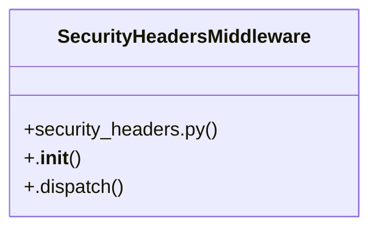

# Community 24

> 5 nodes · cohesion 0.40

## Key Concepts

- [SecurityHeadersMiddleware](file:///Users/kodjododjango/Downloads/dev_projects/synca_conf_back/app/core/security_headers.py#L20) (4 connections)
- **BaseHTTPMiddleware** (1 connections)
- [.dispatch()](file:///Users/kodjododjango/Downloads/dev_projects/synca_conf_back/app/core/security_headers.py#L25) (1 connections)
- [.__init__()](file:///Users/kodjododjango/Downloads/dev_projects/synca_conf_back/app/core/security_headers.py#L21) (1 connections)
- [security_headers.py](file:///Users/kodjododjango/Downloads/dev_projects/synca_conf_back/app/core/security_headers.py#L1) (1 connections)

## Class Diagram

## Relationships

- No strong cross-community connections detected

## Source Files

- [/Users/kodjododjango/Downloads/dev_projects/synca_conf_back/app/core/security_headers.py](file:///Users/kodjododjango/Downloads/dev_projects/synca_conf_back/app/core/security_headers.py)

## Audit Trail

- EXTRACTED: 8 (100%)
- INFERRED: 0 (0%)
- AMBIGUOUS: 0 (0%)

---

*Part of the graphify knowledge wiki. See [[index]] to navigate.*