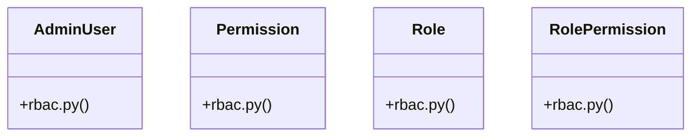

# [BaseModel & ValueError] Cluster

> 81 nodes · cohesion 0.06

## Key Concepts

- [create_access_token()](file:///Users/kodjododjango/Downloads/dev_projects/synca_conf_back/app/services/auth_service.py#L95) (46 connections)
- [Role](file:///Users/kodjododjango/Downloads/dev_projects/synca_conf_back/app/models/rbac.py#L9) (20 connections)
- [test_admin_applications.py](file:///Users/kodjododjango/Downloads/dev_projects/synca_conf_back/tests/test_admin_applications.py#L1) (19 connections)
- [AdminUser](file:///Users/kodjododjango/Downloads/dev_projects/synca_conf_back/app/models/rbac.py#L39) (18 connections)
- [make_admin_with_permission()](file:///Users/kodjododjango/Downloads/dev_projects/synca_conf_back/tests/test_admin_applications.py#L22) (18 connections)
- [RolePermission](file:///Users/kodjododjango/Downloads/dev_projects/synca_conf_back/app/models/rbac.py#L23) (14 connections)
- [Permission](file:///Users/kodjododjango/Downloads/dev_projects/synca_conf_back/app/models/rbac.py#L16) (13 connections)
- [make_admin_with_permission()](file:///Users/kodjododjango/Downloads/dev_projects/synca_conf_back/tests/test_admin_campaign_windows.py#L11) (11 connections)
- [make_admin_with_permission()](file:///Users/kodjododjango/Downloads/dev_projects/synca_conf_back/tests/test_admin_export.py#L15) (10 connections)
- [make_admin_with_permission()](file:///Users/kodjododjango/Downloads/dev_projects/synca_conf_back/tests/test_admin_registrations.py#L13) (9 connections)
- [make_admin_with_permission()](file:///Users/kodjododjango/Downloads/dev_projects/synca_conf_back/tests/test_admin_stats.py#L24) (8 connections)
- [test_stats_computed_from_payments_tickets_and_applications()](file:///Users/kodjododjango/Downloads/dev_projects/synca_conf_back/tests/test_admin_stats.py#L89) (8 connections)
- [test_admin_campaign_windows.py](file:///Users/kodjododjango/Downloads/dev_projects/synca_conf_back/tests/test_admin_campaign_windows.py#L1) (8 connections)
- [test_admin_export.py](file:///Users/kodjododjango/Downloads/dev_projects/synca_conf_back/tests/test_admin_export.py#L1) (8 connections)
- [make_payment()](file:///Users/kodjododjango/Downloads/dev_projects/synca_conf_back/tests/test_admin_export.py#L51) (7 connections)
- [make_payment()](file:///Users/kodjododjango/Downloads/dev_projects/synca_conf_back/tests/test_admin_registrations.py#L49) (7 connections)
- [test_admin_registrations.py](file:///Users/kodjododjango/Downloads/dev_projects/synca_conf_back/tests/test_admin_registrations.py#L1) (7 connections)
- [make_partner()](file:///Users/kodjododjango/Downloads/dev_projects/synca_conf_back/tests/test_admin_applications.py#L95) (6 connections)
- [make_speaker()](file:///Users/kodjododjango/Downloads/dev_projects/synca_conf_back/tests/test_admin_applications.py#L58) (6 connections)
- [make_admin_with_permissions()](file:///Users/kodjododjango/Downloads/dev_projects/synca_conf_back/tests/test_admin_me.py#L11) (6 connections)
- [make_admin_with_role()](file:///Users/kodjododjango/Downloads/dev_projects/synca_conf_back/tests/test_admin_rbac.py#L11) (6 connections)
- [test_admin_endpoint_limited_to_30_per_minute()](file:///Users/kodjododjango/Downloads/dev_projects/synca_conf_back/tests/test_rate_limiting.py#L39) (6 connections)
- [test_admin_rbac.py](file:///Users/kodjododjango/Downloads/dev_projects/synca_conf_back/tests/test_admin_rbac.py#L1) (6 connections)
- [test_admin_stats.py](file:///Users/kodjododjango/Downloads/dev_projects/synca_conf_back/tests/test_admin_stats.py#L1) (6 connections)
- [make_ambassador()](file:///Users/kodjododjango/Downloads/dev_projects/synca_conf_back/tests/test_admin_applications.py#L77) (5 connections)
- *... and 56 more nodes in this community*

## Class Diagram

## Relationships

- No strong cross-community connections detected

## Source Files

- [/Users/kodjododjango/Downloads/dev_projects/synca_conf_back/app/models/rbac.py](file:///Users/kodjododjango/Downloads/dev_projects/synca_conf_back/app/models/rbac.py)
- [/Users/kodjododjango/Downloads/dev_projects/synca_conf_back/app/services/auth_service.py](file:///Users/kodjododjango/Downloads/dev_projects/synca_conf_back/app/services/auth_service.py)
- [/Users/kodjododjango/Downloads/dev_projects/synca_conf_back/tests/test_admin_applications.py](file:///Users/kodjododjango/Downloads/dev_projects/synca_conf_back/tests/test_admin_applications.py)
- [/Users/kodjododjango/Downloads/dev_projects/synca_conf_back/tests/test_admin_campaign_windows.py](file:///Users/kodjododjango/Downloads/dev_projects/synca_conf_back/tests/test_admin_campaign_windows.py)
- [/Users/kodjododjango/Downloads/dev_projects/synca_conf_back/tests/test_admin_export.py](file:///Users/kodjododjango/Downloads/dev_projects/synca_conf_back/tests/test_admin_export.py)
- [/Users/kodjododjango/Downloads/dev_projects/synca_conf_back/tests/test_admin_me.py](file:///Users/kodjododjango/Downloads/dev_projects/synca_conf_back/tests/test_admin_me.py)
- [/Users/kodjododjango/Downloads/dev_projects/synca_conf_back/tests/test_admin_panel.py](file:///Users/kodjododjango/Downloads/dev_projects/synca_conf_back/tests/test_admin_panel.py)
- [/Users/kodjododjango/Downloads/dev_projects/synca_conf_back/tests/test_admin_rbac.py](file:///Users/kodjododjango/Downloads/dev_projects/synca_conf_back/tests/test_admin_rbac.py)
- [/Users/kodjododjango/Downloads/dev_projects/synca_conf_back/tests/test_admin_registrations.py](file:///Users/kodjododjango/Downloads/dev_projects/synca_conf_back/tests/test_admin_registrations.py)
- [/Users/kodjododjango/Downloads/dev_projects/synca_conf_back/tests/test_admin_stats.py](file:///Users/kodjododjango/Downloads/dev_projects/synca_conf_back/tests/test_admin_stats.py)
- [/Users/kodjododjango/Downloads/dev_projects/synca_conf_back/tests/test_rate_limiting.py](file:///Users/kodjododjango/Downloads/dev_projects/synca_conf_back/tests/test_rate_limiting.py)
- [/Users/kodjododjango/Downloads/dev_projects/synca_conf_back/tests/test_rbac.py](file:///Users/kodjododjango/Downloads/dev_projects/synca_conf_back/tests/test_rbac.py)
- [/Users/kodjododjango/Downloads/dev_projects/synca_conf_back/tests/test_schemas.py](file:///Users/kodjododjango/Downloads/dev_projects/synca_conf_back/tests/test_schemas.py)

## Audit Trail

- EXTRACTED: 253 (56%)
- INFERRED: 195 (44%)
- AMBIGUOUS: 0 (0%)

---

*Part of the graphify knowledge wiki. See [[index]] to navigate.*