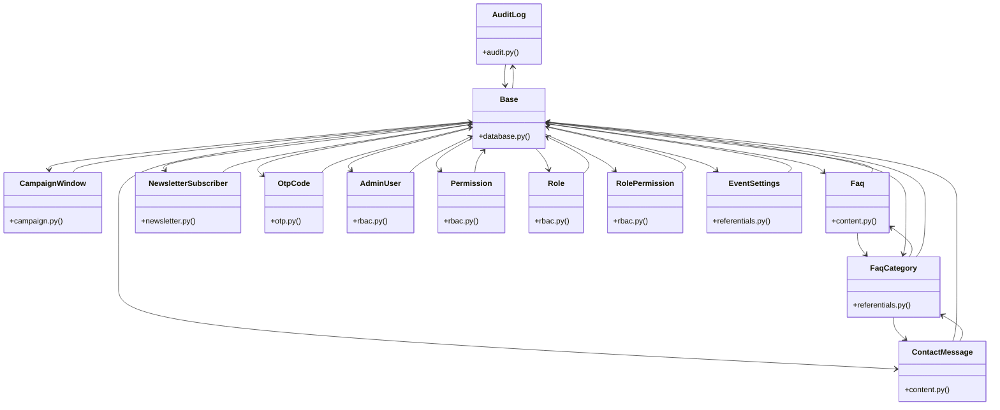

# [BaseModel & ValueError] Cluster

> 85 nodes · cohesion 0.04

## Key Concepts

- [Base](file:///Users/kodjododjango/Downloads/dev_projects/synca_conf_back/app/core/database.py#L13) (32 connections)
- **Base** (26 connections)
- [Role](file:///Users/kodjododjango/Downloads/dev_projects/synca_conf_back/app/models/rbac.py#L9) (20 connections)
- [AdminUser](file:///Users/kodjododjango/Downloads/dev_projects/synca_conf_back/app/models/rbac.py#L39) (19 connections)
- [RolePermission](file:///Users/kodjododjango/Downloads/dev_projects/synca_conf_back/app/models/rbac.py#L23) (14 connections)
- [Permission](file:///Users/kodjododjango/Downloads/dev_projects/synca_conf_back/app/models/rbac.py#L16) (13 connections)
- [test_schemas.py](file:///Users/kodjododjango/Downloads/dev_projects/synca_conf_back/tests/test_schemas.py#L1) (11 connections)
- [FaqCategory](file:///Users/kodjododjango/Downloads/dev_projects/synca_conf_back/app/models/referentials.py#L43) (10 connections)
- [ContactMessage](file:///Users/kodjododjango/Downloads/dev_projects/synca_conf_back/app/models/content.py#L25) (9 connections)
- [test_admin_panel.py](file:///Users/kodjododjango/Downloads/dev_projects/synca_conf_back/tests/test_admin_panel.py#L1) (9 connections)
- [Faq](file:///Users/kodjododjango/Downloads/dev_projects/synca_conf_back/app/models/content.py#L10) (8 connections)
- [make_admin()](file:///Users/kodjododjango/Downloads/dev_projects/synca_conf_back/tests/test_admin_panel.py#L16) (8 connections)
- [OtpCode](file:///Users/kodjododjango/Downloads/dev_projects/synca_conf_back/app/models/otp.py#L9) (6 connections)
- [make_admin_with_permissions()](file:///Users/kodjododjango/Downloads/dev_projects/synca_conf_back/tests/test_admin_me.py#L11) (6 connections)
- [make_admin_with_role()](file:///Users/kodjododjango/Downloads/dev_projects/synca_conf_back/tests/test_admin_rbac.py#L11) (6 connections)
- [test_admin_endpoint_limited_to_30_per_minute()](file:///Users/kodjododjango/Downloads/dev_projects/synca_conf_back/tests/test_rate_limiting.py#L39) (6 connections)
- [test_admin_rbac.py](file:///Users/kodjododjango/Downloads/dev_projects/synca_conf_back/tests/test_admin_rbac.py#L1) (6 connections)
- [CampaignWindow](file:///Users/kodjododjango/Downloads/dev_projects/synca_conf_back/app/models/campaign.py#L18) (5 connections)
- [make_admin()](file:///Users/kodjododjango/Downloads/dev_projects/synca_conf_back/tests/test_admin_contacts.py#L11) (5 connections)
- [test_rbac_read()](file:///Users/kodjododjango/Downloads/dev_projects/synca_conf_back/tests/test_schemas.py#L188) (5 connections)
- [referentials.py](file:///Users/kodjododjango/Downloads/dev_projects/synca_conf_back/app/models/referentials.py#L1) (5 connections)
- [test_admin_contacts.py](file:///Users/kodjododjango/Downloads/dev_projects/synca_conf_back/tests/test_admin_contacts.py#L1) (5 connections)
- [AuditLog](file:///Users/kodjododjango/Downloads/dev_projects/synca_conf_back/app/models/audit.py#L9) (4 connections)
- [NewsletterSubscriber](file:///Users/kodjododjango/Downloads/dev_projects/synca_conf_back/app/models/newsletter.py#L9) (4 connections)
- [test_any_authenticated_admin_can_list_contacts()](file:///Users/kodjododjango/Downloads/dev_projects/synca_conf_back/tests/test_admin_contacts.py#L37) (4 connections)
- *... and 60 more nodes in this community*

## Class Diagram

## Relationships

- [[[create_access_token() & Role] Cluster]] (8 shared connections)

## Source Files

- [/Users/kodjododjango/Downloads/dev_projects/synca_conf_back/alembic/env.py](file:///Users/kodjododjango/Downloads/dev_projects/synca_conf_back/alembic/env.py)
- [/Users/kodjododjango/Downloads/dev_projects/synca_conf_back/app/api/forms.py](file:///Users/kodjododjango/Downloads/dev_projects/synca_conf_back/app/api/forms.py)
- [/Users/kodjododjango/Downloads/dev_projects/synca_conf_back/app/core/database.py](file:///Users/kodjododjango/Downloads/dev_projects/synca_conf_back/app/core/database.py)
- [/Users/kodjododjango/Downloads/dev_projects/synca_conf_back/app/models/audit.py](file:///Users/kodjododjango/Downloads/dev_projects/synca_conf_back/app/models/audit.py)
- [/Users/kodjododjango/Downloads/dev_projects/synca_conf_back/app/models/campaign.py](file:///Users/kodjododjango/Downloads/dev_projects/synca_conf_back/app/models/campaign.py)
- [/Users/kodjododjango/Downloads/dev_projects/synca_conf_back/app/models/content.py](file:///Users/kodjododjango/Downloads/dev_projects/synca_conf_back/app/models/content.py)
- [/Users/kodjododjango/Downloads/dev_projects/synca_conf_back/app/models/newsletter.py](file:///Users/kodjododjango/Downloads/dev_projects/synca_conf_back/app/models/newsletter.py)
- [/Users/kodjododjango/Downloads/dev_projects/synca_conf_back/app/models/otp.py](file:///Users/kodjododjango/Downloads/dev_projects/synca_conf_back/app/models/otp.py)
- [/Users/kodjododjango/Downloads/dev_projects/synca_conf_back/app/models/rbac.py](file:///Users/kodjododjango/Downloads/dev_projects/synca_conf_back/app/models/rbac.py)
- [/Users/kodjododjango/Downloads/dev_projects/synca_conf_back/app/models/referentials.py](file:///Users/kodjododjango/Downloads/dev_projects/synca_conf_back/app/models/referentials.py)
- [/Users/kodjododjango/Downloads/dev_projects/synca_conf_back/tests/test_admin_contacts.py](file:///Users/kodjododjango/Downloads/dev_projects/synca_conf_back/tests/test_admin_contacts.py)
- [/Users/kodjododjango/Downloads/dev_projects/synca_conf_back/tests/test_admin_me.py](file:///Users/kodjododjango/Downloads/dev_projects/synca_conf_back/tests/test_admin_me.py)
- [/Users/kodjododjango/Downloads/dev_projects/synca_conf_back/tests/test_admin_panel.py](file:///Users/kodjododjango/Downloads/dev_projects/synca_conf_back/tests/test_admin_panel.py)
- [/Users/kodjododjango/Downloads/dev_projects/synca_conf_back/tests/test_admin_rbac.py](file:///Users/kodjododjango/Downloads/dev_projects/synca_conf_back/tests/test_admin_rbac.py)
- [/Users/kodjododjango/Downloads/dev_projects/synca_conf_back/tests/test_content.py](file:///Users/kodjododjango/Downloads/dev_projects/synca_conf_back/tests/test_content.py)
- [/Users/kodjododjango/Downloads/dev_projects/synca_conf_back/tests/test_pagination.py](file:///Users/kodjododjango/Downloads/dev_projects/synca_conf_back/tests/test_pagination.py)
- [/Users/kodjododjango/Downloads/dev_projects/synca_conf_back/tests/test_public_faqs.py](file:///Users/kodjododjango/Downloads/dev_projects/synca_conf_back/tests/test_public_faqs.py)
- [/Users/kodjododjango/Downloads/dev_projects/synca_conf_back/tests/test_rate_limiting.py](file:///Users/kodjododjango/Downloads/dev_projects/synca_conf_back/tests/test_rate_limiting.py)
- [/Users/kodjododjango/Downloads/dev_projects/synca_conf_back/tests/test_rbac.py](file:///Users/kodjododjango/Downloads/dev_projects/synca_conf_back/tests/test_rbac.py)
- [/Users/kodjododjango/Downloads/dev_projects/synca_conf_back/tests/test_schemas.py](file:///Users/kodjododjango/Downloads/dev_projects/synca_conf_back/tests/test_schemas.py)

## Audit Trail

- EXTRACTED: 200 (54%)
- INFERRED: 173 (46%)
- AMBIGUOUS: 0 (0%)

---

*Part of the graphify knowledge wiki. See [[index]] to navigate.*