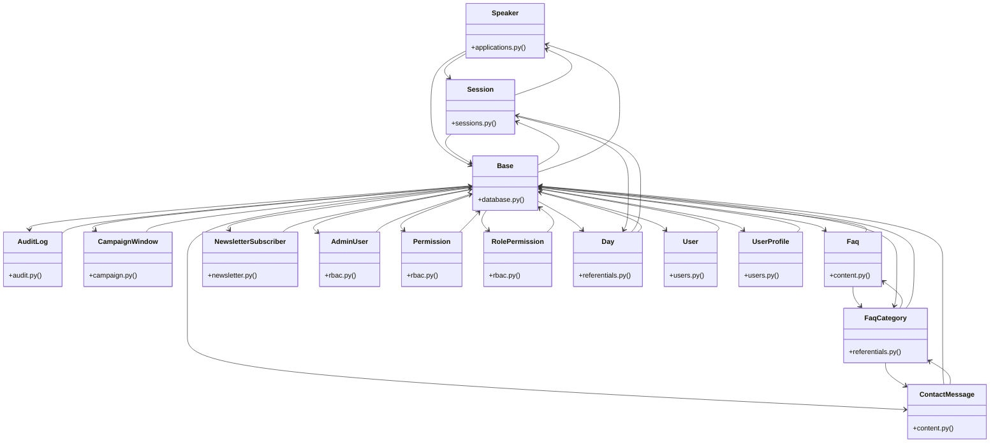

# [BaseModel & ValueError] Cluster

> 76 nodes · cohesion 0.04

## Key Concepts

- [Base](file:///Users/kodjododjango/Downloads/dev_projects/synca_conf_back/app/core/database.py#L13) (29 connections)
- **Base** (24 connections)
- [User](file:///Users/kodjododjango/Downloads/dev_projects/synca_conf_back/app/models/users.py#L24) (19 connections)
- [AdminUser](file:///Users/kodjododjango/Downloads/dev_projects/synca_conf_back/app/models/rbac.py#L39) (16 connections)
- [RolePermission](file:///Users/kodjododjango/Downloads/dev_projects/synca_conf_back/app/models/rbac.py#L23) (13 connections)
- [Permission](file:///Users/kodjododjango/Downloads/dev_projects/synca_conf_back/app/models/rbac.py#L16) (12 connections)
- [Speaker](file:///Users/kodjododjango/Downloads/dev_projects/synca_conf_back/app/models/applications.py#L55) (11 connections)
- [test_schemas.py](file:///Users/kodjododjango/Downloads/dev_projects/synca_conf_back/tests/test_schemas.py#L1) (11 connections)
- [FaqCategory](file:///Users/kodjododjango/Downloads/dev_projects/synca_conf_back/app/models/referentials.py#L43) (10 connections)
- [ContactMessage](file:///Users/kodjododjango/Downloads/dev_projects/synca_conf_back/app/models/content.py#L25) (9 connections)
- [Day](file:///Users/kodjododjango/Downloads/dev_projects/synca_conf_back/app/models/referentials.py#L10) (9 connections)
- [Faq](file:///Users/kodjododjango/Downloads/dev_projects/synca_conf_back/app/models/content.py#L10) (8 connections)
- [Session](file:///Users/kodjododjango/Downloads/dev_projects/synca_conf_back/app/models/sessions.py#L24) (8 connections)
- [UserProfile](file:///Users/kodjododjango/Downloads/dev_projects/synca_conf_back/app/models/users.py#L70) (7 connections)
- [test_admin_endpoint_limited_to_30_per_minute()](file:///Users/kodjododjango/Downloads/dev_projects/synca_conf_back/tests/test_rate_limiting.py#L39) (6 connections)
- [register()](file:///Users/kodjododjango/Downloads/dev_projects/synca_conf_back/app/api/forms.py#L90) (5 connections)
- [test_rbac_read()](file:///Users/kodjododjango/Downloads/dev_projects/synca_conf_back/tests/test_schemas.py#L188) (5 connections)
- [test_public_program.py](file:///Users/kodjododjango/Downloads/dev_projects/synca_conf_back/tests/test_public_program.py#L1) (5 connections)
- [AuditLog](file:///Users/kodjododjango/Downloads/dev_projects/synca_conf_back/app/models/audit.py#L9) (4 connections)
- [CampaignWindow](file:///Users/kodjododjango/Downloads/dev_projects/synca_conf_back/app/models/campaign.py#L17) (4 connections)
- [NewsletterSubscriber](file:///Users/kodjododjango/Downloads/dev_projects/synca_conf_back/app/models/newsletter.py#L9) (4 connections)
- [make_user()](file:///Users/kodjododjango/Downloads/dev_projects/synca_conf_back/tests/test_crypto.py#L7) (4 connections)
- [make_user()](file:///Users/kodjododjango/Downloads/dev_projects/synca_conf_back/tests/test_users.py#L7) (4 connections)
- [rbac.py](file:///Users/kodjododjango/Downloads/dev_projects/synca_conf_back/app/models/rbac.py#L1) (4 connections)
- [referentials.py](file:///Users/kodjododjango/Downloads/dev_projects/synca_conf_back/app/models/referentials.py#L1) (4 connections)
- *... and 51 more nodes in this community*

## Class Diagram

## Relationships

- [[[make_user() & test_delete_me_anonymizes_and_revokes_token()] Cluster]] (3 shared connections)

## Source Files

- [/Users/kodjododjango/Downloads/dev_projects/synca_conf_back/app/api/forms.py](file:///Users/kodjododjango/Downloads/dev_projects/synca_conf_back/app/api/forms.py)
- [/Users/kodjododjango/Downloads/dev_projects/synca_conf_back/app/core/database.py](file:///Users/kodjododjango/Downloads/dev_projects/synca_conf_back/app/core/database.py)
- [/Users/kodjododjango/Downloads/dev_projects/synca_conf_back/app/models/applications.py](file:///Users/kodjododjango/Downloads/dev_projects/synca_conf_back/app/models/applications.py)
- [/Users/kodjododjango/Downloads/dev_projects/synca_conf_back/app/models/audit.py](file:///Users/kodjododjango/Downloads/dev_projects/synca_conf_back/app/models/audit.py)
- [/Users/kodjododjango/Downloads/dev_projects/synca_conf_back/app/models/campaign.py](file:///Users/kodjododjango/Downloads/dev_projects/synca_conf_back/app/models/campaign.py)
- [/Users/kodjododjango/Downloads/dev_projects/synca_conf_back/app/models/content.py](file:///Users/kodjododjango/Downloads/dev_projects/synca_conf_back/app/models/content.py)
- [/Users/kodjododjango/Downloads/dev_projects/synca_conf_back/app/models/newsletter.py](file:///Users/kodjododjango/Downloads/dev_projects/synca_conf_back/app/models/newsletter.py)
- [/Users/kodjododjango/Downloads/dev_projects/synca_conf_back/app/models/rbac.py](file:///Users/kodjododjango/Downloads/dev_projects/synca_conf_back/app/models/rbac.py)
- [/Users/kodjododjango/Downloads/dev_projects/synca_conf_back/app/models/referentials.py](file:///Users/kodjododjango/Downloads/dev_projects/synca_conf_back/app/models/referentials.py)
- [/Users/kodjododjango/Downloads/dev_projects/synca_conf_back/app/models/sessions.py](file:///Users/kodjododjango/Downloads/dev_projects/synca_conf_back/app/models/sessions.py)
- [/Users/kodjododjango/Downloads/dev_projects/synca_conf_back/app/models/users.py](file:///Users/kodjododjango/Downloads/dev_projects/synca_conf_back/app/models/users.py)
- [/Users/kodjododjango/Downloads/dev_projects/synca_conf_back/tests/test_content.py](file:///Users/kodjododjango/Downloads/dev_projects/synca_conf_back/tests/test_content.py)
- [/Users/kodjododjango/Downloads/dev_projects/synca_conf_back/tests/test_crypto.py](file:///Users/kodjododjango/Downloads/dev_projects/synca_conf_back/tests/test_crypto.py)
- [/Users/kodjododjango/Downloads/dev_projects/synca_conf_back/tests/test_pagination.py](file:///Users/kodjododjango/Downloads/dev_projects/synca_conf_back/tests/test_pagination.py)
- [/Users/kodjododjango/Downloads/dev_projects/synca_conf_back/tests/test_public_faqs.py](file:///Users/kodjododjango/Downloads/dev_projects/synca_conf_back/tests/test_public_faqs.py)
- [/Users/kodjododjango/Downloads/dev_projects/synca_conf_back/tests/test_public_program.py](file:///Users/kodjododjango/Downloads/dev_projects/synca_conf_back/tests/test_public_program.py)
- [/Users/kodjododjango/Downloads/dev_projects/synca_conf_back/tests/test_rate_limiting.py](file:///Users/kodjododjango/Downloads/dev_projects/synca_conf_back/tests/test_rate_limiting.py)
- [/Users/kodjododjango/Downloads/dev_projects/synca_conf_back/tests/test_rbac.py](file:///Users/kodjododjango/Downloads/dev_projects/synca_conf_back/tests/test_rbac.py)
- [/Users/kodjododjango/Downloads/dev_projects/synca_conf_back/tests/test_referentials.py](file:///Users/kodjododjango/Downloads/dev_projects/synca_conf_back/tests/test_referentials.py)
- [/Users/kodjododjango/Downloads/dev_projects/synca_conf_back/tests/test_schemas.py](file:///Users/kodjododjango/Downloads/dev_projects/synca_conf_back/tests/test_schemas.py)

## Audit Trail

- EXTRACTED: 160 (47%)
- INFERRED: 177 (53%)
- AMBIGUOUS: 0 (0%)

---

*Part of the graphify knowledge wiki. See [[index]] to navigate.*