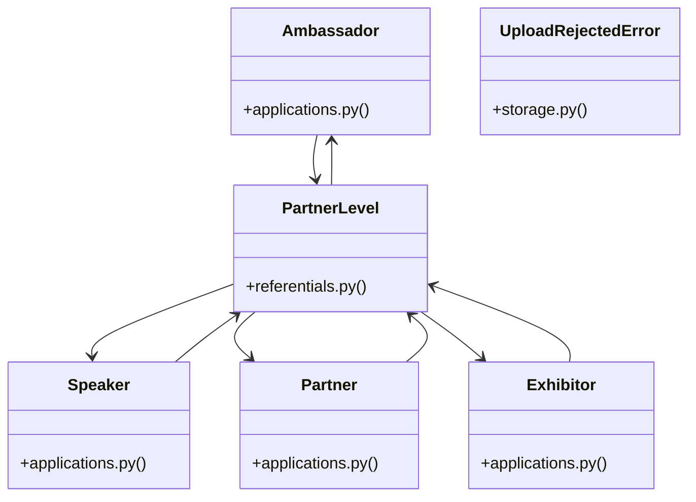

# [BaseModel & ValueError] Cluster

> 115 nodes · cohesion 0.03

## Key Concepts

- [refresh()](file:///Users/kodjododjango/Downloads/dev_projects/synca_conf_back/app/api/auth.py#L51) (68 connections)
- [upload_file()](file:///Users/kodjododjango/Downloads/dev_projects/synca_conf_back/app/services/storage.py#L57) (18 connections)
- [PartnerLevel](file:///Users/kodjododjango/Downloads/dev_projects/synca_conf_back/app/models/referentials.py#L92) (16 connections)
- [Speaker](file:///Users/kodjododjango/Downloads/dev_projects/synca_conf_back/app/models/applications.py#L55) (12 connections)
- [admin_applications.py](file:///Users/kodjododjango/Downloads/dev_projects/synca_conf_back/app/api/admin_applications.py#L1) (12 connections)
- [Partner](file:///Users/kodjododjango/Downloads/dev_projects/synca_conf_back/app/models/applications.py#L148) (11 connections)
- [Ambassador](file:///Users/kodjododjango/Downloads/dev_projects/synca_conf_back/app/models/applications.py#L103) (10 connections)
- [Exhibitor](file:///Users/kodjododjango/Downloads/dev_projects/synca_conf_back/app/models/applications.py#L189) (10 connections)
- [parse_multipart_form()](file:///Users/kodjododjango/Downloads/dev_projects/synca_conf_back/app/core/multipart.py#L28) (10 connections)
- [test_storage.py](file:///Users/kodjododjango/Downloads/dev_projects/synca_conf_back/tests/test_storage.py#L1) (10 connections)
- [forms.py](file:///Users/kodjododjango/Downloads/dev_projects/synca_conf_back/app/api/forms.py#L1) (9 connections)
- [admin_faqs.py](file:///Users/kodjododjango/Downloads/dev_projects/synca_conf_back/app/api/admin_faqs.py#L1) (8 connections)
- [admin_hackathon.py](file:///Users/kodjododjango/Downloads/dev_projects/synca_conf_back/app/api/admin_hackathon.py#L1) (8 connections)
- [test_applications.py](file:///Users/kodjododjango/Downloads/dev_projects/synca_conf_back/tests/test_applications.py#L1) (7 connections)
- [test_public_speakers.py](file:///Users/kodjododjango/Downloads/dev_projects/synca_conf_back/tests/test_public_speakers.py#L1) (7 connections)
- [create_team_member()](file:///Users/kodjododjango/Downloads/dev_projects/synca_conf_back/app/api/admin_hackathon.py#L138) (6 connections)
- [application_received_email()](file:///Users/kodjododjango/Downloads/dev_projects/synca_conf_back/app/services/email_templates.py#L59) (6 connections)
- [apply_as_ambassador()](file:///Users/kodjododjango/Downloads/dev_projects/synca_conf_back/app/api/forms.py#L260) (6 connections)
- [apply_as_exhibitor()](file:///Users/kodjododjango/Downloads/dev_projects/synca_conf_back/app/api/forms.py#L382) (6 connections)
- [apply_as_partner()](file:///Users/kodjododjango/Downloads/dev_projects/synca_conf_back/app/api/forms.py#L320) (6 connections)
- [apply_as_speaker()](file:///Users/kodjododjango/Downloads/dev_projects/synca_conf_back/app/api/forms.py#L196) (6 connections)
- [validate_is_real_image()](file:///Users/kodjododjango/Downloads/dev_projects/synca_conf_back/app/services/storage.py#L26) (6 connections)
- [test_public_ambassadors.py](file:///Users/kodjododjango/Downloads/dev_projects/synca_conf_back/tests/test_public_ambassadors.py#L1) (6 connections)
- [_get_team_or_404()](file:///Users/kodjododjango/Downloads/dev_projects/synca_conf_back/app/api/admin_hackathon.py#L26) (5 connections)
- [generate_ambassador_promo_code()](file:///Users/kodjododjango/Downloads/dev_projects/synca_conf_back/app/services/promo_service.py#L36) (5 connections)
- *... and 90 more nodes in this community*

## Class Diagram

## Relationships

- [[[get_settings() & upload_file()] Cluster]] (2 shared connections)
- [[[send_email() & make_ticket()] Cluster]] (1 shared connections)

## Source Files

- [/Users/kodjododjango/Downloads/dev_projects/synca_conf_back/app/api/admin_applications.py](file:///Users/kodjododjango/Downloads/dev_projects/synca_conf_back/app/api/admin_applications.py)
- [/Users/kodjododjango/Downloads/dev_projects/synca_conf_back/app/api/admin_contacts.py](file:///Users/kodjododjango/Downloads/dev_projects/synca_conf_back/app/api/admin_contacts.py)
- [/Users/kodjododjango/Downloads/dev_projects/synca_conf_back/app/api/admin_event_settings.py](file:///Users/kodjododjango/Downloads/dev_projects/synca_conf_back/app/api/admin_event_settings.py)
- [/Users/kodjododjango/Downloads/dev_projects/synca_conf_back/app/api/admin_faqs.py](file:///Users/kodjododjango/Downloads/dev_projects/synca_conf_back/app/api/admin_faqs.py)
- [/Users/kodjododjango/Downloads/dev_projects/synca_conf_back/app/api/admin_hackathon.py](file:///Users/kodjododjango/Downloads/dev_projects/synca_conf_back/app/api/admin_hackathon.py)
- [/Users/kodjododjango/Downloads/dev_projects/synca_conf_back/app/api/admin_promo_codes.py](file:///Users/kodjododjango/Downloads/dev_projects/synca_conf_back/app/api/admin_promo_codes.py)
- [/Users/kodjododjango/Downloads/dev_projects/synca_conf_back/app/api/auth.py](file:///Users/kodjododjango/Downloads/dev_projects/synca_conf_back/app/api/auth.py)
- [/Users/kodjododjango/Downloads/dev_projects/synca_conf_back/app/api/forms.py](file:///Users/kodjododjango/Downloads/dev_projects/synca_conf_back/app/api/forms.py)
- [/Users/kodjododjango/Downloads/dev_projects/synca_conf_back/app/core/multipart.py](file:///Users/kodjododjango/Downloads/dev_projects/synca_conf_back/app/core/multipart.py)
- [/Users/kodjododjango/Downloads/dev_projects/synca_conf_back/app/models/applications.py](file:///Users/kodjododjango/Downloads/dev_projects/synca_conf_back/app/models/applications.py)
- [/Users/kodjododjango/Downloads/dev_projects/synca_conf_back/app/models/referentials.py](file:///Users/kodjododjango/Downloads/dev_projects/synca_conf_back/app/models/referentials.py)
- [/Users/kodjododjango/Downloads/dev_projects/synca_conf_back/app/services/email_templates.py](file:///Users/kodjododjango/Downloads/dev_projects/synca_conf_back/app/services/email_templates.py)
- [/Users/kodjododjango/Downloads/dev_projects/synca_conf_back/app/services/promo_service.py](file:///Users/kodjododjango/Downloads/dev_projects/synca_conf_back/app/services/promo_service.py)
- [/Users/kodjododjango/Downloads/dev_projects/synca_conf_back/app/services/storage.py](file:///Users/kodjododjango/Downloads/dev_projects/synca_conf_back/app/services/storage.py)
- [/Users/kodjododjango/Downloads/dev_projects/synca_conf_back/tests/test_applications.py](file:///Users/kodjododjango/Downloads/dev_projects/synca_conf_back/tests/test_applications.py)
- [/Users/kodjododjango/Downloads/dev_projects/synca_conf_back/tests/test_public_ambassadors.py](file:///Users/kodjododjango/Downloads/dev_projects/synca_conf_back/tests/test_public_ambassadors.py)
- [/Users/kodjododjango/Downloads/dev_projects/synca_conf_back/tests/test_public_exhibitors.py](file:///Users/kodjododjango/Downloads/dev_projects/synca_conf_back/tests/test_public_exhibitors.py)
- [/Users/kodjododjango/Downloads/dev_projects/synca_conf_back/tests/test_public_partners.py](file:///Users/kodjododjango/Downloads/dev_projects/synca_conf_back/tests/test_public_partners.py)
- [/Users/kodjododjango/Downloads/dev_projects/synca_conf_back/tests/test_public_speakers.py](file:///Users/kodjododjango/Downloads/dev_projects/synca_conf_back/tests/test_public_speakers.py)
- [/Users/kodjododjango/Downloads/dev_projects/synca_conf_back/tests/test_schemas.py](file:///Users/kodjododjango/Downloads/dev_projects/synca_conf_back/tests/test_schemas.py)

## Audit Trail

- EXTRACTED: 252 (52%)
- INFERRED: 235 (48%)
- AMBIGUOUS: 0 (0%)

---

*Part of the graphify knowledge wiki. See [[index]] to navigate.*