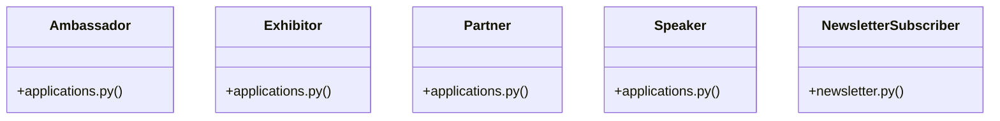

# [BaseModel & ValueError] Cluster

> 88 nodes · cohesion 0.04

## Key Concepts

- [refresh()](file:///Users/kodjododjango/Downloads/dev_projects/synca_conf_back/app/api/auth.py#L51) (78 connections)
- [Speaker](file:///Users/kodjododjango/Downloads/dev_projects/synca_conf_back/app/models/applications.py#L55) (12 connections)
- [admin_applications.py](file:///Users/kodjododjango/Downloads/dev_projects/synca_conf_back/app/api/admin_applications.py#L1) (12 connections)
- [Partner](file:///Users/kodjododjango/Downloads/dev_projects/synca_conf_back/app/models/applications.py#L148) (11 connections)
- [Ambassador](file:///Users/kodjododjango/Downloads/dev_projects/synca_conf_back/app/models/applications.py#L103) (10 connections)
- [Exhibitor](file:///Users/kodjododjango/Downloads/dev_projects/synca_conf_back/app/models/applications.py#L189) (10 connections)
- [parse_multipart_form()](file:///Users/kodjododjango/Downloads/dev_projects/synca_conf_back/app/core/multipart.py#L28) (10 connections)
- [forms.py](file:///Users/kodjododjango/Downloads/dev_projects/synca_conf_back/app/api/forms.py#L1) (9 connections)
- [admin_faqs.py](file:///Users/kodjododjango/Downloads/dev_projects/synca_conf_back/app/api/admin_faqs.py#L1) (8 connections)
- [test_applications.py](file:///Users/kodjododjango/Downloads/dev_projects/synca_conf_back/tests/test_applications.py#L1) (7 connections)
- [test_public_speakers.py](file:///Users/kodjododjango/Downloads/dev_projects/synca_conf_back/tests/test_public_speakers.py#L1) (7 connections)
- [application_received_email()](file:///Users/kodjododjango/Downloads/dev_projects/synca_conf_back/app/services/email_templates.py#L59) (6 connections)
- [apply_as_ambassador()](file:///Users/kodjododjango/Downloads/dev_projects/synca_conf_back/app/api/forms.py#L273) (6 connections)
- [apply_as_exhibitor()](file:///Users/kodjododjango/Downloads/dev_projects/synca_conf_back/app/api/forms.py#L403) (6 connections)
- [apply_as_partner()](file:///Users/kodjododjango/Downloads/dev_projects/synca_conf_back/app/api/forms.py#L337) (6 connections)
- [apply_as_speaker()](file:///Users/kodjododjango/Downloads/dev_projects/synca_conf_back/app/api/forms.py#L205) (6 connections)
- [register()](file:///Users/kodjododjango/Downloads/dev_projects/synca_conf_back/app/api/forms.py#L95) (6 connections)
- [generate_ambassador_promo_code()](file:///Users/kodjododjango/Downloads/dev_projects/synca_conf_back/app/services/promo_service.py#L36) (6 connections)
- [test_public_ambassadors.py](file:///Users/kodjododjango/Downloads/dev_projects/synca_conf_back/tests/test_public_ambassadors.py#L1) (6 connections)
- [create_payment()](file:///Users/kodjododjango/Downloads/dev_projects/synca_conf_back/app/api/payments.py#L48) (5 connections)
- [make_ambassador()](file:///Users/kodjododjango/Downloads/dev_projects/synca_conf_back/tests/test_public_ambassadors.py#L19) (5 connections)
- [make_speaker()](file:///Users/kodjododjango/Downloads/dev_projects/synca_conf_back/tests/test_public_speakers.py#L19) (5 connections)
- [test_applications_read()](file:///Users/kodjododjango/Downloads/dev_projects/synca_conf_back/tests/test_schemas.py#L135) (5 connections)
- [create_ambassador_admin()](file:///Users/kodjododjango/Downloads/dev_projects/synca_conf_back/app/api/admin_applications.py#L153) (4 connections)
- [contact()](file:///Users/kodjododjango/Downloads/dev_projects/synca_conf_back/app/api/forms.py#L161) (4 connections)
- *... and 63 more nodes in this community*

## Class Diagram

## Relationships

- [[[authenticate_admin() & make_admin()] Cluster]] (1 shared connections)
- [[[FaqCategory & ContactMessage] Cluster]] (1 shared connections)
- [[[PromoCode & Payment] Cluster]] (1 shared connections)

## Source Files

- [/Users/kodjododjango/Downloads/dev_projects/synca_conf_back/app/api/admin_applications.py](file:///Users/kodjododjango/Downloads/dev_projects/synca_conf_back/app/api/admin_applications.py)
- [/Users/kodjododjango/Downloads/dev_projects/synca_conf_back/app/api/admin_contacts.py](file:///Users/kodjododjango/Downloads/dev_projects/synca_conf_back/app/api/admin_contacts.py)
- [/Users/kodjododjango/Downloads/dev_projects/synca_conf_back/app/api/admin_event_settings.py](file:///Users/kodjododjango/Downloads/dev_projects/synca_conf_back/app/api/admin_event_settings.py)
- [/Users/kodjododjango/Downloads/dev_projects/synca_conf_back/app/api/admin_faqs.py](file:///Users/kodjododjango/Downloads/dev_projects/synca_conf_back/app/api/admin_faqs.py)
- [/Users/kodjododjango/Downloads/dev_projects/synca_conf_back/app/api/admin_promo_codes.py](file:///Users/kodjododjango/Downloads/dev_projects/synca_conf_back/app/api/admin_promo_codes.py)
- [/Users/kodjododjango/Downloads/dev_projects/synca_conf_back/app/api/auth.py](file:///Users/kodjododjango/Downloads/dev_projects/synca_conf_back/app/api/auth.py)
- [/Users/kodjododjango/Downloads/dev_projects/synca_conf_back/app/api/forms.py](file:///Users/kodjododjango/Downloads/dev_projects/synca_conf_back/app/api/forms.py)
- [/Users/kodjododjango/Downloads/dev_projects/synca_conf_back/app/api/payments.py](file:///Users/kodjododjango/Downloads/dev_projects/synca_conf_back/app/api/payments.py)
- [/Users/kodjododjango/Downloads/dev_projects/synca_conf_back/app/core/multipart.py](file:///Users/kodjododjango/Downloads/dev_projects/synca_conf_back/app/core/multipart.py)
- [/Users/kodjododjango/Downloads/dev_projects/synca_conf_back/app/models/applications.py](file:///Users/kodjododjango/Downloads/dev_projects/synca_conf_back/app/models/applications.py)
- [/Users/kodjododjango/Downloads/dev_projects/synca_conf_back/app/models/newsletter.py](file:///Users/kodjododjango/Downloads/dev_projects/synca_conf_back/app/models/newsletter.py)
- [/Users/kodjododjango/Downloads/dev_projects/synca_conf_back/app/services/email_templates.py](file:///Users/kodjododjango/Downloads/dev_projects/synca_conf_back/app/services/email_templates.py)
- [/Users/kodjododjango/Downloads/dev_projects/synca_conf_back/app/services/promo_service.py](file:///Users/kodjododjango/Downloads/dev_projects/synca_conf_back/app/services/promo_service.py)
- [/Users/kodjododjango/Downloads/dev_projects/synca_conf_back/tests/test_applications.py](file:///Users/kodjododjango/Downloads/dev_projects/synca_conf_back/tests/test_applications.py)
- [/Users/kodjododjango/Downloads/dev_projects/synca_conf_back/tests/test_public_ambassadors.py](file:///Users/kodjododjango/Downloads/dev_projects/synca_conf_back/tests/test_public_ambassadors.py)
- [/Users/kodjododjango/Downloads/dev_projects/synca_conf_back/tests/test_public_speakers.py](file:///Users/kodjododjango/Downloads/dev_projects/synca_conf_back/tests/test_public_speakers.py)
- [/Users/kodjododjango/Downloads/dev_projects/synca_conf_back/tests/test_schemas.py](file:///Users/kodjododjango/Downloads/dev_projects/synca_conf_back/tests/test_schemas.py)

## Audit Trail

- EXTRACTED: 175 (45%)
- INFERRED: 214 (55%)
- AMBIGUOUS: 0 (0%)

---

*Part of the graphify knowledge wiki. See [[index]] to navigate.*