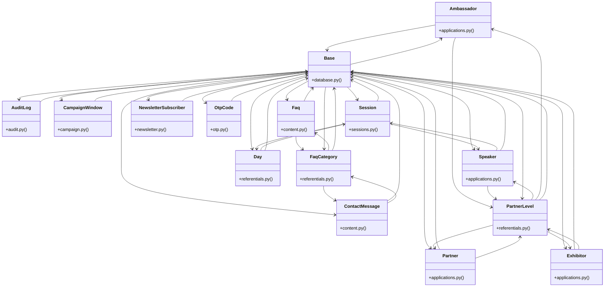

# [Base & Base] Cluster

> 90 nodes · cohesion 0.04

## Key Concepts

- [Base](file:///Users/kodjododjango/Downloads/dev_projects/synca_conf_back/app/core/database.py#L13) (31 connections)
- **Base** (25 connections)
- [PartnerLevel](file:///Users/kodjododjango/Downloads/dev_projects/synca_conf_back/app/models/referentials.py#L32) (15 connections)
- [Speaker](file:///Users/kodjododjango/Downloads/dev_projects/synca_conf_back/app/models/applications.py#L55) (11 connections)
- [test_schemas.py](file:///Users/kodjododjango/Downloads/dev_projects/synca_conf_back/tests/test_schemas.py#L1) (11 connections)
- [Partner](file:///Users/kodjododjango/Downloads/dev_projects/synca_conf_back/app/models/applications.py#L146) (10 connections)
- [FaqCategory](file:///Users/kodjododjango/Downloads/dev_projects/synca_conf_back/app/models/referentials.py#L43) (10 connections)
- [Exhibitor](file:///Users/kodjododjango/Downloads/dev_projects/synca_conf_back/app/models/applications.py#L187) (9 connections)
- [ContactMessage](file:///Users/kodjododjango/Downloads/dev_projects/synca_conf_back/app/models/content.py#L25) (9 connections)
- [Day](file:///Users/kodjododjango/Downloads/dev_projects/synca_conf_back/app/models/referentials.py#L10) (9 connections)
- [test_forms_partner_apply.py](file:///Users/kodjododjango/Downloads/dev_projects/synca_conf_back/tests/test_forms_partner_apply.py#L1) (9 connections)
- [Ambassador](file:///Users/kodjododjango/Downloads/dev_projects/synca_conf_back/app/models/applications.py#L103) (8 connections)
- [Faq](file:///Users/kodjododjango/Downloads/dev_projects/synca_conf_back/app/models/content.py#L10) (8 connections)
- [Session](file:///Users/kodjododjango/Downloads/dev_projects/synca_conf_back/app/models/sessions.py#L24) (8 connections)
- [test_applications.py](file:///Users/kodjododjango/Downloads/dev_projects/synca_conf_back/tests/test_applications.py#L1) (7 connections)
- [OtpCode](file:///Users/kodjododjango/Downloads/dev_projects/synca_conf_back/app/models/otp.py#L9) (6 connections)
- [form_fields()](file:///Users/kodjododjango/Downloads/dev_projects/synca_conf_back/tests/test_forms_partner_apply.py#L44) (6 connections)
- [open_call_for_partner()](file:///Users/kodjododjango/Downloads/dev_projects/synca_conf_back/tests/test_forms_partner_apply.py#L25) (5 connections)
- [test_partner_apply_success_with_logo()](file:///Users/kodjododjango/Downloads/dev_projects/synca_conf_back/tests/test_forms_partner_apply.py#L88) (5 connections)
- [test_applications_read()](file:///Users/kodjododjango/Downloads/dev_projects/synca_conf_back/tests/test_schemas.py#L135) (5 connections)
- [test_public_program.py](file:///Users/kodjododjango/Downloads/dev_projects/synca_conf_back/tests/test_public_program.py#L1) (5 connections)
- [AuditLog](file:///Users/kodjododjango/Downloads/dev_projects/synca_conf_back/app/models/audit.py#L9) (4 connections)
- [CampaignWindow](file:///Users/kodjododjango/Downloads/dev_projects/synca_conf_back/app/models/campaign.py#L17) (4 connections)
- [NewsletterSubscriber](file:///Users/kodjododjango/Downloads/dev_projects/synca_conf_back/app/models/newsletter.py#L9) (4 connections)
- [make_speaker()](file:///Users/kodjododjango/Downloads/dev_projects/synca_conf_back/tests/test_applications.py#L7) (4 connections)
- *... and 65 more nodes in this community*

## Class Diagram

## Relationships

- [[[BaseModel & ValueError] Cluster]] (6 shared connections)

## Source Files

- [/Users/kodjododjango/Downloads/dev_projects/synca_conf_back/alembic/env.py](file:///Users/kodjododjango/Downloads/dev_projects/synca_conf_back/alembic/env.py)
- [/Users/kodjododjango/Downloads/dev_projects/synca_conf_back/app/api/forms.py](file:///Users/kodjododjango/Downloads/dev_projects/synca_conf_back/app/api/forms.py)
- [/Users/kodjododjango/Downloads/dev_projects/synca_conf_back/app/core/database.py](file:///Users/kodjododjango/Downloads/dev_projects/synca_conf_back/app/core/database.py)
- [/Users/kodjododjango/Downloads/dev_projects/synca_conf_back/app/models/applications.py](file:///Users/kodjododjango/Downloads/dev_projects/synca_conf_back/app/models/applications.py)
- [/Users/kodjododjango/Downloads/dev_projects/synca_conf_back/app/models/audit.py](file:///Users/kodjododjango/Downloads/dev_projects/synca_conf_back/app/models/audit.py)
- [/Users/kodjododjango/Downloads/dev_projects/synca_conf_back/app/models/campaign.py](file:///Users/kodjododjango/Downloads/dev_projects/synca_conf_back/app/models/campaign.py)
- [/Users/kodjododjango/Downloads/dev_projects/synca_conf_back/app/models/content.py](file:///Users/kodjododjango/Downloads/dev_projects/synca_conf_back/app/models/content.py)
- [/Users/kodjododjango/Downloads/dev_projects/synca_conf_back/app/models/newsletter.py](file:///Users/kodjododjango/Downloads/dev_projects/synca_conf_back/app/models/newsletter.py)
- [/Users/kodjododjango/Downloads/dev_projects/synca_conf_back/app/models/otp.py](file:///Users/kodjododjango/Downloads/dev_projects/synca_conf_back/app/models/otp.py)
- [/Users/kodjododjango/Downloads/dev_projects/synca_conf_back/app/models/referentials.py](file:///Users/kodjododjango/Downloads/dev_projects/synca_conf_back/app/models/referentials.py)
- [/Users/kodjododjango/Downloads/dev_projects/synca_conf_back/app/models/sessions.py](file:///Users/kodjododjango/Downloads/dev_projects/synca_conf_back/app/models/sessions.py)
- [/Users/kodjododjango/Downloads/dev_projects/synca_conf_back/tests/test_applications.py](file:///Users/kodjododjango/Downloads/dev_projects/synca_conf_back/tests/test_applications.py)
- [/Users/kodjododjango/Downloads/dev_projects/synca_conf_back/tests/test_content.py](file:///Users/kodjododjango/Downloads/dev_projects/synca_conf_back/tests/test_content.py)
- [/Users/kodjododjango/Downloads/dev_projects/synca_conf_back/tests/test_forms_partner_apply.py](file:///Users/kodjododjango/Downloads/dev_projects/synca_conf_back/tests/test_forms_partner_apply.py)
- [/Users/kodjododjango/Downloads/dev_projects/synca_conf_back/tests/test_public_faqs.py](file:///Users/kodjododjango/Downloads/dev_projects/synca_conf_back/tests/test_public_faqs.py)
- [/Users/kodjododjango/Downloads/dev_projects/synca_conf_back/tests/test_public_partners.py](file:///Users/kodjododjango/Downloads/dev_projects/synca_conf_back/tests/test_public_partners.py)
- [/Users/kodjododjango/Downloads/dev_projects/synca_conf_back/tests/test_public_program.py](file:///Users/kodjododjango/Downloads/dev_projects/synca_conf_back/tests/test_public_program.py)
- [/Users/kodjododjango/Downloads/dev_projects/synca_conf_back/tests/test_referentials.py](file:///Users/kodjododjango/Downloads/dev_projects/synca_conf_back/tests/test_referentials.py)
- [/Users/kodjododjango/Downloads/dev_projects/synca_conf_back/tests/test_schemas.py](file:///Users/kodjododjango/Downloads/dev_projects/synca_conf_back/tests/test_schemas.py)
- [/Users/kodjododjango/Downloads/dev_projects/synca_conf_back/tests/test_sessions.py](file:///Users/kodjododjango/Downloads/dev_projects/synca_conf_back/tests/test_sessions.py)

## Audit Trail

- EXTRACTED: 208 (56%)
- INFERRED: 161 (44%)
- AMBIGUOUS: 0 (0%)

---

*Part of the graphify knowledge wiki. See [[index]] to navigate.*