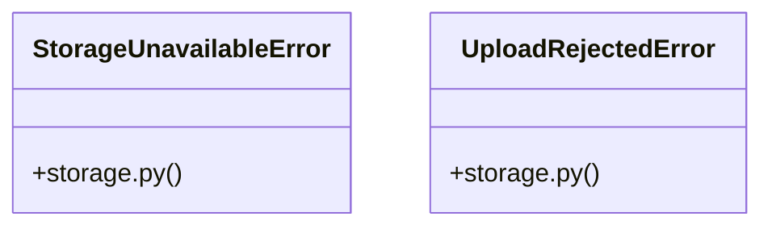

# [FaqCategory & ContactMessage] Cluster

> 53 nodes · cohesion 0.07

## Key Concepts

- [upload_file()](file:///Users/kodjododjango/Downloads/dev_projects/synca_conf_back/app/services/storage.py#L85) (22 connections)
- [test_storage.py](file:///Users/kodjododjango/Downloads/dev_projects/synca_conf_back/tests/test_storage.py#L1) (13 connections)
- [parse_multipart_form()](file:///Users/kodjododjango/Downloads/dev_projects/synca_conf_back/app/core/multipart.py#L28) (10 connections)
- [forms.py](file:///Users/kodjododjango/Downloads/dev_projects/synca_conf_back/app/api/forms.py#L1) (9 connections)
- [admin_hackathon.py](file:///Users/kodjododjango/Downloads/dev_projects/synca_conf_back/app/api/admin_hackathon.py#L1) (8 connections)
- [email_templates.py](file:///Users/kodjododjango/Downloads/dev_projects/synca_conf_back/app/services/email_templates.py#L1) (8 connections)
- [_render()](file:///Users/kodjododjango/Downloads/dev_projects/synca_conf_back/app/services/email_templates.py#L47) (7 connections)
- [storage.py](file:///Users/kodjododjango/Downloads/dev_projects/synca_conf_back/app/services/storage.py#L1) (7 connections)
- [create_team_member()](file:///Users/kodjododjango/Downloads/dev_projects/synca_conf_back/app/api/admin_hackathon.py#L146) (6 connections)
- [application_received_email()](file:///Users/kodjododjango/Downloads/dev_projects/synca_conf_back/app/services/email_templates.py#L59) (6 connections)
- [apply_as_ambassador()](file:///Users/kodjododjango/Downloads/dev_projects/synca_conf_back/app/api/forms.py#L271) (6 connections)
- [apply_as_exhibitor()](file:///Users/kodjododjango/Downloads/dev_projects/synca_conf_back/app/api/forms.py#L397) (6 connections)
- [apply_as_partner()](file:///Users/kodjododjango/Downloads/dev_projects/synca_conf_back/app/api/forms.py#L333) (6 connections)
- [apply_as_speaker()](file:///Users/kodjododjango/Downloads/dev_projects/synca_conf_back/app/api/forms.py#L205) (6 connections)
- [validate_is_real_image()](file:///Users/kodjododjango/Downloads/dev_projects/synca_conf_back/app/services/storage.py#L33) (6 connections)
- [make_png_bytes()](file:///Users/kodjododjango/Downloads/dev_projects/synca_conf_back/tests/test_storage.py#L16) (6 connections)
- [_get_team_or_404()](file:///Users/kodjododjango/Downloads/dev_projects/synca_conf_back/app/api/admin_hackathon.py#L31) (5 connections)
- [update_team_member()](file:///Users/kodjododjango/Downloads/dev_projects/synca_conf_back/app/api/admin_hackathon.py#L188) (4 connections)
- [StorageUnavailableError](file:///Users/kodjododjango/Downloads/dev_projects/synca_conf_back/app/services/storage.py#L28) (4 connections)
- [UploadRejectedError](file:///Users/kodjododjango/Downloads/dev_projects/synca_conf_back/app/services/storage.py#L24) (4 connections)
- [create_team()](file:///Users/kodjododjango/Downloads/dev_projects/synca_conf_back/app/api/admin_hackathon.py#L72) (3 connections)
- [otp_login_email()](file:///Users/kodjododjango/Downloads/dev_projects/synca_conf_back/app/services/email_templates.py#L68) (3 connections)
- [registration_confirmed_email()](file:///Users/kodjododjango/Downloads/dev_projects/synca_conf_back/app/services/email_templates.py#L51) (3 connections)
- [ticket_delivered_email()](file:///Users/kodjododjango/Downloads/dev_projects/synca_conf_back/app/services/email_templates.py#L78) (3 connections)
- [waitlist_reminder_email()](file:///Users/kodjododjango/Downloads/dev_projects/synca_conf_back/app/services/email_templates.py#L100) (3 connections)
- *... and 28 more nodes in this community*

## Class Diagram

## Relationships

- No strong cross-community connections detected

## Source Files

- [/Users/kodjododjango/Downloads/dev_projects/synca_conf_back/app/api/admin_hackathon.py](file:///Users/kodjododjango/Downloads/dev_projects/synca_conf_back/app/api/admin_hackathon.py)
- [/Users/kodjododjango/Downloads/dev_projects/synca_conf_back/app/api/forms.py](file:///Users/kodjododjango/Downloads/dev_projects/synca_conf_back/app/api/forms.py)
- [/Users/kodjododjango/Downloads/dev_projects/synca_conf_back/app/core/multipart.py](file:///Users/kodjododjango/Downloads/dev_projects/synca_conf_back/app/core/multipart.py)
- [/Users/kodjododjango/Downloads/dev_projects/synca_conf_back/app/services/email_templates.py](file:///Users/kodjododjango/Downloads/dev_projects/synca_conf_back/app/services/email_templates.py)
- [/Users/kodjododjango/Downloads/dev_projects/synca_conf_back/app/services/storage.py](file:///Users/kodjododjango/Downloads/dev_projects/synca_conf_back/app/services/storage.py)
- [/Users/kodjododjango/Downloads/dev_projects/synca_conf_back/tests/test_storage.py](file:///Users/kodjododjango/Downloads/dev_projects/synca_conf_back/tests/test_storage.py)

## Audit Trail

- EXTRACTED: 149 (67%)
- INFERRED: 72 (33%)
- AMBIGUOUS: 0 (0%)

---

*Part of the graphify knowledge wiki. See [[index]] to navigate.*