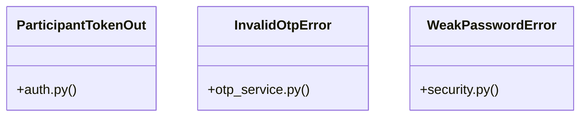

# [FaqCategory & ContactMessage] Cluster

> 43 nodes · cohesion 0.07

## Key Concepts

- [test_participant_otp.py](file:///Users/kodjododjango/Downloads/dev_projects/synca_conf_back/tests/test_participant_otp.py#L1) (11 connections)
- [make_verified_user()](file:///Users/kodjododjango/Downloads/dev_projects/synca_conf_back/tests/test_participant_otp.py#L13) (9 connections)
- [send_email()](file:///Users/kodjododjango/Downloads/dev_projects/synca_conf_back/app/services/email_service.py#L9) (8 connections)
- [request_otp()](file:///Users/kodjododjango/Downloads/dev_projects/synca_conf_back/app/services/otp_service.py#L30) (8 connections)
- [hash_password()](file:///Users/kodjododjango/Downloads/dev_projects/synca_conf_back/app/core/security.py#L37) (8 connections)
- [main()](file:///Users/kodjododjango/Downloads/dev_projects/synca_conf_back/app/cli/create_admin.py#L16) (5 connections)
- [verify_otp()](file:///Users/kodjododjango/Downloads/dev_projects/synca_conf_back/app/services/otp_service.py#L60) (5 connections)
- [validate_password_strength()](file:///Users/kodjododjango/Downloads/dev_projects/synca_conf_back/app/core/security.py#L20) (5 connections)
- [verify_password()](file:///Users/kodjododjango/Downloads/dev_projects/synca_conf_back/app/core/security.py#L41) (5 connections)
- [verify_login_code()](file:///Users/kodjododjango/Downloads/dev_projects/synca_conf_back/app/api/participant_auth.py#L31) (4 connections)
- [test_verify_otp_expired_code_returns_401()](file:///Users/kodjododjango/Downloads/dev_projects/synca_conf_back/tests/test_participant_otp.py#L117) (4 connections)
- [security.py](file:///Users/kodjododjango/Downloads/dev_projects/synca_conf_back/app/core/security.py#L1) (4 connections)
- [otp_service.py](file:///Users/kodjododjango/Downloads/dev_projects/synca_conf_back/app/services/otp_service.py#L1) (4 connections)
- [test_email_service.py](file:///Users/kodjododjango/Downloads/dev_projects/synca_conf_back/tests/test_email_service.py#L1) (4 connections)
- [test_security.py](file:///Users/kodjododjango/Downloads/dev_projects/synca_conf_back/tests/test_security.py#L1) (4 connections)
- [ParticipantTokenOut](file:///Users/kodjododjango/Downloads/dev_projects/synca_conf_back/app/schemas/auth.py#L24) (3 connections)
- [InvalidOtpError](file:///Users/kodjododjango/Downloads/dev_projects/synca_conf_back/app/services/otp_service.py#L22) (3 connections)
- [WeakPasswordError](file:///Users/kodjododjango/Downloads/dev_projects/synca_conf_back/app/core/security.py#L16) (3 connections)
- [_mock_response()](file:///Users/kodjododjango/Downloads/dev_projects/synca_conf_back/tests/test_email_service.py#L15) (3 connections)
- [test_send_email_calls_resend_when_key_configured()](file:///Users/kodjododjango/Downloads/dev_projects/synca_conf_back/tests/test_email_service.py#L20) (3 connections)
- [test_send_email_raises_on_resend_error()](file:///Users/kodjododjango/Downloads/dev_projects/synca_conf_back/tests/test_email_service.py#L39) (3 connections)
- [test_hash_and_verify_roundtrip()](file:///Users/kodjododjango/Downloads/dev_projects/synca_conf_back/tests/test_security.py#L11) (3 connections)
- [test_verify_wrong_password_fails()](file:///Users/kodjododjango/Downloads/dev_projects/synca_conf_back/tests/test_security.py#L17) (3 connections)
- [_generate_code()](file:///Users/kodjododjango/Downloads/dev_projects/synca_conf_back/app/services/otp_service.py#L26) (2 connections)
- [request_login_code()](file:///Users/kodjododjango/Downloads/dev_projects/synca_conf_back/app/api/participant_auth.py#L16) (2 connections)
- *... and 18 more nodes in this community*

## Class Diagram

## Relationships

- [[[PassType & register_payload()] Cluster]] (2 shared connections)
- [[[make_admin() & hash_password()] Cluster]] (1 shared connections)

## Source Files

- [/Users/kodjododjango/Downloads/dev_projects/synca_conf_back/app/api/participant_auth.py](file:///Users/kodjododjango/Downloads/dev_projects/synca_conf_back/app/api/participant_auth.py)
- [/Users/kodjododjango/Downloads/dev_projects/synca_conf_back/app/cli/create_admin.py](file:///Users/kodjododjango/Downloads/dev_projects/synca_conf_back/app/cli/create_admin.py)
- [/Users/kodjododjango/Downloads/dev_projects/synca_conf_back/app/core/security.py](file:///Users/kodjododjango/Downloads/dev_projects/synca_conf_back/app/core/security.py)
- [/Users/kodjododjango/Downloads/dev_projects/synca_conf_back/app/schemas/auth.py](file:///Users/kodjododjango/Downloads/dev_projects/synca_conf_back/app/schemas/auth.py)
- [/Users/kodjododjango/Downloads/dev_projects/synca_conf_back/app/services/email_service.py](file:///Users/kodjododjango/Downloads/dev_projects/synca_conf_back/app/services/email_service.py)
- [/Users/kodjododjango/Downloads/dev_projects/synca_conf_back/app/services/otp_service.py](file:///Users/kodjododjango/Downloads/dev_projects/synca_conf_back/app/services/otp_service.py)
- [/Users/kodjododjango/Downloads/dev_projects/synca_conf_back/tests/test_email_service.py](file:///Users/kodjododjango/Downloads/dev_projects/synca_conf_back/tests/test_email_service.py)
- [/Users/kodjododjango/Downloads/dev_projects/synca_conf_back/tests/test_participant_otp.py](file:///Users/kodjododjango/Downloads/dev_projects/synca_conf_back/tests/test_participant_otp.py)
- [/Users/kodjododjango/Downloads/dev_projects/synca_conf_back/tests/test_security.py](file:///Users/kodjododjango/Downloads/dev_projects/synca_conf_back/tests/test_security.py)

## Audit Trail

- EXTRACTED: 96 (67%)
- INFERRED: 48 (33%)
- AMBIGUOUS: 0 (0%)

---

*Part of the graphify knowledge wiki. See [[index]] to navigate.*