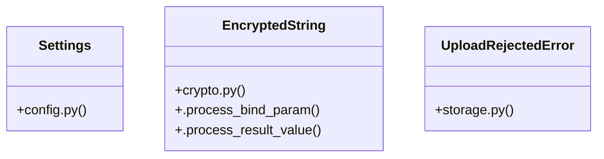

# [FaqCategory & ContactMessage] Cluster

> 44 nodes · cohesion 0.07

## Key Concepts

- [get_settings()](file:///Users/kodjododjango/Downloads/dev_projects/synca_conf_back/app/core/config.py#L106) (17 connections)
- [upload_file()](file:///Users/kodjododjango/Downloads/dev_projects/synca_conf_back/app/services/storage.py#L57) (14 connections)
- [test_storage.py](file:///Users/kodjododjango/Downloads/dev_projects/synca_conf_back/tests/test_storage.py#L1) (10 connections)
- [EncryptedString](file:///Users/kodjododjango/Downloads/dev_projects/synca_conf_back/app/core/crypto.py#L8) (7 connections)
- [validate_is_real_image()](file:///Users/kodjododjango/Downloads/dev_projects/synca_conf_back/app/services/storage.py#L26) (6 connections)
- [make_png_bytes()](file:///Users/kodjododjango/Downloads/dev_projects/synca_conf_back/tests/test_storage.py#L16) (5 connections)
- [storage.py](file:///Users/kodjododjango/Downloads/dev_projects/synca_conf_back/app/services/storage.py#L1) (5 connections)
- [configure_logging()](file:///Users/kodjododjango/Downloads/dev_projects/synca_conf_back/app/core/logging_config.py#L25) (4 connections)
- [UploadRejectedError](file:///Users/kodjododjango/Downloads/dev_projects/synca_conf_back/app/services/storage.py#L22) (4 connections)
- [config.py](file:///Users/kodjododjango/Downloads/dev_projects/synca_conf_back/app/core/config.py#L1) (4 connections)
- [Settings](file:///Users/kodjododjango/Downloads/dev_projects/synca_conf_back/app/core/config.py#L6) (3 connections)
- [_client()](file:///Users/kodjododjango/Downloads/dev_projects/synca_conf_back/app/services/storage.py#L40) (3 connections)
- [test_upload_file_rejects_disallowed_content_type()](file:///Users/kodjododjango/Downloads/dev_projects/synca_conf_back/tests/test_storage.py#L32) (3 connections)
- [test_upload_file_respects_custom_max_bytes()](file:///Users/kodjododjango/Downloads/dev_projects/synca_conf_back/tests/test_storage.py#L96) (3 connections)
- [test_upload_file_success_never_uses_original_filename()](file:///Users/kodjododjango/Downloads/dev_projects/synca_conf_back/tests/test_storage.py#L54) (3 connections)
- [test_validate_is_real_image_accepts_real_image()](file:///Users/kodjododjango/Downloads/dev_projects/synca_conf_back/tests/test_storage.py#L22) (3 connections)
- [2026_08_26_1444-d7d5f8910852_encrypt_users_phone_whatsapp_and_.py](file:///Users/kodjododjango/Downloads/dev_projects/synca_conf_back/alembic/versions/2026_08_26_1444-d7d5f8910852_encrypt_users_phone_whatsapp_and_.py#L1) (3 connections)
- [logging_config.py](file:///Users/kodjododjango/Downloads/dev_projects/synca_conf_back/app/core/logging_config.py#L1) (3 connections)
- [downgrade()](file:///Users/kodjododjango/Downloads/dev_projects/synca_conf_back/alembic/versions/2026_08_26_1444-d7d5f8910852_encrypt_users_phone_whatsapp_and_.py#L62) (2 connections)
- [upgrade()](file:///Users/kodjododjango/Downloads/dev_projects/synca_conf_back/alembic/versions/2026_08_26_1444-d7d5f8910852_encrypt_users_phone_whatsapp_and_.py#L31) (2 connections)
- [db_session()](file:///Users/kodjododjango/Downloads/dev_projects/synca_conf_back/tests/conftest.py#L23) (2 connections)
- [.process_bind_param()](file:///Users/kodjododjango/Downloads/dev_projects/synca_conf_back/app/core/crypto.py#L20) (2 connections)
- [.process_result_value()](file:///Users/kodjododjango/Downloads/dev_projects/synca_conf_back/app/core/crypto.py#L26) (2 connections)
- [_is_channel()](file:///Users/kodjododjango/Downloads/dev_projects/synca_conf_back/app/core/logging_config.py#L17) (2 connections)
- [_generate_key()](file:///Users/kodjododjango/Downloads/dev_projects/synca_conf_back/app/services/storage.py#L50) (2 connections)
- *... and 19 more nodes in this community*

## Class Diagram

## Relationships

- [[[verify_stripe_signature() & payment_webhook()] Cluster]] (1 shared connections)

## Source Files

- [/Users/kodjododjango/Downloads/dev_projects/synca_conf_back/alembic/versions/2026_08_26_1444-d7d5f8910852_encrypt_users_phone_whatsapp_and_.py](file:///Users/kodjododjango/Downloads/dev_projects/synca_conf_back/alembic/versions/2026_08_26_1444-d7d5f8910852_encrypt_users_phone_whatsapp_and_.py)
- [/Users/kodjododjango/Downloads/dev_projects/synca_conf_back/app/core/config.py](file:///Users/kodjododjango/Downloads/dev_projects/synca_conf_back/app/core/config.py)
- [/Users/kodjododjango/Downloads/dev_projects/synca_conf_back/app/core/crypto.py](file:///Users/kodjododjango/Downloads/dev_projects/synca_conf_back/app/core/crypto.py)
- [/Users/kodjododjango/Downloads/dev_projects/synca_conf_back/app/core/logging_config.py](file:///Users/kodjododjango/Downloads/dev_projects/synca_conf_back/app/core/logging_config.py)
- [/Users/kodjododjango/Downloads/dev_projects/synca_conf_back/app/services/storage.py](file:///Users/kodjododjango/Downloads/dev_projects/synca_conf_back/app/services/storage.py)
- [/Users/kodjododjango/Downloads/dev_projects/synca_conf_back/tests/conftest.py](file:///Users/kodjododjango/Downloads/dev_projects/synca_conf_back/tests/conftest.py)
- [/Users/kodjododjango/Downloads/dev_projects/synca_conf_back/tests/test_admin_login.py](file:///Users/kodjododjango/Downloads/dev_projects/synca_conf_back/tests/test_admin_login.py)
- [/Users/kodjododjango/Downloads/dev_projects/synca_conf_back/tests/test_logging_config.py](file:///Users/kodjododjango/Downloads/dev_projects/synca_conf_back/tests/test_logging_config.py)
- [/Users/kodjododjango/Downloads/dev_projects/synca_conf_back/tests/test_storage.py](file:///Users/kodjododjango/Downloads/dev_projects/synca_conf_back/tests/test_storage.py)

## Audit Trail

- EXTRACTED: 92 (66%)
- INFERRED: 48 (34%)
- AMBIGUOUS: 0 (0%)

---

*Part of the graphify knowledge wiki. See [[index]] to navigate.*