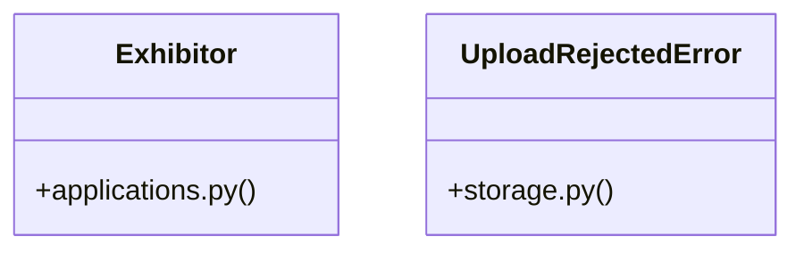

# [FaqCategory & ContactMessage] Cluster

> 53 nodes · cohesion 0.07

## Key Concepts

- [upload_file()](file:///Users/kodjododjango/Downloads/dev_projects/synca_conf_back/app/services/storage.py#L57) (18 connections)
- [Exhibitor](file:///Users/kodjododjango/Downloads/dev_projects/synca_conf_back/app/models/applications.py#L189) (10 connections)
- [parse_multipart_form()](file:///Users/kodjododjango/Downloads/dev_projects/synca_conf_back/app/core/multipart.py#L28) (10 connections)
- [test_storage.py](file:///Users/kodjododjango/Downloads/dev_projects/synca_conf_back/tests/test_storage.py#L1) (10 connections)
- [forms.py](file:///Users/kodjododjango/Downloads/dev_projects/synca_conf_back/app/api/forms.py#L1) (9 connections)
- [admin_hackathon.py](file:///Users/kodjododjango/Downloads/dev_projects/synca_conf_back/app/api/admin_hackathon.py#L1) (8 connections)
- [email_templates.py](file:///Users/kodjododjango/Downloads/dev_projects/synca_conf_back/app/services/email_templates.py#L1) (8 connections)
- [_render()](file:///Users/kodjododjango/Downloads/dev_projects/synca_conf_back/app/services/email_templates.py#L47) (7 connections)
- [create_team_member()](file:///Users/kodjododjango/Downloads/dev_projects/synca_conf_back/app/api/admin_hackathon.py#L141) (6 connections)
- [application_received_email()](file:///Users/kodjododjango/Downloads/dev_projects/synca_conf_back/app/services/email_templates.py#L59) (6 connections)
- [apply_as_exhibitor()](file:///Users/kodjododjango/Downloads/dev_projects/synca_conf_back/app/api/forms.py#L382) (6 connections)
- [apply_as_partner()](file:///Users/kodjododjango/Downloads/dev_projects/synca_conf_back/app/api/forms.py#L320) (6 connections)
- [apply_as_speaker()](file:///Users/kodjododjango/Downloads/dev_projects/synca_conf_back/app/api/forms.py#L196) (6 connections)
- [register()](file:///Users/kodjododjango/Downloads/dev_projects/synca_conf_back/app/api/forms.py#L90) (6 connections)
- [validate_is_real_image()](file:///Users/kodjododjango/Downloads/dev_projects/synca_conf_back/app/services/storage.py#L26) (6 connections)
- [_get_team_or_404()](file:///Users/kodjododjango/Downloads/dev_projects/synca_conf_back/app/api/admin_hackathon.py#L26) (5 connections)
- [make_png_bytes()](file:///Users/kodjododjango/Downloads/dev_projects/synca_conf_back/tests/test_storage.py#L16) (5 connections)
- [storage.py](file:///Users/kodjododjango/Downloads/dev_projects/synca_conf_back/app/services/storage.py#L1) (5 connections)
- [update_team_member()](file:///Users/kodjododjango/Downloads/dev_projects/synca_conf_back/app/api/admin_hackathon.py#L181) (4 connections)
- [UploadRejectedError](file:///Users/kodjododjango/Downloads/dev_projects/synca_conf_back/app/services/storage.py#L22) (4 connections)
- [test_public_exhibitors.py](file:///Users/kodjododjango/Downloads/dev_projects/synca_conf_back/tests/test_public_exhibitors.py#L1) (4 connections)
- [create_exhibitor_admin()](file:///Users/kodjododjango/Downloads/dev_projects/synca_conf_back/app/api/admin_applications.py#L328) (3 connections)
- [create_team()](file:///Users/kodjododjango/Downloads/dev_projects/synca_conf_back/app/api/admin_hackathon.py#L67) (3 connections)
- [otp_login_email()](file:///Users/kodjododjango/Downloads/dev_projects/synca_conf_back/app/services/email_templates.py#L68) (3 connections)
- [registration_confirmed_email()](file:///Users/kodjododjango/Downloads/dev_projects/synca_conf_back/app/services/email_templates.py#L51) (3 connections)
- *... and 28 more nodes in this community*

## Class Diagram

## Relationships

- [[[BaseModel & ValueError] Cluster]] (2 shared connections)

## Source Files

- [/Users/kodjododjango/Downloads/dev_projects/synca_conf_back/app/api/admin_applications.py](file:///Users/kodjododjango/Downloads/dev_projects/synca_conf_back/app/api/admin_applications.py)
- [/Users/kodjododjango/Downloads/dev_projects/synca_conf_back/app/api/admin_hackathon.py](file:///Users/kodjododjango/Downloads/dev_projects/synca_conf_back/app/api/admin_hackathon.py)
- [/Users/kodjododjango/Downloads/dev_projects/synca_conf_back/app/api/forms.py](file:///Users/kodjododjango/Downloads/dev_projects/synca_conf_back/app/api/forms.py)
- [/Users/kodjododjango/Downloads/dev_projects/synca_conf_back/app/core/multipart.py](file:///Users/kodjododjango/Downloads/dev_projects/synca_conf_back/app/core/multipart.py)
- [/Users/kodjododjango/Downloads/dev_projects/synca_conf_back/app/models/applications.py](file:///Users/kodjododjango/Downloads/dev_projects/synca_conf_back/app/models/applications.py)
- [/Users/kodjododjango/Downloads/dev_projects/synca_conf_back/app/services/email_templates.py](file:///Users/kodjododjango/Downloads/dev_projects/synca_conf_back/app/services/email_templates.py)
- [/Users/kodjododjango/Downloads/dev_projects/synca_conf_back/app/services/storage.py](file:///Users/kodjododjango/Downloads/dev_projects/synca_conf_back/app/services/storage.py)
- [/Users/kodjododjango/Downloads/dev_projects/synca_conf_back/tests/test_public_exhibitors.py](file:///Users/kodjododjango/Downloads/dev_projects/synca_conf_back/tests/test_public_exhibitors.py)
- [/Users/kodjododjango/Downloads/dev_projects/synca_conf_back/tests/test_storage.py](file:///Users/kodjododjango/Downloads/dev_projects/synca_conf_back/tests/test_storage.py)

## Audit Trail

- EXTRACTED: 141 (64%)
- INFERRED: 78 (36%)
- AMBIGUOUS: 0 (0%)

---

*Part of the graphify knowledge wiki. See [[index]] to navigate.*