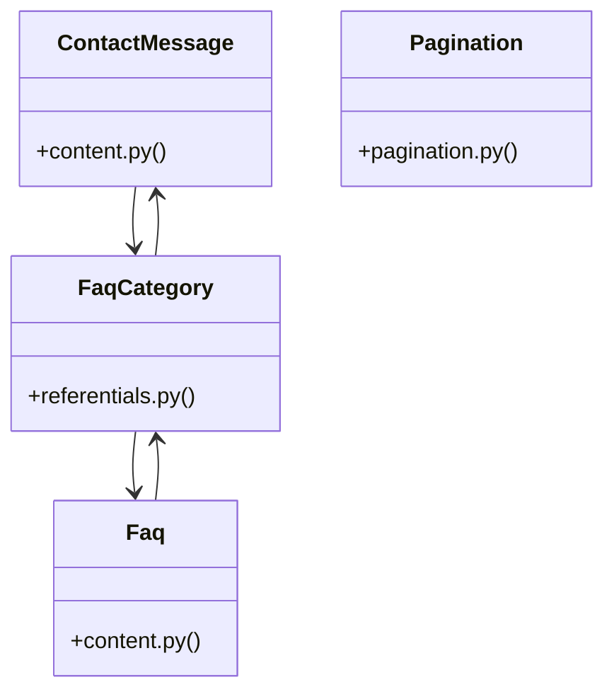

# [FaqCategory & ContactMessage] Cluster

> 37 nodes · cohesion 0.08

## Key Concepts

- [FaqCategory](file:///Users/kodjododjango/Downloads/dev_projects/synca_conf_back/app/models/referentials.py#L43) (10 connections)
- [ContactMessage](file:///Users/kodjododjango/Downloads/dev_projects/synca_conf_back/app/models/content.py#L25) (9 connections)
- [Faq](file:///Users/kodjododjango/Downloads/dev_projects/synca_conf_back/app/models/content.py#L10) (8 connections)
- [verify_recaptcha()](file:///Users/kodjododjango/Downloads/dev_projects/synca_conf_back/app/services/recaptcha.py#L9) (8 connections)
- [make_admin()](file:///Users/kodjododjango/Downloads/dev_projects/synca_conf_back/tests/test_admin_contacts.py#L11) (5 connections)
- [test_admin_contacts.py](file:///Users/kodjododjango/Downloads/dev_projects/synca_conf_back/tests/test_admin_contacts.py#L1) (5 connections)
- [test_pagination.py](file:///Users/kodjododjango/Downloads/dev_projects/synca_conf_back/tests/test_pagination.py#L1) (5 connections)
- [test_recaptcha.py](file:///Users/kodjododjango/Downloads/dev_projects/synca_conf_back/tests/test_recaptcha.py#L1) (5 connections)
- [test_any_authenticated_admin_can_list_contacts()](file:///Users/kodjododjango/Downloads/dev_projects/synca_conf_back/tests/test_admin_contacts.py#L37) (4 connections)
- [test_list_contacts_filters_by_is_read()](file:///Users/kodjododjango/Downloads/dev_projects/synca_conf_back/tests/test_admin_contacts.py#L53) (4 connections)
- [_mock_response()](file:///Users/kodjododjango/Downloads/dev_projects/synca_conf_back/tests/test_recaptcha.py#L17) (4 connections)
- [contact()](file:///Users/kodjododjango/Downloads/dev_projects/synca_conf_back/app/api/forms.py#L151) (3 connections)
- [pagination_params()](file:///Users/kodjododjango/Downloads/dev_projects/synca_conf_back/app/deps/pagination.py#L12) (3 connections)
- [test_faq_crud_basic()](file:///Users/kodjododjango/Downloads/dev_projects/synca_conf_back/tests/test_content.py#L8) (3 connections)
- [test_pagination_limit_actually_limits_results()](file:///Users/kodjododjango/Downloads/dev_projects/synca_conf_back/tests/test_pagination.py#L52) (3 connections)
- [test_faqs_filter_by_category()](file:///Users/kodjododjango/Downloads/dev_projects/synca_conf_back/tests/test_public_faqs.py#L20) (3 connections)
- [test_verify_recaptcha_accepts_good_score()](file:///Users/kodjododjango/Downloads/dev_projects/synca_conf_back/tests/test_recaptcha.py#L23) (3 connections)
- [test_verify_recaptcha_rejects_low_score()](file:///Users/kodjododjango/Downloads/dev_projects/synca_conf_back/tests/test_recaptcha.py#L38) (3 connections)
- [test_verify_recaptcha_rejects_unsuccessful_response()](file:///Users/kodjododjango/Downloads/dev_projects/synca_conf_back/tests/test_recaptcha.py#L55) (3 connections)
- [test_content_read()](file:///Users/kodjododjango/Downloads/dev_projects/synca_conf_back/tests/test_schemas.py#L177) (3 connections)
- [test_public_faqs.py](file:///Users/kodjododjango/Downloads/dev_projects/synca_conf_back/tests/test_public_faqs.py#L1) (3 connections)
- [Pagination](file:///Users/kodjododjango/Downloads/dev_projects/synca_conf_back/app/deps/pagination.py#L7) (2 connections)
- [test_contact_message_default_unread()](file:///Users/kodjododjango/Downloads/dev_projects/synca_conf_back/tests/test_content.py#L32) (2 connections)
- [test_pagination_custom_values()](file:///Users/kodjododjango/Downloads/dev_projects/synca_conf_back/tests/test_pagination.py#L10) (2 connections)
- [test_verify_recaptcha_skips_when_no_secret_configured()](file:///Users/kodjododjango/Downloads/dev_projects/synca_conf_back/tests/test_recaptcha.py#L11) (2 connections)
- *... and 12 more nodes in this community*

## Class Diagram

## Relationships

- No strong cross-community connections detected

## Source Files

- [/Users/kodjododjango/Downloads/dev_projects/synca_conf_back/app/api/forms.py](file:///Users/kodjododjango/Downloads/dev_projects/synca_conf_back/app/api/forms.py)
- [/Users/kodjododjango/Downloads/dev_projects/synca_conf_back/app/deps/pagination.py](file:///Users/kodjododjango/Downloads/dev_projects/synca_conf_back/app/deps/pagination.py)
- [/Users/kodjododjango/Downloads/dev_projects/synca_conf_back/app/models/content.py](file:///Users/kodjododjango/Downloads/dev_projects/synca_conf_back/app/models/content.py)
- [/Users/kodjododjango/Downloads/dev_projects/synca_conf_back/app/models/referentials.py](file:///Users/kodjododjango/Downloads/dev_projects/synca_conf_back/app/models/referentials.py)
- [/Users/kodjododjango/Downloads/dev_projects/synca_conf_back/app/services/recaptcha.py](file:///Users/kodjododjango/Downloads/dev_projects/synca_conf_back/app/services/recaptcha.py)
- [/Users/kodjododjango/Downloads/dev_projects/synca_conf_back/tests/test_admin_contacts.py](file:///Users/kodjododjango/Downloads/dev_projects/synca_conf_back/tests/test_admin_contacts.py)
- [/Users/kodjododjango/Downloads/dev_projects/synca_conf_back/tests/test_content.py](file:///Users/kodjododjango/Downloads/dev_projects/synca_conf_back/tests/test_content.py)
- [/Users/kodjododjango/Downloads/dev_projects/synca_conf_back/tests/test_pagination.py](file:///Users/kodjododjango/Downloads/dev_projects/synca_conf_back/tests/test_pagination.py)
- [/Users/kodjododjango/Downloads/dev_projects/synca_conf_back/tests/test_public_faqs.py](file:///Users/kodjododjango/Downloads/dev_projects/synca_conf_back/tests/test_public_faqs.py)
- [/Users/kodjododjango/Downloads/dev_projects/synca_conf_back/tests/test_recaptcha.py](file:///Users/kodjododjango/Downloads/dev_projects/synca_conf_back/tests/test_recaptcha.py)
- [/Users/kodjododjango/Downloads/dev_projects/synca_conf_back/tests/test_schemas.py](file:///Users/kodjododjango/Downloads/dev_projects/synca_conf_back/tests/test_schemas.py)

## Audit Trail

- EXTRACTED: 70 (58%)
- INFERRED: 50 (42%)
- AMBIGUOUS: 0 (0%)

---

*Part of the graphify knowledge wiki. See [[index]] to navigate.*