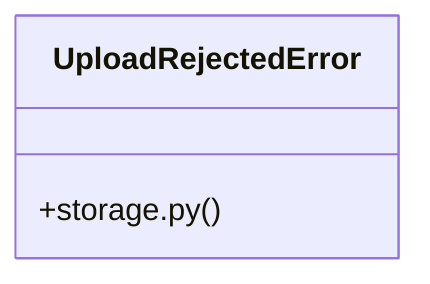

# [FaqCategory & ContactMessage] Cluster

> 39 nodes · cohesion 0.09

## Key Concepts

- [upload_file()](file:///Users/kodjododjango/Downloads/dev_projects/synca_conf_back/app/services/storage.py#L57) (14 connections)
- [test_storage.py](file:///Users/kodjododjango/Downloads/dev_projects/synca_conf_back/tests/test_storage.py#L1) (10 connections)
- [forms.py](file:///Users/kodjododjango/Downloads/dev_projects/synca_conf_back/app/api/forms.py#L1) (9 connections)
- [email_templates.py](file:///Users/kodjododjango/Downloads/dev_projects/synca_conf_back/app/services/email_templates.py#L1) (8 connections)
- [_render()](file:///Users/kodjododjango/Downloads/dev_projects/synca_conf_back/app/services/email_templates.py#L47) (7 connections)
- [application_received_email()](file:///Users/kodjododjango/Downloads/dev_projects/synca_conf_back/app/services/email_templates.py#L59) (6 connections)
- [validate_is_real_image()](file:///Users/kodjododjango/Downloads/dev_projects/synca_conf_back/app/services/storage.py#L26) (6 connections)
- [apply_as_partner()](file:///Users/kodjododjango/Downloads/dev_projects/synca_conf_back/app/api/forms.py#L307) (5 connections)
- [apply_as_speaker()](file:///Users/kodjododjango/Downloads/dev_projects/synca_conf_back/app/api/forms.py#L196) (5 connections)
- [parse_multipart_form()](file:///Users/kodjododjango/Downloads/dev_projects/synca_conf_back/app/core/multipart.py#L18) (5 connections)
- [make_png_bytes()](file:///Users/kodjododjango/Downloads/dev_projects/synca_conf_back/tests/test_storage.py#L16) (5 connections)
- [storage.py](file:///Users/kodjododjango/Downloads/dev_projects/synca_conf_back/app/services/storage.py#L1) (5 connections)
- [UploadRejectedError](file:///Users/kodjododjango/Downloads/dev_projects/synca_conf_back/app/services/storage.py#L22) (4 connections)
- [otp_login_email()](file:///Users/kodjododjango/Downloads/dev_projects/synca_conf_back/app/services/email_templates.py#L68) (3 connections)
- [registration_confirmed_email()](file:///Users/kodjododjango/Downloads/dev_projects/synca_conf_back/app/services/email_templates.py#L51) (3 connections)
- [ticket_delivered_email()](file:///Users/kodjododjango/Downloads/dev_projects/synca_conf_back/app/services/email_templates.py#L78) (3 connections)
- [waitlist_reminder_email()](file:///Users/kodjododjango/Downloads/dev_projects/synca_conf_back/app/services/email_templates.py#L100) (3 connections)
- [waitlist_ticketing_open_email()](file:///Users/kodjododjango/Downloads/dev_projects/synca_conf_back/app/services/email_templates.py#L91) (3 connections)
- [apply_as_ambassador()](file:///Users/kodjododjango/Downloads/dev_projects/synca_conf_back/app/api/forms.py#L260) (3 connections)
- [apply_as_exhibitor()](file:///Users/kodjododjango/Downloads/dev_projects/synca_conf_back/app/api/forms.py#L369) (3 connections)
- [contact()](file:///Users/kodjododjango/Downloads/dev_projects/synca_conf_back/app/api/forms.py#L152) (3 connections)
- [_client()](file:///Users/kodjododjango/Downloads/dev_projects/synca_conf_back/app/services/storage.py#L40) (3 connections)
- [test_upload_file_rejects_disallowed_content_type()](file:///Users/kodjododjango/Downloads/dev_projects/synca_conf_back/tests/test_storage.py#L32) (3 connections)
- [test_upload_file_respects_custom_max_bytes()](file:///Users/kodjododjango/Downloads/dev_projects/synca_conf_back/tests/test_storage.py#L96) (3 connections)
- [test_upload_file_success_never_uses_original_filename()](file:///Users/kodjododjango/Downloads/dev_projects/synca_conf_back/tests/test_storage.py#L54) (3 connections)
- *... and 14 more nodes in this community*

## Class Diagram

## Relationships

- [[[verify_stripe_signature() & payment_webhook()] Cluster]] (3 shared connections)

## Source Files

- [/Users/kodjododjango/Downloads/dev_projects/synca_conf_back/app/api/forms.py](file:///Users/kodjododjango/Downloads/dev_projects/synca_conf_back/app/api/forms.py)
- [/Users/kodjododjango/Downloads/dev_projects/synca_conf_back/app/core/multipart.py](file:///Users/kodjododjango/Downloads/dev_projects/synca_conf_back/app/core/multipart.py)
- [/Users/kodjododjango/Downloads/dev_projects/synca_conf_back/app/services/email_templates.py](file:///Users/kodjododjango/Downloads/dev_projects/synca_conf_back/app/services/email_templates.py)
- [/Users/kodjododjango/Downloads/dev_projects/synca_conf_back/app/services/storage.py](file:///Users/kodjododjango/Downloads/dev_projects/synca_conf_back/app/services/storage.py)
- [/Users/kodjododjango/Downloads/dev_projects/synca_conf_back/tests/test_admin_login.py](file:///Users/kodjododjango/Downloads/dev_projects/synca_conf_back/tests/test_admin_login.py)
- [/Users/kodjododjango/Downloads/dev_projects/synca_conf_back/tests/test_storage.py](file:///Users/kodjododjango/Downloads/dev_projects/synca_conf_back/tests/test_storage.py)

## Audit Trail

- EXTRACTED: 101 (67%)
- INFERRED: 49 (33%)
- AMBIGUOUS: 0 (0%)

---

*Part of the graphify knowledge wiki. See [[index]] to navigate.*