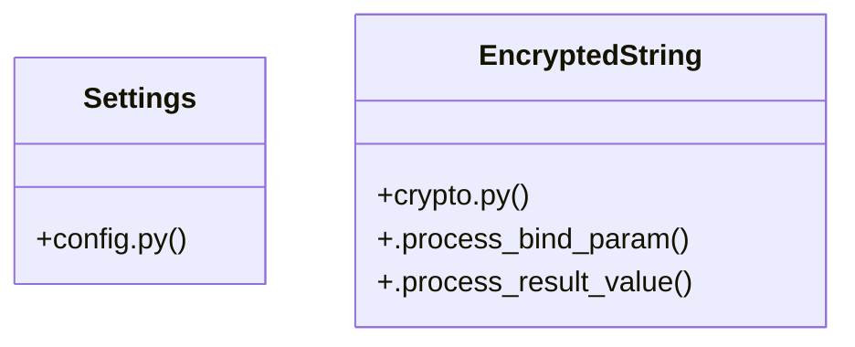

# [FaqCategory & ContactMessage] Cluster

> 37 nodes · cohesion 0.07

## Key Concepts

- [get_settings()](file:///Users/kodjododjango/Downloads/dev_projects/synca_conf_back/app/core/config.py#L88) (15 connections)
- [verify_recaptcha()](file:///Users/kodjododjango/Downloads/dev_projects/synca_conf_back/app/services/recaptcha.py#L9) (8 connections)
- [EncryptedString](file:///Users/kodjododjango/Downloads/dev_projects/synca_conf_back/app/core/crypto.py#L8) (7 connections)
- [test_recaptcha.py](file:///Users/kodjododjango/Downloads/dev_projects/synca_conf_back/tests/test_recaptcha.py#L1) (5 connections)
- [configure_logging()](file:///Users/kodjododjango/Downloads/dev_projects/synca_conf_back/app/core/logging_config.py#L25) (4 connections)
- [_mock_response()](file:///Users/kodjododjango/Downloads/dev_projects/synca_conf_back/tests/test_recaptcha.py#L17) (4 connections)
- [config.py](file:///Users/kodjododjango/Downloads/dev_projects/synca_conf_back/app/core/config.py#L1) (4 connections)
- [Settings](file:///Users/kodjododjango/Downloads/dev_projects/synca_conf_back/app/core/config.py#L6) (3 connections)
- [contact()](file:///Users/kodjododjango/Downloads/dev_projects/synca_conf_back/app/api/forms.py#L152) (3 connections)
- [_client()](file:///Users/kodjododjango/Downloads/dev_projects/synca_conf_back/app/services/storage.py#L40) (3 connections)
- [test_verify_recaptcha_accepts_good_score()](file:///Users/kodjododjango/Downloads/dev_projects/synca_conf_back/tests/test_recaptcha.py#L23) (3 connections)
- [test_verify_recaptcha_rejects_low_score()](file:///Users/kodjododjango/Downloads/dev_projects/synca_conf_back/tests/test_recaptcha.py#L38) (3 connections)
- [test_verify_recaptcha_rejects_unsuccessful_response()](file:///Users/kodjododjango/Downloads/dev_projects/synca_conf_back/tests/test_recaptcha.py#L55) (3 connections)
- [2026_08_26_1444-d7d5f8910852_encrypt_users_phone_whatsapp_and_.py](file:///Users/kodjododjango/Downloads/dev_projects/synca_conf_back/alembic/versions/2026_08_26_1444-d7d5f8910852_encrypt_users_phone_whatsapp_and_.py#L1) (3 connections)
- [logging_config.py](file:///Users/kodjododjango/Downloads/dev_projects/synca_conf_back/app/core/logging_config.py#L1) (3 connections)
- [downgrade()](file:///Users/kodjododjango/Downloads/dev_projects/synca_conf_back/alembic/versions/2026_08_26_1444-d7d5f8910852_encrypt_users_phone_whatsapp_and_.py#L62) (2 connections)
- [upgrade()](file:///Users/kodjododjango/Downloads/dev_projects/synca_conf_back/alembic/versions/2026_08_26_1444-d7d5f8910852_encrypt_users_phone_whatsapp_and_.py#L31) (2 connections)
- [db_session()](file:///Users/kodjododjango/Downloads/dev_projects/synca_conf_back/tests/conftest.py#L23) (2 connections)
- [.process_bind_param()](file:///Users/kodjododjango/Downloads/dev_projects/synca_conf_back/app/core/crypto.py#L20) (2 connections)
- [.process_result_value()](file:///Users/kodjododjango/Downloads/dev_projects/synca_conf_back/app/core/crypto.py#L26) (2 connections)
- [_is_channel()](file:///Users/kodjododjango/Downloads/dev_projects/synca_conf_back/app/core/logging_config.py#L17) (2 connections)
- [client()](file:///Users/kodjododjango/Downloads/dev_projects/synca_conf_back/tests/test_admin_login.py#L35) (2 connections)
- [test_configure_logging_routes_channels_to_separate_files()](file:///Users/kodjododjango/Downloads/dev_projects/synca_conf_back/tests/test_logging_config.py#L8) (2 connections)
- [test_verify_recaptcha_skips_when_no_secret_configured()](file:///Users/kodjododjango/Downloads/dev_projects/synca_conf_back/tests/test_recaptcha.py#L11) (2 connections)
- [conftest.py](file:///Users/kodjododjango/Downloads/dev_projects/synca_conf_back/tests/conftest.py#L1) (2 connections)
- *... and 12 more nodes in this community*

## Class Diagram

## Relationships

- [[[get_settings() & upload_file()] Cluster]] (2 shared connections)

## Source Files

- [/Users/kodjododjango/Downloads/dev_projects/synca_conf_back/alembic/versions/2026_08_26_1444-d7d5f8910852_encrypt_users_phone_whatsapp_and_.py](file:///Users/kodjododjango/Downloads/dev_projects/synca_conf_back/alembic/versions/2026_08_26_1444-d7d5f8910852_encrypt_users_phone_whatsapp_and_.py)
- [/Users/kodjododjango/Downloads/dev_projects/synca_conf_back/app/api/forms.py](file:///Users/kodjododjango/Downloads/dev_projects/synca_conf_back/app/api/forms.py)
- [/Users/kodjododjango/Downloads/dev_projects/synca_conf_back/app/core/config.py](file:///Users/kodjododjango/Downloads/dev_projects/synca_conf_back/app/core/config.py)
- [/Users/kodjododjango/Downloads/dev_projects/synca_conf_back/app/core/crypto.py](file:///Users/kodjododjango/Downloads/dev_projects/synca_conf_back/app/core/crypto.py)
- [/Users/kodjododjango/Downloads/dev_projects/synca_conf_back/app/core/logging_config.py](file:///Users/kodjododjango/Downloads/dev_projects/synca_conf_back/app/core/logging_config.py)
- [/Users/kodjododjango/Downloads/dev_projects/synca_conf_back/app/services/recaptcha.py](file:///Users/kodjododjango/Downloads/dev_projects/synca_conf_back/app/services/recaptcha.py)
- [/Users/kodjododjango/Downloads/dev_projects/synca_conf_back/app/services/storage.py](file:///Users/kodjododjango/Downloads/dev_projects/synca_conf_back/app/services/storage.py)
- [/Users/kodjododjango/Downloads/dev_projects/synca_conf_back/tests/conftest.py](file:///Users/kodjododjango/Downloads/dev_projects/synca_conf_back/tests/conftest.py)
- [/Users/kodjododjango/Downloads/dev_projects/synca_conf_back/tests/test_admin_login.py](file:///Users/kodjododjango/Downloads/dev_projects/synca_conf_back/tests/test_admin_login.py)
- [/Users/kodjododjango/Downloads/dev_projects/synca_conf_back/tests/test_logging_config.py](file:///Users/kodjododjango/Downloads/dev_projects/synca_conf_back/tests/test_logging_config.py)
- [/Users/kodjododjango/Downloads/dev_projects/synca_conf_back/tests/test_recaptcha.py](file:///Users/kodjododjango/Downloads/dev_projects/synca_conf_back/tests/test_recaptcha.py)

## Audit Trail

- EXTRACTED: 65 (63%)
- INFERRED: 38 (37%)
- AMBIGUOUS: 0 (0%)

---

*Part of the graphify knowledge wiki. See [[index]] to navigate.*