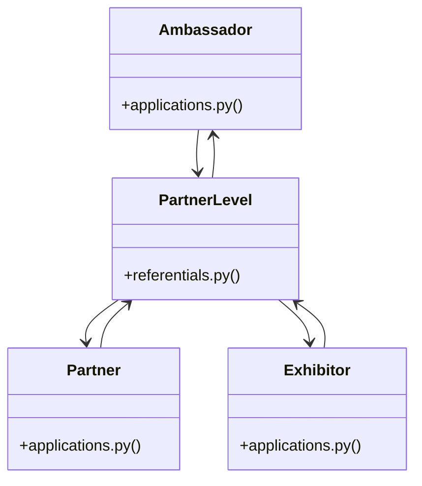

# [FaqCategory & ContactMessage] Cluster

> 34 nodes · cohesion 0.10

## Key Concepts

- [PartnerLevel](file:///Users/kodjododjango/Downloads/dev_projects/synca_conf_back/app/models/referentials.py#L32) (15 connections)
- [Partner](file:///Users/kodjododjango/Downloads/dev_projects/synca_conf_back/app/models/applications.py#L146) (10 connections)
- [Exhibitor](file:///Users/kodjododjango/Downloads/dev_projects/synca_conf_back/app/models/applications.py#L187) (9 connections)
- [test_forms_partner_apply.py](file:///Users/kodjododjango/Downloads/dev_projects/synca_conf_back/tests/test_forms_partner_apply.py#L1) (9 connections)
- [Ambassador](file:///Users/kodjododjango/Downloads/dev_projects/synca_conf_back/app/models/applications.py#L103) (8 connections)
- [test_applications.py](file:///Users/kodjododjango/Downloads/dev_projects/synca_conf_back/tests/test_applications.py#L1) (7 connections)
- [form_fields()](file:///Users/kodjododjango/Downloads/dev_projects/synca_conf_back/tests/test_forms_partner_apply.py#L44) (6 connections)
- [open_call_for_partner()](file:///Users/kodjododjango/Downloads/dev_projects/synca_conf_back/tests/test_forms_partner_apply.py#L25) (5 connections)
- [test_partner_apply_success_with_logo()](file:///Users/kodjododjango/Downloads/dev_projects/synca_conf_back/tests/test_forms_partner_apply.py#L88) (5 connections)
- [test_applications_read()](file:///Users/kodjododjango/Downloads/dev_projects/synca_conf_back/tests/test_schemas.py#L135) (5 connections)
- [make_speaker()](file:///Users/kodjododjango/Downloads/dev_projects/synca_conf_back/tests/test_applications.py#L7) (4 connections)
- [test_partner_apply_fake_logo_rejected_400()](file:///Users/kodjododjango/Downloads/dev_projects/synca_conf_back/tests/test_forms_partner_apply.py#L117) (4 connections)
- [test_partner_apply_success_without_logo()](file:///Users/kodjododjango/Downloads/dev_projects/synca_conf_back/tests/test_forms_partner_apply.py#L71) (4 connections)
- [applications.py](file:///Users/kodjododjango/Downloads/dev_projects/synca_conf_back/app/models/applications.py#L1) (4 connections)
- [test_public_exhibitors.py](file:///Users/kodjododjango/Downloads/dev_projects/synca_conf_back/tests/test_public_exhibitors.py#L1) (4 connections)
- [test_public_partners.py](file:///Users/kodjododjango/Downloads/dev_projects/synca_conf_back/tests/test_public_partners.py#L1) (4 connections)
- [test_partner_negotiation_workflow()](file:///Users/kodjododjango/Downloads/dev_projects/synca_conf_back/tests/test_applications.py#L97) (3 connections)
- [test_partner_apply_invalid_level_400()](file:///Users/kodjododjango/Downloads/dev_projects/synca_conf_back/tests/test_forms_partner_apply.py#L107) (3 connections)
- [make_exhibitor()](file:///Users/kodjododjango/Downloads/dev_projects/synca_conf_back/tests/test_public_exhibitors.py#L19) (3 connections)
- [make_partner()](file:///Users/kodjododjango/Downloads/dev_projects/synca_conf_back/tests/test_public_partners.py#L19) (3 connections)
- [test_partners_filter_by_level_excludes_private()](file:///Users/kodjododjango/Downloads/dev_projects/synca_conf_back/tests/test_public_partners.py#L39) (3 connections)
- [test_ambassador_social_handles_json()](file:///Users/kodjododjango/Downloads/dev_projects/synca_conf_back/tests/test_applications.py#L53) (2 connections)
- [test_exhibitor_default_status_and_public()](file:///Users/kodjododjango/Downloads/dev_projects/synca_conf_back/tests/test_applications.py#L127) (2 connections)
- [test_partner_requires_valid_level_fk()](file:///Users/kodjododjango/Downloads/dev_projects/synca_conf_back/tests/test_applications.py#L77) (2 connections)
- [test_speaker_default_status_pending_and_not_public()](file:///Users/kodjododjango/Downloads/dev_projects/synca_conf_back/tests/test_applications.py#L27) (2 connections)
- *... and 9 more nodes in this community*

## Class Diagram

## Relationships

- No strong cross-community connections detected

## Source Files

- [/Users/kodjododjango/Downloads/dev_projects/synca_conf_back/app/models/applications.py](file:///Users/kodjododjango/Downloads/dev_projects/synca_conf_back/app/models/applications.py)
- [/Users/kodjododjango/Downloads/dev_projects/synca_conf_back/app/models/referentials.py](file:///Users/kodjododjango/Downloads/dev_projects/synca_conf_back/app/models/referentials.py)
- [/Users/kodjododjango/Downloads/dev_projects/synca_conf_back/tests/test_applications.py](file:///Users/kodjododjango/Downloads/dev_projects/synca_conf_back/tests/test_applications.py)
- [/Users/kodjododjango/Downloads/dev_projects/synca_conf_back/tests/test_forms_partner_apply.py](file:///Users/kodjododjango/Downloads/dev_projects/synca_conf_back/tests/test_forms_partner_apply.py)
- [/Users/kodjododjango/Downloads/dev_projects/synca_conf_back/tests/test_public_exhibitors.py](file:///Users/kodjododjango/Downloads/dev_projects/synca_conf_back/tests/test_public_exhibitors.py)
- [/Users/kodjododjango/Downloads/dev_projects/synca_conf_back/tests/test_public_partners.py](file:///Users/kodjododjango/Downloads/dev_projects/synca_conf_back/tests/test_public_partners.py)
- [/Users/kodjododjango/Downloads/dev_projects/synca_conf_back/tests/test_schemas.py](file:///Users/kodjododjango/Downloads/dev_projects/synca_conf_back/tests/test_schemas.py)

## Audit Trail

- EXTRACTED: 89 (64%)
- INFERRED: 50 (36%)
- AMBIGUOUS: 0 (0%)

---

*Part of the graphify knowledge wiki. See [[index]] to navigate.*