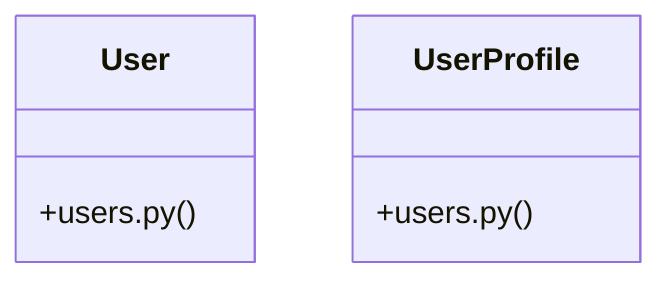

# [ModelView & _has_permission()] Cluster

> 26 nodes · cohesion 0.12

## Key Concepts

- [User](file:///Users/kodjododjango/Downloads/dev_projects/synca_conf_back/app/models/users.py#L24) (20 connections)
- [test_participant_otp.py](file:///Users/kodjododjango/Downloads/dev_projects/synca_conf_back/tests/test_participant_otp.py#L1) (11 connections)
- [make_verified_user()](file:///Users/kodjododjango/Downloads/dev_projects/synca_conf_back/tests/test_participant_otp.py#L13) (9 connections)
- [UserProfile](file:///Users/kodjododjango/Downloads/dev_projects/synca_conf_back/app/models/users.py#L70) (7 connections)
- [register()](file:///Users/kodjododjango/Downloads/dev_projects/synca_conf_back/app/api/forms.py#L90) (5 connections)
- [make_user()](file:///Users/kodjododjango/Downloads/dev_projects/synca_conf_back/tests/test_crypto.py#L7) (4 connections)
- [test_verify_otp_expired_code_returns_401()](file:///Users/kodjododjango/Downloads/dev_projects/synca_conf_back/tests/test_participant_otp.py#L117) (4 connections)
- [make_user()](file:///Users/kodjododjango/Downloads/dev_projects/synca_conf_back/tests/test_users.py#L7) (4 connections)
- [test_crypto.py](file:///Users/kodjododjango/Downloads/dev_projects/synca_conf_back/tests/test_crypto.py#L1) (4 connections)
- [test_user_and_profile_read()](file:///Users/kodjododjango/Downloads/dev_projects/synca_conf_back/tests/test_schemas.py#L83) (3 connections)
- [test_user_profile_unique_pair()](file:///Users/kodjododjango/Downloads/dev_projects/synca_conf_back/tests/test_users.py#L33) (3 connections)
- [test_users.py](file:///Users/kodjododjango/Downloads/dev_projects/synca_conf_back/tests/test_users.py#L1) (3 connections)
- [test_null_special_needs_stays_null()](file:///Users/kodjododjango/Downloads/dev_projects/synca_conf_back/tests/test_crypto.py#L51) (2 connections)
- [test_orm_read_returns_plaintext()](file:///Users/kodjododjango/Downloads/dev_projects/synca_conf_back/tests/test_crypto.py#L26) (2 connections)
- [test_raw_db_row_is_not_plaintext()](file:///Users/kodjododjango/Downloads/dev_projects/synca_conf_back/tests/test_crypto.py#L34) (2 connections)
- [test_request_otp_only_creates_row_for_known_verified_email()](file:///Users/kodjododjango/Downloads/dev_projects/synca_conf_back/tests/test_participant_otp.py#L62) (2 connections)
- [test_request_otp_rate_limited_after_three_per_15_minutes()](file:///Users/kodjododjango/Downloads/dev_projects/synca_conf_back/tests/test_participant_otp.py#L154) (2 connections)
- [test_request_otp_same_generic_response_known_and_unknown_email()](file:///Users/kodjododjango/Downloads/dev_projects/synca_conf_back/tests/test_participant_otp.py#L47) (2 connections)
- [test_verify_otp_cannot_be_reused()](file:///Users/kodjododjango/Downloads/dev_projects/synca_conf_back/tests/test_participant_otp.py#L137) (2 connections)
- [test_verify_otp_success_grants_access_to_user_me()](file:///Users/kodjododjango/Downloads/dev_projects/synca_conf_back/tests/test_participant_otp.py#L76) (2 connections)
- [test_verify_otp_wrong_code_returns_401()](file:///Users/kodjododjango/Downloads/dev_projects/synca_conf_back/tests/test_participant_otp.py#L94) (2 connections)
- [test_user_email_unique()](file:///Users/kodjododjango/Downloads/dev_projects/synca_conf_back/tests/test_users.py#L23) (2 connections)
- [users.py](file:///Users/kodjododjango/Downloads/dev_projects/synca_conf_back/app/models/users.py#L1) (2 connections)
- [client()](file:///Users/kodjododjango/Downloads/dev_projects/synca_conf_back/tests/test_participant_otp.py#L31) (1 connections)
- [fixed_code()](file:///Users/kodjododjango/Downloads/dev_projects/synca_conf_back/tests/test_participant_otp.py#L41) (1 connections)
- *... and 1 more nodes in this community*

## Class Diagram

## Relationships

- No strong cross-community connections detected

## Source Files

- [/Users/kodjododjango/Downloads/dev_projects/synca_conf_back/app/api/forms.py](file:///Users/kodjododjango/Downloads/dev_projects/synca_conf_back/app/api/forms.py)
- [/Users/kodjododjango/Downloads/dev_projects/synca_conf_back/app/models/users.py](file:///Users/kodjododjango/Downloads/dev_projects/synca_conf_back/app/models/users.py)
- [/Users/kodjododjango/Downloads/dev_projects/synca_conf_back/tests/test_crypto.py](file:///Users/kodjododjango/Downloads/dev_projects/synca_conf_back/tests/test_crypto.py)
- [/Users/kodjododjango/Downloads/dev_projects/synca_conf_back/tests/test_participant_otp.py](file:///Users/kodjododjango/Downloads/dev_projects/synca_conf_back/tests/test_participant_otp.py)
- [/Users/kodjododjango/Downloads/dev_projects/synca_conf_back/tests/test_schemas.py](file:///Users/kodjododjango/Downloads/dev_projects/synca_conf_back/tests/test_schemas.py)
- [/Users/kodjododjango/Downloads/dev_projects/synca_conf_back/tests/test_users.py](file:///Users/kodjododjango/Downloads/dev_projects/synca_conf_back/tests/test_users.py)

## Audit Trail

- EXTRACTED: 67 (66%)
- INFERRED: 35 (34%)
- AMBIGUOUS: 0 (0%)

---

*Part of the graphify knowledge wiki. See [[index]] to navigate.*