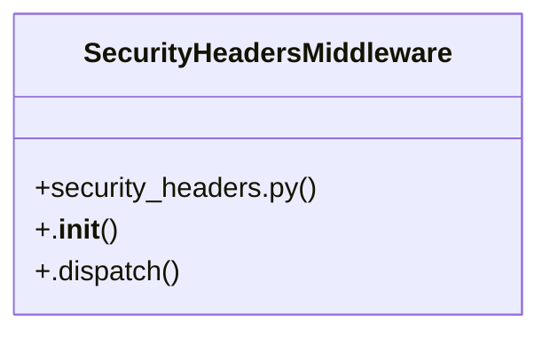

# [ModelView & _has_permission()] Cluster

> 19 nodes · cohesion 0.12

## Key Concepts

- [SecurityHeadersMiddleware](file:///Users/kodjododjango/Downloads/dev_projects/synca_conf_back/app/core/security_headers.py#L20) (9 connections)
- [_waitlist_reminder_loop()](file:///Users/kodjododjango/Downloads/dev_projects/synca_conf_back/app/main.py#L51) (5 connections)
- [send_waitlist_reminders()](file:///Users/kodjododjango/Downloads/dev_projects/synca_conf_back/app/services/waitlist_reminder.py#L36) (5 connections)
- [main.py](file:///Users/kodjododjango/Downloads/dev_projects/synca_conf_back/app/main.py#L1) (4 connections)
- [waitlist_reminder.py](file:///Users/kodjododjango/Downloads/dev_projects/synca_conf_back/app/services/waitlist_reminder.py#L1) (3 connections)
- [lifespan()](file:///Users/kodjododjango/Downloads/dev_projects/synca_conf_back/app/main.py#L67) (2 connections)
- [Pas de cron dans le projet : boucle asyncio en tâche de fond,     voir app/servi](file:///Users/kodjododjango/Downloads/dev_projects/synca_conf_back/app/main.py#L52) (2 connections)
- [Rappels récurrents waitlist (voir DEVLOG.md front, phase J3 suite).  Pas de cron](file:///Users/kodjododjango/Downloads/dev_projects/synca_conf_back/app/services/waitlist_reminder.py#L1) (2 connections)
- [_ticketing_window_open()](file:///Users/kodjododjango/Downloads/dev_projects/synca_conf_back/app/services/waitlist_reminder.py#L24) (2 connections)
- **BaseHTTPMiddleware** (1 connections)
- [health()](file:///Users/kodjododjango/Downloads/dev_projects/synca_conf_back/app/main.py#L137) (1 connections)
- [_log_rate_limit_exceeded()](file:///Users/kodjododjango/Downloads/dev_projects/synca_conf_back/app/main.py#L93) (1 connections)
- [Pas de cron dans le projet : boucle asyncio en tâche de fond,     voir app/servi](file:///Users/kodjododjango/Downloads/dev_projects/synca_conf_back/app/main.py#L46) (1 connections)
- [Pas de cron dans le projet : boucle asyncio en tâche de fond,     voir app/servi](file:///Users/kodjododjango/Downloads/dev_projects/synca_conf_back/app/main.py#L48) (1 connections)
- [Pas de cron dans le projet : boucle asyncio en tâche de fond,     voir app/servi](file:///Users/kodjododjango/Downloads/dev_projects/synca_conf_back/app/main.py#L50) (1 connections)
- [Pas de cron dans le projet : boucle asyncio en tâche de fond,     voir app/servi](file:///Users/kodjododjango/Downloads/dev_projects/synca_conf_back/app/main.py#L51) (1 connections)
- [.dispatch()](file:///Users/kodjododjango/Downloads/dev_projects/synca_conf_back/app/core/security_headers.py#L25) (1 connections)
- [.__init__()](file:///Users/kodjododjango/Downloads/dev_projects/synca_conf_back/app/core/security_headers.py#L21) (1 connections)
- [security_headers.py](file:///Users/kodjododjango/Downloads/dev_projects/synca_conf_back/app/core/security_headers.py#L1) (1 connections)

## Class Diagram

## Relationships

- [[[send_email() & make_ticket()] Cluster]] (5 shared connections)

## Source Files

- [/Users/kodjododjango/Downloads/dev_projects/synca_conf_back/app/core/security_headers.py](file:///Users/kodjododjango/Downloads/dev_projects/synca_conf_back/app/core/security_headers.py)
- [/Users/kodjododjango/Downloads/dev_projects/synca_conf_back/app/main.py](file:///Users/kodjododjango/Downloads/dev_projects/synca_conf_back/app/main.py)
- [/Users/kodjododjango/Downloads/dev_projects/synca_conf_back/app/services/waitlist_reminder.py](file:///Users/kodjododjango/Downloads/dev_projects/synca_conf_back/app/services/waitlist_reminder.py)

## Audit Trail

- EXTRACTED: 28 (64%)
- INFERRED: 16 (36%)
- AMBIGUOUS: 0 (0%)

---

*Part of the graphify knowledge wiki. See [[index]] to navigate.*