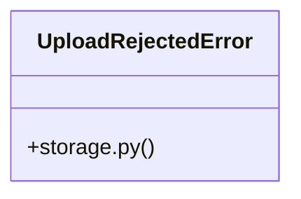

# [ModelView & _has_permission()] Cluster

> 17 nodes · cohesion 0.23

## Key Concepts

- [upload_file()](file:///Users/kodjododjango/Downloads/dev_projects/synca_conf_back/app/services/storage.py#L57) (14 connections)
- [test_storage.py](file:///Users/kodjododjango/Downloads/dev_projects/synca_conf_back/tests/test_storage.py#L1) (10 connections)
- [validate_is_real_image()](file:///Users/kodjododjango/Downloads/dev_projects/synca_conf_back/app/services/storage.py#L26) (6 connections)
- [make_png_bytes()](file:///Users/kodjododjango/Downloads/dev_projects/synca_conf_back/tests/test_storage.py#L16) (5 connections)
- [storage.py](file:///Users/kodjododjango/Downloads/dev_projects/synca_conf_back/app/services/storage.py#L1) (5 connections)
- [UploadRejectedError](file:///Users/kodjododjango/Downloads/dev_projects/synca_conf_back/app/services/storage.py#L22) (4 connections)
- [test_upload_file_rejects_disallowed_content_type()](file:///Users/kodjododjango/Downloads/dev_projects/synca_conf_back/tests/test_storage.py#L32) (3 connections)
- [test_upload_file_respects_custom_max_bytes()](file:///Users/kodjododjango/Downloads/dev_projects/synca_conf_back/tests/test_storage.py#L96) (3 connections)
- [test_upload_file_success_never_uses_original_filename()](file:///Users/kodjododjango/Downloads/dev_projects/synca_conf_back/tests/test_storage.py#L54) (3 connections)
- [test_validate_is_real_image_accepts_real_image()](file:///Users/kodjododjango/Downloads/dev_projects/synca_conf_back/tests/test_storage.py#L22) (3 connections)
- [_generate_key()](file:///Users/kodjododjango/Downloads/dev_projects/synca_conf_back/app/services/storage.py#L50) (2 connections)
- [test_upload_file_pdf_skips_image_validation()](file:///Users/kodjododjango/Downloads/dev_projects/synca_conf_back/tests/test_storage.py#L76) (2 connections)
- [test_upload_file_rejects_fake_image_bytes()](file:///Users/kodjododjango/Downloads/dev_projects/synca_conf_back/tests/test_storage.py#L48) (2 connections)
- [test_upload_file_rejects_oversized_file()](file:///Users/kodjododjango/Downloads/dev_projects/synca_conf_back/tests/test_storage.py#L41) (2 connections)
- [test_validate_is_real_image_rejects_fake_image()](file:///Users/kodjododjango/Downloads/dev_projects/synca_conf_back/tests/test_storage.py#L26) (2 connections)
- [Reject anything whose bytes aren't actually a decodable image.      A client-sup](file:///Users/kodjododjango/Downloads/dev_projects/synca_conf_back/app/services/storage.py#L27) (1 connections)
- [test_max_photo_bytes_is_tighter_than_shared_upload_cap()](file:///Users/kodjododjango/Downloads/dev_projects/synca_conf_back/tests/test_storage.py#L103) (1 connections)

## Class Diagram

## Relationships

- [[[make_admin() & hash_password()] Cluster]] (1 shared connections)

## Source Files

- [/Users/kodjododjango/Downloads/dev_projects/synca_conf_back/app/services/storage.py](file:///Users/kodjododjango/Downloads/dev_projects/synca_conf_back/app/services/storage.py)
- [/Users/kodjododjango/Downloads/dev_projects/synca_conf_back/tests/test_storage.py](file:///Users/kodjododjango/Downloads/dev_projects/synca_conf_back/tests/test_storage.py)

## Audit Trail

- EXTRACTED: 48 (71%)
- INFERRED: 20 (29%)
- AMBIGUOUS: 0 (0%)

---

*Part of the graphify knowledge wiki. See [[index]] to navigate.*