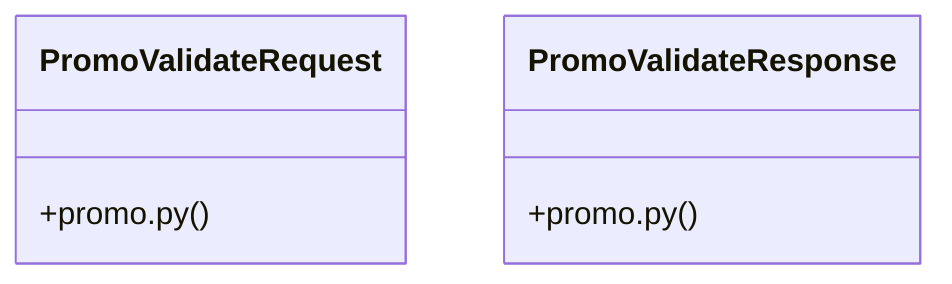

# [ModelView & _has_permission()] Cluster

> 22 nodes · cohesion 0.10

## Key Concepts

- [admin_applications.py](file:///Users/kodjododjango/Downloads/dev_projects/synca_conf_back/app/api/admin_applications.py#L1) (12 connections)
- [generate_ambassador_promo_code()](file:///Users/kodjododjango/Downloads/dev_projects/synca_conf_back/app/services/promo_service.py#L36) (5 connections)
- [create_payment()](file:///Users/kodjododjango/Downloads/dev_projects/synca_conf_back/app/api/payments.py#L48) (4 connections)
- [get_valid_promo_code()](file:///Users/kodjododjango/Downloads/dev_projects/synca_conf_back/app/services/promo_service.py#L14) (4 connections)
- [create_ambassador_admin()](file:///Users/kodjododjango/Downloads/dev_projects/synca_conf_back/app/api/admin_applications.py#L152) (3 connections)
- [_validate_promo_code()](file:///Users/kodjododjango/Downloads/dev_projects/synca_conf_back/app/api/forms.py#L55) (3 connections)
- [validate_promo()](file:///Users/kodjododjango/Downloads/dev_projects/synca_conf_back/app/api/payments.py#L31) (3 connections)
- [PromoValidateResponse](file:///Users/kodjododjango/Downloads/dev_projects/synca_conf_back/app/schemas/promo.py#L8) (3 connections)
- [payments.py](file:///Users/kodjododjango/Downloads/dev_projects/synca_conf_back/app/api/payments.py#L1) (3 connections)
- [promo_service.py](file:///Users/kodjododjango/Downloads/dev_projects/synca_conf_back/app/services/promo_service.py#L1) (3 connections)
- [update_ambassador_status()](file:///Users/kodjododjango/Downloads/dev_projects/synca_conf_back/app/api/admin_applications.py#L194) (2 connections)
- [PromoValidateRequest](file:///Users/kodjododjango/Downloads/dev_projects/synca_conf_back/app/schemas/promo.py#L4) (2 connections)
- [compute_discounted_amount()](file:///Users/kodjododjango/Downloads/dev_projects/synca_conf_back/app/services/promo_service.py#L30) (2 connections)
- [promo.py](file:///Users/kodjododjango/Downloads/dev_projects/synca_conf_back/app/schemas/promo.py#L1) (2 connections)
- [list_ambassadors()](file:///Users/kodjododjango/Downloads/dev_projects/synca_conf_back/app/api/admin_applications.py#L129) (1 connections)
- [list_exhibitors()](file:///Users/kodjododjango/Downloads/dev_projects/synca_conf_back/app/api/admin_applications.py#L305) (1 connections)
- [list_partners()](file:///Users/kodjododjango/Downloads/dev_projects/synca_conf_back/app/api/admin_applications.py#L218) (1 connections)
- [list_speakers()](file:///Users/kodjododjango/Downloads/dev_projects/synca_conf_back/app/api/admin_applications.py#L33) (1 connections)
- [update_exhibitor_status()](file:///Users/kodjododjango/Downloads/dev_projects/synca_conf_back/app/api/admin_applications.py#L368) (1 connections)
- [update_partner_status()](file:///Users/kodjododjango/Downloads/dev_projects/synca_conf_back/app/api/admin_applications.py#L285) (1 connections)
- [update_speaker_status()](file:///Users/kodjododjango/Downloads/dev_projects/synca_conf_back/app/api/admin_applications.py#L107) (1 connections)
- [Create and attach a promo code to a newly-accepted ambassador.      No usage_lim](file:///Users/kodjododjango/Downloads/dev_projects/synca_conf_back/app/services/promo_service.py#L37) (1 connections)

## Class Diagram

## Relationships

- [[[PromoCode & Payment] Cluster]] (1 shared connections)

## Source Files

- [/Users/kodjododjango/Downloads/dev_projects/synca_conf_back/app/api/admin_applications.py](file:///Users/kodjododjango/Downloads/dev_projects/synca_conf_back/app/api/admin_applications.py)
- [/Users/kodjododjango/Downloads/dev_projects/synca_conf_back/app/api/forms.py](file:///Users/kodjododjango/Downloads/dev_projects/synca_conf_back/app/api/forms.py)
- [/Users/kodjododjango/Downloads/dev_projects/synca_conf_back/app/api/payments.py](file:///Users/kodjododjango/Downloads/dev_projects/synca_conf_back/app/api/payments.py)
- [/Users/kodjododjango/Downloads/dev_projects/synca_conf_back/app/schemas/promo.py](file:///Users/kodjododjango/Downloads/dev_projects/synca_conf_back/app/schemas/promo.py)
- [/Users/kodjododjango/Downloads/dev_projects/synca_conf_back/app/services/promo_service.py](file:///Users/kodjododjango/Downloads/dev_projects/synca_conf_back/app/services/promo_service.py)

## Audit Trail

- EXTRACTED: 42 (71%)
- INFERRED: 17 (29%)
- AMBIGUOUS: 0 (0%)

---

*Part of the graphify knowledge wiki. See [[index]] to navigate.*