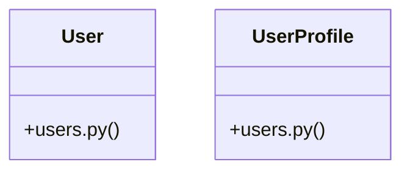

# [PassType & register_payload()] Cluster

> 31 nodes · cohesion 0.11

## Key Concepts

- [User](file:///Users/kodjododjango/Downloads/dev_projects/synca_conf_back/app/models/users.py#L24) (21 connections)
- [test_payments_webhook.py](file:///Users/kodjododjango/Downloads/dev_projects/synca_conf_back/tests/test_payments_webhook.py#L1) (14 connections)
- [make_pending_payment()](file:///Users/kodjododjango/Downloads/dev_projects/synca_conf_back/tests/test_payments_webhook.py#L49) (10 connections)
- [wave_signature()](file:///Users/kodjododjango/Downloads/dev_projects/synca_conf_back/tests/test_payments_webhook.py#L77) (7 connections)
- [UserProfile](file:///Users/kodjododjango/Downloads/dev_projects/synca_conf_back/app/models/users.py#L70) (7 connections)
- [test_webhook_increments_promo_usage_count_on_completion()](file:///Users/kodjododjango/Downloads/dev_projects/synca_conf_back/tests/test_payments_webhook.py#L257) (6 connections)
- [make_user()](file:///Users/kodjododjango/Downloads/dev_projects/synca_conf_back/tests/test_crypto.py#L7) (4 connections)
- [make_user()](file:///Users/kodjododjango/Downloads/dev_projects/synca_conf_back/tests/test_users.py#L7) (4 connections)
- [test_crypto.py](file:///Users/kodjododjango/Downloads/dev_projects/synca_conf_back/tests/test_crypto.py#L1) (4 connections)
- [test_webhook_completes_payment_and_creates_ticket()](file:///Users/kodjododjango/Downloads/dev_projects/synca_conf_back/tests/test_payments_webhook.py#L106) (3 connections)
- [test_webhook_failed_status_marks_payment_failed()](file:///Users/kodjododjango/Downloads/dev_projects/synca_conf_back/tests/test_payments_webhook.py#L168) (3 connections)
- [test_webhook_rejects_transaction_ref_reused_on_other_payment()](file:///Users/kodjododjango/Downloads/dev_projects/synca_conf_back/tests/test_payments_webhook.py#L218) (3 connections)
- [test_webhook_replay_is_idempotent()](file:///Users/kodjododjango/Downloads/dev_projects/synca_conf_back/tests/test_payments_webhook.py#L138) (3 connections)
- [test_webhook_stripe_valid_signature_accepted()](file:///Users/kodjododjango/Downloads/dev_projects/synca_conf_back/tests/test_payments_webhook.py#L201) (3 connections)
- [test_user_and_profile_read()](file:///Users/kodjododjango/Downloads/dev_projects/synca_conf_back/tests/test_schemas.py#L83) (3 connections)
- [test_user_profile_unique_pair()](file:///Users/kodjododjango/Downloads/dev_projects/synca_conf_back/tests/test_users.py#L33) (3 connections)
- [test_users.py](file:///Users/kodjododjango/Downloads/dev_projects/synca_conf_back/tests/test_users.py#L1) (3 connections)
- [create_participant()](file:///Users/kodjododjango/Downloads/dev_projects/synca_conf_back/app/api/admin_participants.py#L34) (2 connections)
- [test_null_special_needs_stays_null()](file:///Users/kodjododjango/Downloads/dev_projects/synca_conf_back/tests/test_crypto.py#L51) (2 connections)
- [test_orm_read_returns_plaintext()](file:///Users/kodjododjango/Downloads/dev_projects/synca_conf_back/tests/test_crypto.py#L26) (2 connections)
- [test_raw_db_row_is_not_plaintext()](file:///Users/kodjododjango/Downloads/dev_projects/synca_conf_back/tests/test_crypto.py#L34) (2 connections)
- [stripe_signature()](file:///Users/kodjododjango/Downloads/dev_projects/synca_conf_back/tests/test_payments_webhook.py#L81) (2 connections)
- [test_webhook_invalid_signature_401()](file:///Users/kodjododjango/Downloads/dev_projects/synca_conf_back/tests/test_payments_webhook.py#L89) (2 connections)
- [test_webhook_unknown_payment_404()](file:///Users/kodjododjango/Downloads/dev_projects/synca_conf_back/tests/test_payments_webhook.py#L187) (2 connections)
- [test_user_email_unique()](file:///Users/kodjododjango/Downloads/dev_projects/synca_conf_back/tests/test_users.py#L23) (2 connections)
- *... and 6 more nodes in this community*

## Class Diagram

## Relationships

- No strong cross-community connections detected

## Source Files

- [/Users/kodjododjango/Downloads/dev_projects/synca_conf_back/app/api/admin_participants.py](file:///Users/kodjododjango/Downloads/dev_projects/synca_conf_back/app/api/admin_participants.py)
- [/Users/kodjododjango/Downloads/dev_projects/synca_conf_back/app/models/users.py](file:///Users/kodjododjango/Downloads/dev_projects/synca_conf_back/app/models/users.py)
- [/Users/kodjododjango/Downloads/dev_projects/synca_conf_back/tests/test_crypto.py](file:///Users/kodjododjango/Downloads/dev_projects/synca_conf_back/tests/test_crypto.py)
- [/Users/kodjododjango/Downloads/dev_projects/synca_conf_back/tests/test_payments_webhook.py](file:///Users/kodjododjango/Downloads/dev_projects/synca_conf_back/tests/test_payments_webhook.py)
- [/Users/kodjododjango/Downloads/dev_projects/synca_conf_back/tests/test_schemas.py](file:///Users/kodjododjango/Downloads/dev_projects/synca_conf_back/tests/test_schemas.py)
- [/Users/kodjododjango/Downloads/dev_projects/synca_conf_back/tests/test_users.py](file:///Users/kodjododjango/Downloads/dev_projects/synca_conf_back/tests/test_users.py)

## Audit Trail

- EXTRACTED: 87 (70%)
- INFERRED: 38 (30%)
- AMBIGUOUS: 0 (0%)

---

*Part of the graphify knowledge wiki. See [[index]] to navigate.*