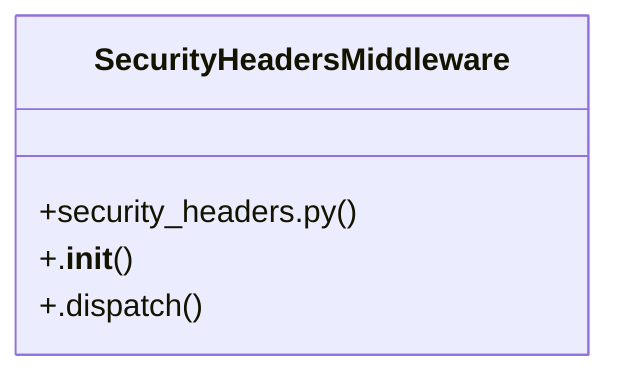

# [PassType & register_payload()] Cluster

> 28 nodes · cohesion 0.09

## Key Concepts

- [send_email()](file:///Users/kodjododjango/Downloads/dev_projects/synca_conf_back/app/services/email_service.py#L9) (10 connections)
- [_waitlist_reminder_loop()](file:///Users/kodjododjango/Downloads/dev_projects/synca_conf_back/app/main.py#L45) (5 connections)
- [SecurityHeadersMiddleware](file:///Users/kodjododjango/Downloads/dev_projects/synca_conf_back/app/core/security_headers.py#L20) (5 connections)
- [send_waitlist_reminders()](file:///Users/kodjododjango/Downloads/dev_projects/synca_conf_back/app/services/waitlist_reminder.py#L36) (5 connections)
- [admin_campaign_windows.py](file:///Users/kodjododjango/Downloads/dev_projects/synca_conf_back/app/api/admin_campaign_windows.py#L1) (4 connections)
- [main.py](file:///Users/kodjododjango/Downloads/dev_projects/synca_conf_back/app/main.py#L1) (4 connections)
- [test_email_service.py](file:///Users/kodjododjango/Downloads/dev_projects/synca_conf_back/tests/test_email_service.py#L1) (4 connections)
- [_notify_waitlist()](file:///Users/kodjododjango/Downloads/dev_projects/synca_conf_back/app/api/admin_campaign_windows.py#L26) (3 connections)
- [_mock_response()](file:///Users/kodjododjango/Downloads/dev_projects/synca_conf_back/tests/test_email_service.py#L15) (3 connections)
- [test_send_email_calls_resend_when_key_configured()](file:///Users/kodjododjango/Downloads/dev_projects/synca_conf_back/tests/test_email_service.py#L20) (3 connections)
- [test_send_email_raises_on_resend_error()](file:///Users/kodjododjango/Downloads/dev_projects/synca_conf_back/tests/test_email_service.py#L39) (3 connections)
- [waitlist_reminder.py](file:///Users/kodjododjango/Downloads/dev_projects/synca_conf_back/app/services/waitlist_reminder.py#L1) (3 connections)
- [_is_open()](file:///Users/kodjododjango/Downloads/dev_projects/synca_conf_back/app/api/admin_campaign_windows.py#L19) (2 connections)
- [update_campaign_window()](file:///Users/kodjododjango/Downloads/dev_projects/synca_conf_back/app/api/admin_campaign_windows.py#L59) (2 connections)
- [lifespan()](file:///Users/kodjododjango/Downloads/dev_projects/synca_conf_back/app/main.py#L61) (2 connections)
- [Pas de cron dans le projet : boucle asyncio en tâche de fond,     voir app/servi](file:///Users/kodjododjango/Downloads/dev_projects/synca_conf_back/app/main.py#L46) (2 connections)
- [test_send_email_logs_in_dev_without_key()](file:///Users/kodjododjango/Downloads/dev_projects/synca_conf_back/tests/test_email_service.py#L10) (2 connections)
- [Rappels récurrents waitlist (voir DEVLOG.md front, phase J3 suite).  Pas de cron](file:///Users/kodjododjango/Downloads/dev_projects/synca_conf_back/app/services/waitlist_reminder.py#L1) (2 connections)
- [_ticketing_window_open()](file:///Users/kodjododjango/Downloads/dev_projects/synca_conf_back/app/services/waitlist_reminder.py#L24) (2 connections)
- [list_campaign_windows_admin()](file:///Users/kodjododjango/Downloads/dev_projects/synca_conf_back/app/api/admin_campaign_windows.py#L46) (1 connections)
- **BaseHTTPMiddleware** (1 connections)
- [Send a transactional email, or log it in dev.      Without RESEND_API_KEY config](file:///Users/kodjododjango/Downloads/dev_projects/synca_conf_back/app/services/email_service.py#L10) (1 connections)
- [health()](file:///Users/kodjododjango/Downloads/dev_projects/synca_conf_back/app/main.py#L124) (1 connections)
- [_log_rate_limit_exceeded()](file:///Users/kodjododjango/Downloads/dev_projects/synca_conf_back/app/main.py#L87) (1 connections)
- [.dispatch()](file:///Users/kodjododjango/Downloads/dev_projects/synca_conf_back/app/core/security_headers.py#L25) (1 connections)
- *... and 3 more nodes in this community*

## Class Diagram

## Relationships

- [[[send_email() & make_ticket()] Cluster]] (1 shared connections)

## Source Files

- [/Users/kodjododjango/Downloads/dev_projects/synca_conf_back/app/api/admin_campaign_windows.py](file:///Users/kodjododjango/Downloads/dev_projects/synca_conf_back/app/api/admin_campaign_windows.py)
- [/Users/kodjododjango/Downloads/dev_projects/synca_conf_back/app/core/security_headers.py](file:///Users/kodjododjango/Downloads/dev_projects/synca_conf_back/app/core/security_headers.py)
- [/Users/kodjododjango/Downloads/dev_projects/synca_conf_back/app/main.py](file:///Users/kodjododjango/Downloads/dev_projects/synca_conf_back/app/main.py)
- [/Users/kodjododjango/Downloads/dev_projects/synca_conf_back/app/services/email_service.py](file:///Users/kodjododjango/Downloads/dev_projects/synca_conf_back/app/services/email_service.py)
- [/Users/kodjododjango/Downloads/dev_projects/synca_conf_back/app/services/waitlist_reminder.py](file:///Users/kodjododjango/Downloads/dev_projects/synca_conf_back/app/services/waitlist_reminder.py)
- [/Users/kodjododjango/Downloads/dev_projects/synca_conf_back/tests/test_email_service.py](file:///Users/kodjododjango/Downloads/dev_projects/synca_conf_back/tests/test_email_service.py)

## Audit Trail

- EXTRACTED: 54 (72%)
- INFERRED: 21 (28%)
- AMBIGUOUS: 0 (0%)

---

*Part of the graphify knowledge wiki. See [[index]] to navigate.*