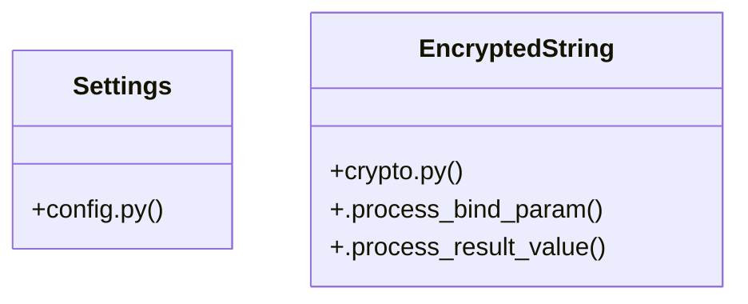

# [PassType & register_payload()] Cluster

> 40 nodes · cohesion 0.06

## Key Concepts

- [get_settings()](file:///Users/kodjododjango/Downloads/dev_projects/synca_conf_back/app/core/config.py#L115) (17 connections)
- [make_ticket()](file:///Users/kodjododjango/Downloads/dev_projects/synca_conf_back/tests/test_ticket_finalization.py#L10) (9 connections)
- [finalize_ticket()](file:///Users/kodjododjango/Downloads/dev_projects/synca_conf_back/app/services/ticket_finalization.py#L14) (8 connections)
- [EncryptedString](file:///Users/kodjododjango/Downloads/dev_projects/synca_conf_back/app/core/crypto.py#L8) (7 connections)
- [test_ticket_finalization.py](file:///Users/kodjododjango/Downloads/dev_projects/synca_conf_back/tests/test_ticket_finalization.py#L1) (5 connections)
- [configure_logging()](file:///Users/kodjododjango/Downloads/dev_projects/synca_conf_back/app/core/logging_config.py#L25) (4 connections)
- [test_finalize_ticket_sets_pdf_url_and_sends_email()](file:///Users/kodjododjango/Downloads/dev_projects/synca_conf_back/tests/test_ticket_finalization.py#L77) (4 connections)
- [generate_and_upload_ticket_pdf()](file:///Users/kodjododjango/Downloads/dev_projects/synca_conf_back/app/services/ticket_pdf.py#L96) (4 connections)
- [_render_ticket_pdf()](file:///Users/kodjododjango/Downloads/dev_projects/synca_conf_back/app/services/ticket_pdf.py#L34) (4 connections)
- [config.py](file:///Users/kodjododjango/Downloads/dev_projects/synca_conf_back/app/core/config.py#L1) (4 connections)
- [Settings](file:///Users/kodjododjango/Downloads/dev_projects/synca_conf_back/app/core/config.py#L6) (3 connections)
- [_client()](file:///Users/kodjododjango/Downloads/dev_projects/synca_conf_back/app/services/storage.py#L68) (3 connections)
- [test_finalize_ticket_is_idempotent_when_already_finalized()](file:///Users/kodjododjango/Downloads/dev_projects/synca_conf_back/tests/test_ticket_finalization.py#L111) (3 connections)
- [2026_08_26_1444-d7d5f8910852_encrypt_users_phone_whatsapp_and_.py](file:///Users/kodjododjango/Downloads/dev_projects/synca_conf_back/alembic/versions/2026_08_26_1444-d7d5f8910852_encrypt_users_phone_whatsapp_and_.py#L1) (3 connections)
- [logging_config.py](file:///Users/kodjododjango/Downloads/dev_projects/synca_conf_back/app/core/logging_config.py#L1) (3 connections)
- [ticket_pdf.py](file:///Users/kodjododjango/Downloads/dev_projects/synca_conf_back/app/services/ticket_pdf.py#L1) (3 connections)
- [downgrade()](file:///Users/kodjododjango/Downloads/dev_projects/synca_conf_back/alembic/versions/2026_08_26_1444-d7d5f8910852_encrypt_users_phone_whatsapp_and_.py#L62) (2 connections)
- [upgrade()](file:///Users/kodjododjango/Downloads/dev_projects/synca_conf_back/alembic/versions/2026_08_26_1444-d7d5f8910852_encrypt_users_phone_whatsapp_and_.py#L31) (2 connections)
- [db_session()](file:///Users/kodjododjango/Downloads/dev_projects/synca_conf_back/tests/conftest.py#L22) (2 connections)
- [.process_bind_param()](file:///Users/kodjododjango/Downloads/dev_projects/synca_conf_back/app/core/crypto.py#L20) (2 connections)
- [.process_result_value()](file:///Users/kodjododjango/Downloads/dev_projects/synca_conf_back/app/core/crypto.py#L26) (2 connections)
- [_is_channel()](file:///Users/kodjododjango/Downloads/dev_projects/synca_conf_back/app/core/logging_config.py#L17) (2 connections)
- [client()](file:///Users/kodjododjango/Downloads/dev_projects/synca_conf_back/tests/test_admin_login.py#L35) (2 connections)
- [test_configure_logging_routes_channels_to_separate_files()](file:///Users/kodjododjango/Downloads/dev_projects/synca_conf_back/tests/test_logging_config.py#L8) (2 connections)
- [test_finalize_ticket_noops_on_missing_ticket()](file:///Users/kodjododjango/Downloads/dev_projects/synca_conf_back/tests/test_ticket_finalization.py#L136) (2 connections)
- *... and 15 more nodes in this community*

## Class Diagram

## Relationships

- No strong cross-community connections detected

## Source Files

- [/Users/kodjododjango/Downloads/dev_projects/synca_conf_back/alembic/versions/2026_08_26_1444-d7d5f8910852_encrypt_users_phone_whatsapp_and_.py](file:///Users/kodjododjango/Downloads/dev_projects/synca_conf_back/alembic/versions/2026_08_26_1444-d7d5f8910852_encrypt_users_phone_whatsapp_and_.py)
- [/Users/kodjododjango/Downloads/dev_projects/synca_conf_back/app/core/config.py](file:///Users/kodjododjango/Downloads/dev_projects/synca_conf_back/app/core/config.py)
- [/Users/kodjododjango/Downloads/dev_projects/synca_conf_back/app/core/crypto.py](file:///Users/kodjododjango/Downloads/dev_projects/synca_conf_back/app/core/crypto.py)
- [/Users/kodjododjango/Downloads/dev_projects/synca_conf_back/app/core/logging_config.py](file:///Users/kodjododjango/Downloads/dev_projects/synca_conf_back/app/core/logging_config.py)
- [/Users/kodjododjango/Downloads/dev_projects/synca_conf_back/app/services/storage.py](file:///Users/kodjododjango/Downloads/dev_projects/synca_conf_back/app/services/storage.py)
- [/Users/kodjododjango/Downloads/dev_projects/synca_conf_back/app/services/ticket_finalization.py](file:///Users/kodjododjango/Downloads/dev_projects/synca_conf_back/app/services/ticket_finalization.py)
- [/Users/kodjododjango/Downloads/dev_projects/synca_conf_back/app/services/ticket_pdf.py](file:///Users/kodjododjango/Downloads/dev_projects/synca_conf_back/app/services/ticket_pdf.py)
- [/Users/kodjododjango/Downloads/dev_projects/synca_conf_back/tests/conftest.py](file:///Users/kodjododjango/Downloads/dev_projects/synca_conf_back/tests/conftest.py)
- [/Users/kodjododjango/Downloads/dev_projects/synca_conf_back/tests/test_admin_login.py](file:///Users/kodjododjango/Downloads/dev_projects/synca_conf_back/tests/test_admin_login.py)
- [/Users/kodjododjango/Downloads/dev_projects/synca_conf_back/tests/test_logging_config.py](file:///Users/kodjododjango/Downloads/dev_projects/synca_conf_back/tests/test_logging_config.py)
- [/Users/kodjododjango/Downloads/dev_projects/synca_conf_back/tests/test_ticket_finalization.py](file:///Users/kodjododjango/Downloads/dev_projects/synca_conf_back/tests/test_ticket_finalization.py)

## Audit Trail

- EXTRACTED: 72 (60%)
- INFERRED: 48 (40%)
- AMBIGUOUS: 0 (0%)

---

*Part of the graphify knowledge wiki. See [[index]] to navigate.*