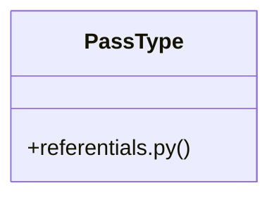

# [PassType & register_payload()] Cluster

> 26 nodes · cohesion 0.17

## Key Concepts

- [PassType](file:///Users/kodjododjango/Downloads/dev_projects/synca_conf_back/app/models/referentials.py#L19) (28 connections)
- [test_forms_register.py](file:///Users/kodjododjango/Downloads/dev_projects/synca_conf_back/tests/test_forms_register.py#L1) (12 connections)
- [register_payload()](file:///Users/kodjododjango/Downloads/dev_projects/synca_conf_back/tests/test_forms_register.py#L33) (10 connections)
- [open_ticketing()](file:///Users/kodjododjango/Downloads/dev_projects/synca_conf_back/tests/test_forms_register.py#L22) (9 connections)
- [test_payments_create.py](file:///Users/kodjododjango/Downloads/dev_projects/synca_conf_back/tests/test_payments_create.py#L1) (7 connections)
- [make_user()](file:///Users/kodjododjango/Downloads/dev_projects/synca_conf_back/tests/test_payments_create.py#L19) (6 connections)
- [test_register_duplicate_email_conflict()](file:///Users/kodjododjango/Downloads/dev_projects/synca_conf_back/tests/test_forms_register.py#L172) (5 connections)
- [test_register_valid_promo_code_accepted()](file:///Users/kodjododjango/Downloads/dev_projects/synca_conf_back/tests/test_forms_register.py#L155) (5 connections)
- [test_register_inactive_pass_type_400()](file:///Users/kodjododjango/Downloads/dev_projects/synca_conf_back/tests/test_forms_register.py#L124) (4 connections)
- [test_register_invalid_promo_code_400()](file:///Users/kodjododjango/Downloads/dev_projects/synca_conf_back/tests/test_forms_register.py#L139) (4 connections)
- [test_register_sends_confirmation_email()](file:///Users/kodjododjango/Downloads/dev_projects/synca_conf_back/tests/test_forms_register.py#L76) (4 connections)
- [test_register_success()](file:///Users/kodjododjango/Downloads/dev_projects/synca_conf_back/tests/test_forms_register.py#L58) (4 connections)
- [test_create_payment_applies_fixed_discount()](file:///Users/kodjododjango/Downloads/dev_projects/synca_conf_back/tests/test_payments_create.py#L87) (4 connections)
- [test_create_payment_applies_percent_discount()](file:///Users/kodjododjango/Downloads/dev_projects/synca_conf_back/tests/test_payments_create.py#L61) (4 connections)
- [test_register_invalid_pass_type_400()](file:///Users/kodjododjango/Downloads/dev_projects/synca_conf_back/tests/test_forms_register.py#L113) (3 connections)
- [test_register_missing_gdpr_consent_422()](file:///Users/kodjododjango/Downloads/dev_projects/synca_conf_back/tests/test_forms_register.py#L102) (3 connections)
- [test_create_payment_invalid_promo_400()](file:///Users/kodjododjango/Downloads/dev_projects/synca_conf_back/tests/test_payments_create.py#L125) (3 connections)
- [test_create_payment_success_no_promo()](file:///Users/kodjododjango/Downloads/dev_projects/synca_conf_back/tests/test_payments_create.py#L36) (3 connections)
- [test_public_pass_types.py](file:///Users/kodjododjango/Downloads/dev_projects/synca_conf_back/tests/test_public_pass_types.py#L1) (3 connections)
- [test_register_closed_window_forbidden()](file:///Users/kodjododjango/Downloads/dev_projects/synca_conf_back/tests/test_forms_register.py#L50) (2 connections)
- [test_create_payment_invalid_user_400()](file:///Users/kodjododjango/Downloads/dev_projects/synca_conf_back/tests/test_payments_create.py#L110) (2 connections)
- [test_list_pass_types_excludes_inactive()](file:///Users/kodjododjango/Downloads/dev_projects/synca_conf_back/tests/test_public_pass_types.py#L20) (2 connections)
- [client()](file:///Users/kodjododjango/Downloads/dev_projects/synca_conf_back/tests/test_forms_register.py#L13) (1 connections)
- [client()](file:///Users/kodjododjango/Downloads/dev_projects/synca_conf_back/tests/test_payments_create.py#L10) (1 connections)
- [client()](file:///Users/kodjododjango/Downloads/dev_projects/synca_conf_back/tests/test_public_pass_types.py#L10) (1 connections)
- *... and 1 more nodes in this community*

## Class Diagram

## Relationships

- No strong cross-community connections detected

## Source Files

- [/Users/kodjododjango/Downloads/dev_projects/synca_conf_back/app/models/referentials.py](file:///Users/kodjododjango/Downloads/dev_projects/synca_conf_back/app/models/referentials.py)
- [/Users/kodjododjango/Downloads/dev_projects/synca_conf_back/tests/test_forms_register.py](file:///Users/kodjododjango/Downloads/dev_projects/synca_conf_back/tests/test_forms_register.py)
- [/Users/kodjododjango/Downloads/dev_projects/synca_conf_back/tests/test_payments_create.py](file:///Users/kodjododjango/Downloads/dev_projects/synca_conf_back/tests/test_payments_create.py)
- [/Users/kodjododjango/Downloads/dev_projects/synca_conf_back/tests/test_public_pass_types.py](file:///Users/kodjododjango/Downloads/dev_projects/synca_conf_back/tests/test_public_pass_types.py)

## Audit Trail

- EXTRACTED: 88 (67%)
- INFERRED: 43 (33%)
- AMBIGUOUS: 0 (0%)

---

*Part of the graphify knowledge wiki. See [[index]] to navigate.*