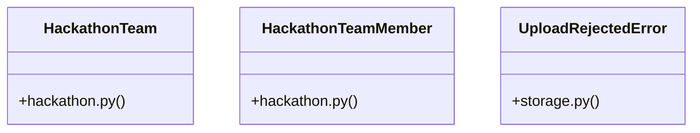

# [PassType & register_payload()] Cluster

> 34 nodes · cohesion 0.10

## Key Concepts

- [upload_file()](file:///Users/kodjododjango/Downloads/dev_projects/synca_conf_back/app/services/storage.py#L57) (18 connections)
- [parse_multipart_form()](file:///Users/kodjododjango/Downloads/dev_projects/synca_conf_back/app/core/multipart.py#L28) (10 connections)
- [test_storage.py](file:///Users/kodjododjango/Downloads/dev_projects/synca_conf_back/tests/test_storage.py#L1) (10 connections)
- [admin_hackathon.py](file:///Users/kodjododjango/Downloads/dev_projects/synca_conf_back/app/api/admin_hackathon.py#L1) (8 connections)
- [validate_is_real_image()](file:///Users/kodjododjango/Downloads/dev_projects/synca_conf_back/app/services/storage.py#L26) (6 connections)
- [create_team_member()](file:///Users/kodjododjango/Downloads/dev_projects/synca_conf_back/app/api/admin_hackathon.py#L138) (5 connections)
- [_get_team_or_404()](file:///Users/kodjododjango/Downloads/dev_projects/synca_conf_back/app/api/admin_hackathon.py#L26) (5 connections)
- [make_png_bytes()](file:///Users/kodjododjango/Downloads/dev_projects/synca_conf_back/tests/test_storage.py#L16) (5 connections)
- [storage.py](file:///Users/kodjododjango/Downloads/dev_projects/synca_conf_back/app/services/storage.py#L1) (5 connections)
- [HackathonTeam](file:///Users/kodjododjango/Downloads/dev_projects/synca_conf_back/app/models/hackathon.py#L9) (4 connections)
- [HackathonTeamMember](file:///Users/kodjododjango/Downloads/dev_projects/synca_conf_back/app/models/hackathon.py#L24) (4 connections)
- [UploadRejectedError](file:///Users/kodjododjango/Downloads/dev_projects/synca_conf_back/app/services/storage.py#L22) (4 connections)
- [create_team()](file:///Users/kodjododjango/Downloads/dev_projects/synca_conf_back/app/api/admin_hackathon.py#L67) (3 connections)
- [update_team_member()](file:///Users/kodjododjango/Downloads/dev_projects/synca_conf_back/app/api/admin_hackathon.py#L178) (3 connections)
- [test_upload_file_rejects_disallowed_content_type()](file:///Users/kodjododjango/Downloads/dev_projects/synca_conf_back/tests/test_storage.py#L32) (3 connections)
- [test_upload_file_respects_custom_max_bytes()](file:///Users/kodjododjango/Downloads/dev_projects/synca_conf_back/tests/test_storage.py#L96) (3 connections)
- [test_upload_file_success_never_uses_original_filename()](file:///Users/kodjododjango/Downloads/dev_projects/synca_conf_back/tests/test_storage.py#L54) (3 connections)
- [test_validate_is_real_image_accepts_real_image()](file:///Users/kodjododjango/Downloads/dev_projects/synca_conf_back/tests/test_storage.py#L22) (3 connections)
- [multipart.py](file:///Users/kodjododjango/Downloads/dev_projects/synca_conf_back/app/core/multipart.py#L1) (3 connections)
- [delete_team()](file:///Users/kodjododjango/Downloads/dev_projects/synca_conf_back/app/api/admin_hackathon.py#L112) (2 connections)
- [update_team()](file:///Users/kodjododjango/Downloads/dev_projects/synca_conf_back/app/api/admin_hackathon.py#L87) (2 connections)
- [_is_dict_annotation()](file:///Users/kodjododjango/Downloads/dev_projects/synca_conf_back/app/core/multipart.py#L19) (2 connections)
- [_is_list_annotation()](file:///Users/kodjododjango/Downloads/dev_projects/synca_conf_back/app/core/multipart.py#L10) (2 connections)
- [_generate_key()](file:///Users/kodjododjango/Downloads/dev_projects/synca_conf_back/app/services/storage.py#L50) (2 connections)
- [test_upload_file_pdf_skips_image_validation()](file:///Users/kodjododjango/Downloads/dev_projects/synca_conf_back/tests/test_storage.py#L76) (2 connections)
- *... and 9 more nodes in this community*

## Class Diagram

## Relationships

- [[[verify_stripe_signature() & payment_webhook()] Cluster]] (2 shared connections)

## Source Files

- [/Users/kodjododjango/Downloads/dev_projects/synca_conf_back/app/api/admin_hackathon.py](file:///Users/kodjododjango/Downloads/dev_projects/synca_conf_back/app/api/admin_hackathon.py)
- [/Users/kodjododjango/Downloads/dev_projects/synca_conf_back/app/core/multipart.py](file:///Users/kodjododjango/Downloads/dev_projects/synca_conf_back/app/core/multipart.py)
- [/Users/kodjododjango/Downloads/dev_projects/synca_conf_back/app/models/hackathon.py](file:///Users/kodjododjango/Downloads/dev_projects/synca_conf_back/app/models/hackathon.py)
- [/Users/kodjododjango/Downloads/dev_projects/synca_conf_back/app/services/storage.py](file:///Users/kodjododjango/Downloads/dev_projects/synca_conf_back/app/services/storage.py)
- [/Users/kodjododjango/Downloads/dev_projects/synca_conf_back/tests/test_storage.py](file:///Users/kodjododjango/Downloads/dev_projects/synca_conf_back/tests/test_storage.py)

## Audit Trail

- EXTRACTED: 90 (69%)
- INFERRED: 40 (31%)
- AMBIGUOUS: 0 (0%)

---

*Part of the graphify knowledge wiki. See [[index]] to navigate.*