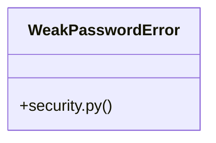

# [PassType & register_payload()] Cluster

> 19 nodes · cohesion 0.16

## Key Concepts

- [test_admin_panel.py](file:///Users/kodjododjango/Downloads/dev_projects/synca_conf_back/tests/test_admin_panel.py#L1) (9 connections)
- [make_admin()](file:///Users/kodjododjango/Downloads/dev_projects/synca_conf_back/tests/test_admin_panel.py#L16) (8 connections)
- [hash_password()](file:///Users/kodjododjango/Downloads/dev_projects/synca_conf_back/app/core/security.py#L37) (5 connections)
- [validate_password_strength()](file:///Users/kodjododjango/Downloads/dev_projects/synca_conf_back/app/core/security.py#L20) (4 connections)
- [verify_password()](file:///Users/kodjododjango/Downloads/dev_projects/synca_conf_back/app/core/security.py#L41) (4 connections)
- [security.py](file:///Users/kodjododjango/Downloads/dev_projects/synca_conf_back/app/core/security.py#L1) (4 connections)
- [test_security.py](file:///Users/kodjododjango/Downloads/dev_projects/synca_conf_back/tests/test_security.py#L1) (4 connections)
- [WeakPasswordError](file:///Users/kodjododjango/Downloads/dev_projects/synca_conf_back/app/core/security.py#L16) (3 connections)
- [test_login_success_grants_access_to_a_permitted_view()](file:///Users/kodjododjango/Downloads/dev_projects/synca_conf_back/tests/test_admin_panel.py#L88) (3 connections)
- [test_hash_and_verify_roundtrip()](file:///Users/kodjododjango/Downloads/dev_projects/synca_conf_back/tests/test_security.py#L11) (3 connections)
- [test_verify_wrong_password_fails()](file:///Users/kodjododjango/Downloads/dev_projects/synca_conf_back/tests/test_security.py#L17) (3 connections)
- [test_any_authenticated_admin_can_read_contact_messages()](file:///Users/kodjododjango/Downloads/dev_projects/synca_conf_back/tests/test_admin_panel.py#L138) (2 connections)
- [test_login_wrong_password_is_rejected()](file:///Users/kodjododjango/Downloads/dev_projects/synca_conf_back/tests/test_admin_panel.py#L105) (2 connections)
- [test_role_without_permission_gets_403_on_gated_view()](file:///Users/kodjododjango/Downloads/dev_projects/synca_conf_back/tests/test_admin_panel.py#L122) (2 connections)
- [test_validate_password_strength_accepts_strong_password()](file:///Users/kodjododjango/Downloads/dev_projects/synca_conf_back/tests/test_security.py#L37) (2 connections)
- [test_validate_password_strength_rejects_weak_passwords()](file:///Users/kodjododjango/Downloads/dev_projects/synca_conf_back/tests/test_security.py#L32) (2 connections)
- [client()](file:///Users/kodjododjango/Downloads/dev_projects/synca_conf_back/tests/test_admin_panel.py#L68) (1 connections)
- [_dispose_global_engine()](file:///Users/kodjododjango/Downloads/dev_projects/synca_conf_back/tests/test_admin_panel.py#L56) (1 connections)
- [test_unauthenticated_request_redirects_to_login()](file:///Users/kodjododjango/Downloads/dev_projects/synca_conf_back/tests/test_admin_panel.py#L154) (1 connections)

## Class Diagram

## Relationships

- No strong cross-community connections detected

## Source Files

- [/Users/kodjododjango/Downloads/dev_projects/synca_conf_back/app/core/security.py](file:///Users/kodjododjango/Downloads/dev_projects/synca_conf_back/app/core/security.py)
- [/Users/kodjododjango/Downloads/dev_projects/synca_conf_back/tests/test_admin_panel.py](file:///Users/kodjododjango/Downloads/dev_projects/synca_conf_back/tests/test_admin_panel.py)
- [/Users/kodjododjango/Downloads/dev_projects/synca_conf_back/tests/test_security.py](file:///Users/kodjododjango/Downloads/dev_projects/synca_conf_back/tests/test_security.py)

## Audit Trail

- EXTRACTED: 45 (71%)
- INFERRED: 18 (29%)
- AMBIGUOUS: 0 (0%)

---

*Part of the graphify knowledge wiki. See [[index]] to navigate.*