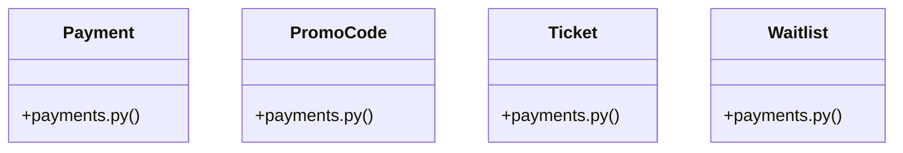

# [PromoCode & Payment] Cluster

> 42 nodes · cohesion 0.09

## Key Concepts

- [PromoCode](file:///Users/kodjododjango/Downloads/dev_projects/synca_conf_back/app/models/payments.py#L22) (17 connections)
- [Payment](file:///Users/kodjododjango/Downloads/dev_projects/synca_conf_back/app/models/payments.py#L37) (15 connections)
- [test_payments_webhook.py](file:///Users/kodjododjango/Downloads/dev_projects/synca_conf_back/tests/test_payments_webhook.py#L1) (14 connections)
- [make_pending_payment()](file:///Users/kodjododjango/Downloads/dev_projects/synca_conf_back/tests/test_payments_webhook.py#L49) (10 connections)
- [Ticket](file:///Users/kodjododjango/Downloads/dev_projects/synca_conf_back/app/models/payments.py#L65) (9 connections)
- [make_admin_with_permission()](file:///Users/kodjododjango/Downloads/dev_projects/synca_conf_back/tests/test_admin_stats.py#L24) (8 connections)
- [test_stats_computed_from_payments_tickets_and_applications()](file:///Users/kodjododjango/Downloads/dev_projects/synca_conf_back/tests/test_admin_stats.py#L89) (8 connections)
- [Waitlist](file:///Users/kodjododjango/Downloads/dev_projects/synca_conf_back/app/models/payments.py#L82) (7 connections)
- [wave_signature()](file:///Users/kodjododjango/Downloads/dev_projects/synca_conf_back/tests/test_payments_webhook.py#L77) (7 connections)
- [test_promo_validate.py](file:///Users/kodjododjango/Downloads/dev_projects/synca_conf_back/tests/test_promo_validate.py#L1) (7 connections)
- [test_webhook_increments_promo_usage_count_on_completion()](file:///Users/kodjododjango/Downloads/dev_projects/synca_conf_back/tests/test_payments_webhook.py#L257) (6 connections)
- [test_admin_stats.py](file:///Users/kodjododjango/Downloads/dev_projects/synca_conf_back/tests/test_admin_stats.py#L1) (6 connections)
- [make_user_and_pass()](file:///Users/kodjododjango/Downloads/dev_projects/synca_conf_back/tests/test_payments.py#L7) (5 connections)
- [test_promo_code_payment_ticket_waitlist_read()](file:///Users/kodjododjango/Downloads/dev_projects/synca_conf_back/tests/test_schemas.py#L109) (5 connections)
- [test_payments.py](file:///Users/kodjododjango/Downloads/dev_projects/synca_conf_back/tests/test_payments.py#L1) (5 connections)
- [make_user_and_pass_type()](file:///Users/kodjododjango/Downloads/dev_projects/synca_conf_back/tests/test_admin_stats.py#L60) (4 connections)
- [test_ticket_one_per_payment()](file:///Users/kodjododjango/Downloads/dev_projects/synca_conf_back/tests/test_payments.py#L56) (4 connections)
- [payments.py](file:///Users/kodjododjango/Downloads/dev_projects/synca_conf_back/app/models/payments.py#L1) (4 connections)
- [test_stats_forbidden_without_permission()](file:///Users/kodjododjango/Downloads/dev_projects/synca_conf_back/tests/test_admin_stats.py#L172) (3 connections)
- [test_stats_handles_no_completed_payments()](file:///Users/kodjododjango/Downloads/dev_projects/synca_conf_back/tests/test_admin_stats.py#L185) (3 connections)
- [test_payment_default_status_pending()](file:///Users/kodjododjango/Downloads/dev_projects/synca_conf_back/tests/test_payments.py#L39) (3 connections)
- [test_promo_code_and_waitlist_unique()](file:///Users/kodjododjango/Downloads/dev_projects/synca_conf_back/tests/test_payments.py#L94) (3 connections)
- [test_webhook_completes_payment_and_creates_ticket()](file:///Users/kodjododjango/Downloads/dev_projects/synca_conf_back/tests/test_payments_webhook.py#L106) (3 connections)
- [test_webhook_failed_status_marks_payment_failed()](file:///Users/kodjododjango/Downloads/dev_projects/synca_conf_back/tests/test_payments_webhook.py#L168) (3 connections)
- [test_webhook_rejects_transaction_ref_reused_on_other_payment()](file:///Users/kodjododjango/Downloads/dev_projects/synca_conf_back/tests/test_payments_webhook.py#L218) (3 connections)
- *... and 17 more nodes in this community*

## Class Diagram

## Relationships

- No strong cross-community connections detected

## Source Files

- [/Users/kodjododjango/Downloads/dev_projects/synca_conf_back/app/models/payments.py](file:///Users/kodjododjango/Downloads/dev_projects/synca_conf_back/app/models/payments.py)
- [/Users/kodjododjango/Downloads/dev_projects/synca_conf_back/tests/test_admin_stats.py](file:///Users/kodjododjango/Downloads/dev_projects/synca_conf_back/tests/test_admin_stats.py)
- [/Users/kodjododjango/Downloads/dev_projects/synca_conf_back/tests/test_payments.py](file:///Users/kodjododjango/Downloads/dev_projects/synca_conf_back/tests/test_payments.py)
- [/Users/kodjododjango/Downloads/dev_projects/synca_conf_back/tests/test_payments_webhook.py](file:///Users/kodjododjango/Downloads/dev_projects/synca_conf_back/tests/test_payments_webhook.py)
- [/Users/kodjododjango/Downloads/dev_projects/synca_conf_back/tests/test_promo_validate.py](file:///Users/kodjododjango/Downloads/dev_projects/synca_conf_back/tests/test_promo_validate.py)
- [/Users/kodjododjango/Downloads/dev_projects/synca_conf_back/tests/test_schemas.py](file:///Users/kodjododjango/Downloads/dev_projects/synca_conf_back/tests/test_schemas.py)

## Audit Trail

- EXTRACTED: 115 (60%)
- INFERRED: 77 (40%)
- AMBIGUOUS: 0 (0%)

---

*Part of the graphify knowledge wiki. See [[index]] to navigate.*