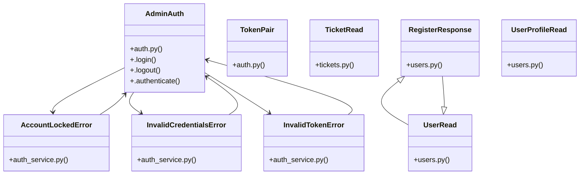

# [PromoCode & Payment] Cluster

> 58 nodes · cohesion 0.06

## Key Concepts

- [authenticate_admin()](file:///Users/kodjododjango/Downloads/dev_projects/synca_conf_back/app/services/auth_service.py#L36) (12 connections)
- [make_admin()](file:///Users/kodjododjango/Downloads/dev_projects/synca_conf_back/tests/test_admin_login.py#L19) (11 connections)
- [AdminAuth](file:///Users/kodjododjango/Downloads/dev_projects/synca_conf_back/app/admin/auth.py#L18) (10 connections)
- [decode_token()](file:///Users/kodjododjango/Downloads/dev_projects/synca_conf_back/app/services/auth_service.py#L121) (10 connections)
- [auth_service.py](file:///Users/kodjododjango/Downloads/dev_projects/synca_conf_back/app/services/auth_service.py#L1) (9 connections)
- [UserRead](file:///Users/kodjododjango/Downloads/dev_projects/synca_conf_back/app/schemas/users.py#L13) (9 connections)
- [InvalidTokenError](file:///Users/kodjododjango/Downloads/dev_projects/synca_conf_back/app/services/auth_service.py#L24) (8 connections)
- [TicketRead](file:///Users/kodjododjango/Downloads/dev_projects/synca_conf_back/app/schemas/tickets.py#L6) (7 connections)
- [test_admin_login.py](file:///Users/kodjododjango/Downloads/dev_projects/synca_conf_back/tests/test_admin_login.py#L1) (7 connections)
- [login()](file:///Users/kodjododjango/Downloads/dev_projects/synca_conf_back/app/api/auth.py#L24) (5 connections)
- [AccountLockedError](file:///Users/kodjododjango/Downloads/dev_projects/synca_conf_back/app/services/auth_service.py#L32) (5 connections)
- [InvalidCredentialsError](file:///Users/kodjododjango/Downloads/dev_projects/synca_conf_back/app/services/auth_service.py#L28) (5 connections)
- **Exception** (5 connections)
- [test_auth_service.py](file:///Users/kodjododjango/Downloads/dev_projects/synca_conf_back/tests/test_auth_service.py#L1) (5 connections)
- [build_admin_auth()](file:///Users/kodjododjango/Downloads/dev_projects/synca_conf_back/app/admin/auth.py#L73) (4 connections)
- [SQLAdmin login backed by the same admin_users/Argon2id/lockout path     as POST](file:///Users/kodjododjango/Downloads/dev_projects/synca_conf_back/app/admin/auth.py#L19) (4 connections)
- [create_participant_token()](file:///Users/kodjododjango/Downloads/dev_projects/synca_conf_back/app/services/auth_service.py#L105) (4 connections)
- [create_refresh_token()](file:///Users/kodjododjango/Downloads/dev_projects/synca_conf_back/app/services/auth_service.py#L101) (4 connections)
- [_create_token()](file:///Users/kodjododjango/Downloads/dev_projects/synca_conf_back/app/services/auth_service.py#L80) (4 connections)
- [Accepts either credential: the legacy one-time `access_token` handed     out at](file:///Users/kodjododjango/Downloads/dev_projects/synca_conf_back/app/api/user_me.py#L23) (4 connections)
- [TODO.md: ticket download from the web page.      Scoped to `Ticket.user_id == us](file:///Users/kodjododjango/Downloads/dev_projects/synca_conf_back/app/api/user_me.py#L77) (4 connections)
- [Right to erasure (RGPD) via anonymization, not a physical delete --     tickets/](file:///Users/kodjododjango/Downloads/dev_projects/synca_conf_back/app/api/user_me.py#L98) (4 connections)
- [user_me.py](file:///Users/kodjododjango/Downloads/dev_projects/synca_conf_back/app/api/user_me.py#L1) (4 connections)
- [.login()](file:///Users/kodjododjango/Downloads/dev_projects/synca_conf_back/app/admin/auth.py#L27) (3 connections)
- [TokenPair](file:///Users/kodjododjango/Downloads/dev_projects/synca_conf_back/app/schemas/auth.py#L9) (3 connections)
- *... and 33 more nodes in this community*

## Class Diagram

## Relationships

- No strong cross-community connections detected

## Source Files

- [/Users/kodjododjango/Downloads/dev_projects/synca_conf_back/app/admin/auth.py](file:///Users/kodjododjango/Downloads/dev_projects/synca_conf_back/app/admin/auth.py)
- [/Users/kodjododjango/Downloads/dev_projects/synca_conf_back/app/admin/setup.py](file:///Users/kodjododjango/Downloads/dev_projects/synca_conf_back/app/admin/setup.py)
- [/Users/kodjododjango/Downloads/dev_projects/synca_conf_back/app/api/auth.py](file:///Users/kodjododjango/Downloads/dev_projects/synca_conf_back/app/api/auth.py)
- [/Users/kodjododjango/Downloads/dev_projects/synca_conf_back/app/api/user_me.py](file:///Users/kodjododjango/Downloads/dev_projects/synca_conf_back/app/api/user_me.py)
- [/Users/kodjododjango/Downloads/dev_projects/synca_conf_back/app/schemas/auth.py](file:///Users/kodjododjango/Downloads/dev_projects/synca_conf_back/app/schemas/auth.py)
- [/Users/kodjododjango/Downloads/dev_projects/synca_conf_back/app/schemas/tickets.py](file:///Users/kodjododjango/Downloads/dev_projects/synca_conf_back/app/schemas/tickets.py)
- [/Users/kodjododjango/Downloads/dev_projects/synca_conf_back/app/schemas/users.py](file:///Users/kodjododjango/Downloads/dev_projects/synca_conf_back/app/schemas/users.py)
- [/Users/kodjododjango/Downloads/dev_projects/synca_conf_back/app/services/auth_service.py](file:///Users/kodjododjango/Downloads/dev_projects/synca_conf_back/app/services/auth_service.py)
- [/Users/kodjododjango/Downloads/dev_projects/synca_conf_back/tests/test_admin_login.py](file:///Users/kodjododjango/Downloads/dev_projects/synca_conf_back/tests/test_admin_login.py)
- [/Users/kodjododjango/Downloads/dev_projects/synca_conf_back/tests/test_audit_log.py](file:///Users/kodjododjango/Downloads/dev_projects/synca_conf_back/tests/test_audit_log.py)
- [/Users/kodjododjango/Downloads/dev_projects/synca_conf_back/tests/test_auth_service.py](file:///Users/kodjododjango/Downloads/dev_projects/synca_conf_back/tests/test_auth_service.py)

## Audit Trail

- EXTRACTED: 125 (57%)
- INFERRED: 94 (43%)
- AMBIGUOUS: 0 (0%)

---

*Part of the graphify knowledge wiki. See [[index]] to navigate.*