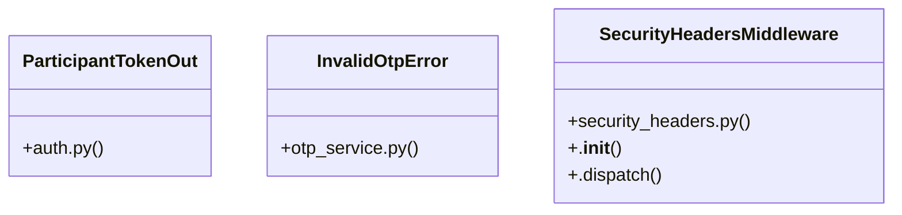

# [authenticate_admin() & make_admin()] Cluster

> 66 nodes · cohesion 0.04

## Key Concepts

- [send_email()](file:///Users/kodjododjango/Downloads/dev_projects/synca_conf_back/app/services/email_service.py#L9) (10 connections)
- [SecurityHeadersMiddleware](file:///Users/kodjododjango/Downloads/dev_projects/synca_conf_back/app/core/security_headers.py#L20) (10 connections)
- [make_ticket()](file:///Users/kodjododjango/Downloads/dev_projects/synca_conf_back/tests/test_ticket_finalization.py#L10) (9 connections)
- [request_otp()](file:///Users/kodjododjango/Downloads/dev_projects/synca_conf_back/app/services/otp_service.py#L30) (8 connections)
- [finalize_ticket()](file:///Users/kodjododjango/Downloads/dev_projects/synca_conf_back/app/services/ticket_finalization.py#L14) (8 connections)
- [email_templates.py](file:///Users/kodjododjango/Downloads/dev_projects/synca_conf_back/app/services/email_templates.py#L1) (8 connections)
- [_render()](file:///Users/kodjododjango/Downloads/dev_projects/synca_conf_back/app/services/email_templates.py#L47) (7 connections)
- [_waitlist_reminder_loop()](file:///Users/kodjododjango/Downloads/dev_projects/synca_conf_back/app/main.py#L55) (5 connections)
- [verify_otp()](file:///Users/kodjododjango/Downloads/dev_projects/synca_conf_back/app/services/otp_service.py#L60) (5 connections)
- [admin_campaign_windows.py](file:///Users/kodjododjango/Downloads/dev_projects/synca_conf_back/app/api/admin_campaign_windows.py#L1) (5 connections)
- [test_ticket_finalization.py](file:///Users/kodjododjango/Downloads/dev_projects/synca_conf_back/tests/test_ticket_finalization.py#L1) (5 connections)
- [send_waitlist_reminders()](file:///Users/kodjododjango/Downloads/dev_projects/synca_conf_back/app/services/waitlist_reminder.py#L36) (5 connections)
- [update_campaign_window()](file:///Users/kodjododjango/Downloads/dev_projects/synca_conf_back/app/api/admin_campaign_windows.py#L60) (4 connections)
- [verify_login_code()](file:///Users/kodjododjango/Downloads/dev_projects/synca_conf_back/app/api/participant_auth.py#L31) (4 connections)
- [test_finalize_ticket_sets_pdf_url_and_sends_email()](file:///Users/kodjododjango/Downloads/dev_projects/synca_conf_back/tests/test_ticket_finalization.py#L77) (4 connections)
- [generate_and_upload_ticket_pdf()](file:///Users/kodjododjango/Downloads/dev_projects/synca_conf_back/app/services/ticket_pdf.py#L96) (4 connections)
- [_render_ticket_pdf()](file:///Users/kodjododjango/Downloads/dev_projects/synca_conf_back/app/services/ticket_pdf.py#L34) (4 connections)
- [main.py](file:///Users/kodjododjango/Downloads/dev_projects/synca_conf_back/app/main.py#L1) (4 connections)
- [otp_service.py](file:///Users/kodjododjango/Downloads/dev_projects/synca_conf_back/app/services/otp_service.py#L1) (4 connections)
- [test_email_service.py](file:///Users/kodjododjango/Downloads/dev_projects/synca_conf_back/tests/test_email_service.py#L1) (4 connections)
- [_aware()](file:///Users/kodjododjango/Downloads/dev_projects/synca_conf_back/app/api/admin_campaign_windows.py#L19) (3 connections)
- [_is_open()](file:///Users/kodjododjango/Downloads/dev_projects/synca_conf_back/app/api/admin_campaign_windows.py#L23) (3 connections)
- [_notify_waitlist()](file:///Users/kodjododjango/Downloads/dev_projects/synca_conf_back/app/api/admin_campaign_windows.py#L27) (3 connections)
- [ParticipantTokenOut](file:///Users/kodjododjango/Downloads/dev_projects/synca_conf_back/app/schemas/auth.py#L28) (3 connections)
- [otp_login_email()](file:///Users/kodjododjango/Downloads/dev_projects/synca_conf_back/app/services/email_templates.py#L68) (3 connections)
- *... and 41 more nodes in this community*

## Class Diagram

## Relationships

- [[[send_email() & make_ticket()] Cluster]] (7 shared connections)
- [[[verify_stripe_signature() & payment_webhook()] Cluster]] (2 shared connections)
- [[[PassType & register_payload()] Cluster]] (1 shared connections)
- [[[FaqCategory & ContactMessage] Cluster]] (1 shared connections)

## Source Files

- [/Users/kodjododjango/Downloads/dev_projects/synca_conf_back/app/api/admin_campaign_windows.py](file:///Users/kodjododjango/Downloads/dev_projects/synca_conf_back/app/api/admin_campaign_windows.py)
- [/Users/kodjododjango/Downloads/dev_projects/synca_conf_back/app/api/participant_auth.py](file:///Users/kodjododjango/Downloads/dev_projects/synca_conf_back/app/api/participant_auth.py)
- [/Users/kodjododjango/Downloads/dev_projects/synca_conf_back/app/core/security_headers.py](file:///Users/kodjododjango/Downloads/dev_projects/synca_conf_back/app/core/security_headers.py)
- [/Users/kodjododjango/Downloads/dev_projects/synca_conf_back/app/main.py](file:///Users/kodjododjango/Downloads/dev_projects/synca_conf_back/app/main.py)
- [/Users/kodjododjango/Downloads/dev_projects/synca_conf_back/app/schemas/auth.py](file:///Users/kodjododjango/Downloads/dev_projects/synca_conf_back/app/schemas/auth.py)
- [/Users/kodjododjango/Downloads/dev_projects/synca_conf_back/app/services/email_service.py](file:///Users/kodjododjango/Downloads/dev_projects/synca_conf_back/app/services/email_service.py)
- [/Users/kodjododjango/Downloads/dev_projects/synca_conf_back/app/services/email_templates.py](file:///Users/kodjododjango/Downloads/dev_projects/synca_conf_back/app/services/email_templates.py)
- [/Users/kodjododjango/Downloads/dev_projects/synca_conf_back/app/services/otp_service.py](file:///Users/kodjododjango/Downloads/dev_projects/synca_conf_back/app/services/otp_service.py)
- [/Users/kodjododjango/Downloads/dev_projects/synca_conf_back/app/services/ticket_finalization.py](file:///Users/kodjododjango/Downloads/dev_projects/synca_conf_back/app/services/ticket_finalization.py)
- [/Users/kodjododjango/Downloads/dev_projects/synca_conf_back/app/services/ticket_pdf.py](file:///Users/kodjododjango/Downloads/dev_projects/synca_conf_back/app/services/ticket_pdf.py)
- [/Users/kodjododjango/Downloads/dev_projects/synca_conf_back/app/services/waitlist_reminder.py](file:///Users/kodjododjango/Downloads/dev_projects/synca_conf_back/app/services/waitlist_reminder.py)
- [/Users/kodjododjango/Downloads/dev_projects/synca_conf_back/tests/test_email_service.py](file:///Users/kodjododjango/Downloads/dev_projects/synca_conf_back/tests/test_email_service.py)
- [/Users/kodjododjango/Downloads/dev_projects/synca_conf_back/tests/test_ticket_finalization.py](file:///Users/kodjododjango/Downloads/dev_projects/synca_conf_back/tests/test_ticket_finalization.py)

## Audit Trail

- EXTRACTED: 137 (66%)
- INFERRED: 70 (34%)
- AMBIGUOUS: 0 (0%)

---

*Part of the graphify knowledge wiki. See [[index]] to navigate.*