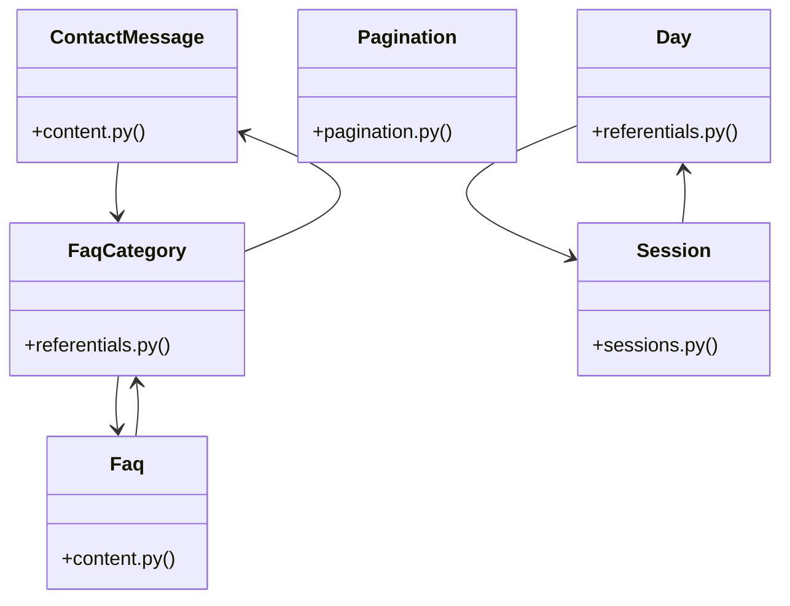

# [authenticate_admin() & make_admin()] Cluster

> 57 nodes · cohesion 0.05

## Key Concepts

- [FaqCategory](file:///Users/kodjododjango/Downloads/dev_projects/synca_conf_back/app/models/referentials.py#L106) (11 connections)
- [test_schemas.py](file:///Users/kodjododjango/Downloads/dev_projects/synca_conf_back/tests/test_schemas.py#L1) (11 connections)
- [Day](file:///Users/kodjododjango/Downloads/dev_projects/synca_conf_back/app/models/referentials.py#L10) (10 connections)
- [ContactMessage](file:///Users/kodjododjango/Downloads/dev_projects/synca_conf_back/app/models/content.py#L25) (9 connections)
- [Faq](file:///Users/kodjododjango/Downloads/dev_projects/synca_conf_back/app/models/content.py#L10) (9 connections)
- [Session](file:///Users/kodjododjango/Downloads/dev_projects/synca_conf_back/app/models/sessions.py#L24) (9 connections)
- [admin_program.py](file:///Users/kodjododjango/Downloads/dev_projects/synca_conf_back/app/api/admin_program.py#L1) (8 connections)
- [make_admin()](file:///Users/kodjododjango/Downloads/dev_projects/synca_conf_back/tests/test_admin_contacts.py#L11) (5 connections)
- [test_admin_contacts.py](file:///Users/kodjododjango/Downloads/dev_projects/synca_conf_back/tests/test_admin_contacts.py#L1) (5 connections)
- [test_pagination.py](file:///Users/kodjododjango/Downloads/dev_projects/synca_conf_back/tests/test_pagination.py#L1) (5 connections)
- [test_public_program.py](file:///Users/kodjododjango/Downloads/dev_projects/synca_conf_back/tests/test_public_program.py#L1) (5 connections)
- [test_any_authenticated_admin_can_list_contacts()](file:///Users/kodjododjango/Downloads/dev_projects/synca_conf_back/tests/test_admin_contacts.py#L37) (4 connections)
- [test_list_contacts_filters_by_is_read()](file:///Users/kodjododjango/Downloads/dev_projects/synca_conf_back/tests/test_admin_contacts.py#L53) (4 connections)
- [test_faq_crud_basic()](file:///Users/kodjododjango/Downloads/dev_projects/synca_conf_back/tests/test_content.py#L8) (4 connections)
- [create_faq_category()](file:///Users/kodjododjango/Downloads/dev_projects/synca_conf_back/app/api/admin_faqs.py#L39) (3 connections)
- [create_day()](file:///Users/kodjododjango/Downloads/dev_projects/synca_conf_back/app/api/admin_program.py#L34) (3 connections)
- [create_session()](file:///Users/kodjododjango/Downloads/dev_projects/synca_conf_back/app/api/admin_program.py#L138) (3 connections)
- [pagination_params()](file:///Users/kodjododjango/Downloads/dev_projects/synca_conf_back/app/deps/pagination.py#L12) (3 connections)
- [test_contact_message_default_unread()](file:///Users/kodjododjango/Downloads/dev_projects/synca_conf_back/tests/test_content.py#L32) (3 connections)
- [test_pagination_limit_actually_limits_results()](file:///Users/kodjododjango/Downloads/dev_projects/synca_conf_back/tests/test_pagination.py#L52) (3 connections)
- [test_faqs_filter_by_category()](file:///Users/kodjododjango/Downloads/dev_projects/synca_conf_back/tests/test_public_faqs.py#L20) (3 connections)
- [test_sessions_filter_by_day_and_category_excludes_private()](file:///Users/kodjododjango/Downloads/dev_projects/synca_conf_back/tests/test_public_program.py#L49) (3 connections)
- [test_partner_level_and_faq_category()](file:///Users/kodjododjango/Downloads/dev_projects/synca_conf_back/tests/test_referentials.py#L30) (3 connections)
- [test_content_read()](file:///Users/kodjododjango/Downloads/dev_projects/synca_conf_back/tests/test_schemas.py#L177) (3 connections)
- [test_filter_sessions_by_day_and_category()](file:///Users/kodjododjango/Downloads/dev_projects/synca_conf_back/tests/test_sessions.py#L10) (3 connections)
- *... and 32 more nodes in this community*

## Class Diagram

## Relationships

- No strong cross-community connections detected

## Source Files

- [/Users/kodjododjango/Downloads/dev_projects/synca_conf_back/app/api/admin_faqs.py](file:///Users/kodjododjango/Downloads/dev_projects/synca_conf_back/app/api/admin_faqs.py)
- [/Users/kodjododjango/Downloads/dev_projects/synca_conf_back/app/api/admin_program.py](file:///Users/kodjododjango/Downloads/dev_projects/synca_conf_back/app/api/admin_program.py)
- [/Users/kodjododjango/Downloads/dev_projects/synca_conf_back/app/deps/pagination.py](file:///Users/kodjododjango/Downloads/dev_projects/synca_conf_back/app/deps/pagination.py)
- [/Users/kodjododjango/Downloads/dev_projects/synca_conf_back/app/models/content.py](file:///Users/kodjododjango/Downloads/dev_projects/synca_conf_back/app/models/content.py)
- [/Users/kodjododjango/Downloads/dev_projects/synca_conf_back/app/models/referentials.py](file:///Users/kodjododjango/Downloads/dev_projects/synca_conf_back/app/models/referentials.py)
- [/Users/kodjododjango/Downloads/dev_projects/synca_conf_back/app/models/sessions.py](file:///Users/kodjododjango/Downloads/dev_projects/synca_conf_back/app/models/sessions.py)
- [/Users/kodjododjango/Downloads/dev_projects/synca_conf_back/tests/test_admin_contacts.py](file:///Users/kodjododjango/Downloads/dev_projects/synca_conf_back/tests/test_admin_contacts.py)
- [/Users/kodjododjango/Downloads/dev_projects/synca_conf_back/tests/test_content.py](file:///Users/kodjododjango/Downloads/dev_projects/synca_conf_back/tests/test_content.py)
- [/Users/kodjododjango/Downloads/dev_projects/synca_conf_back/tests/test_pagination.py](file:///Users/kodjododjango/Downloads/dev_projects/synca_conf_back/tests/test_pagination.py)
- [/Users/kodjododjango/Downloads/dev_projects/synca_conf_back/tests/test_public_faqs.py](file:///Users/kodjododjango/Downloads/dev_projects/synca_conf_back/tests/test_public_faqs.py)
- [/Users/kodjododjango/Downloads/dev_projects/synca_conf_back/tests/test_public_program.py](file:///Users/kodjododjango/Downloads/dev_projects/synca_conf_back/tests/test_public_program.py)
- [/Users/kodjododjango/Downloads/dev_projects/synca_conf_back/tests/test_referentials.py](file:///Users/kodjododjango/Downloads/dev_projects/synca_conf_back/tests/test_referentials.py)
- [/Users/kodjododjango/Downloads/dev_projects/synca_conf_back/tests/test_schemas.py](file:///Users/kodjododjango/Downloads/dev_projects/synca_conf_back/tests/test_schemas.py)
- [/Users/kodjododjango/Downloads/dev_projects/synca_conf_back/tests/test_sessions.py](file:///Users/kodjododjango/Downloads/dev_projects/synca_conf_back/tests/test_sessions.py)

## Audit Trail

- EXTRACTED: 104 (57%)
- INFERRED: 78 (43%)
- AMBIGUOUS: 0 (0%)

---

*Part of the graphify knowledge wiki. See [[index]] to navigate.*