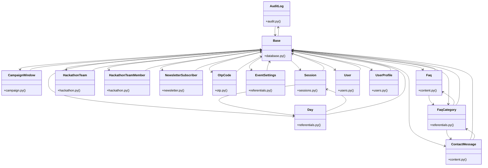

# [create_access_token() & Role] Cluster

> 95 nodes · cohesion 0.03

## Key Concepts

- [Base](file:///Users/kodjododjango/Downloads/dev_projects/synca_conf_back/app/core/database.py#L13) (34 connections)
- **Base** (28 connections)
- [User](file:///Users/kodjododjango/Downloads/dev_projects/synca_conf_back/app/models/users.py#L24) (20 connections)
- [FaqCategory](file:///Users/kodjododjango/Downloads/dev_projects/synca_conf_back/app/models/referentials.py#L43) (11 connections)
- [test_schemas.py](file:///Users/kodjododjango/Downloads/dev_projects/synca_conf_back/tests/test_schemas.py#L1) (11 connections)
- [Day](file:///Users/kodjododjango/Downloads/dev_projects/synca_conf_back/app/models/referentials.py#L10) (10 connections)
- [ContactMessage](file:///Users/kodjododjango/Downloads/dev_projects/synca_conf_back/app/models/content.py#L25) (9 connections)
- [Faq](file:///Users/kodjododjango/Downloads/dev_projects/synca_conf_back/app/models/content.py#L10) (9 connections)
- [Session](file:///Users/kodjododjango/Downloads/dev_projects/synca_conf_back/app/models/sessions.py#L24) (9 connections)
- [admin_faqs.py](file:///Users/kodjododjango/Downloads/dev_projects/synca_conf_back/app/api/admin_faqs.py#L1) (8 connections)
- [admin_program.py](file:///Users/kodjododjango/Downloads/dev_projects/synca_conf_back/app/api/admin_program.py#L1) (8 connections)
- [UserProfile](file:///Users/kodjododjango/Downloads/dev_projects/synca_conf_back/app/models/users.py#L70) (7 connections)
- [OtpCode](file:///Users/kodjododjango/Downloads/dev_projects/synca_conf_back/app/models/otp.py#L9) (6 connections)
- [CampaignWindow](file:///Users/kodjododjango/Downloads/dev_projects/synca_conf_back/app/models/campaign.py#L20) (5 connections)
- [register()](file:///Users/kodjododjango/Downloads/dev_projects/synca_conf_back/app/api/forms.py#L90) (5 connections)
- [EventSettings](file:///Users/kodjododjango/Downloads/dev_projects/synca_conf_back/app/models/referentials.py#L50) (5 connections)
- [referentials.py](file:///Users/kodjododjango/Downloads/dev_projects/synca_conf_back/app/models/referentials.py#L1) (5 connections)
- [test_public_program.py](file:///Users/kodjododjango/Downloads/dev_projects/synca_conf_back/tests/test_public_program.py#L1) (5 connections)
- [AuditLog](file:///Users/kodjododjango/Downloads/dev_projects/synca_conf_back/app/models/audit.py#L9) (4 connections)
- [HackathonTeam](file:///Users/kodjododjango/Downloads/dev_projects/synca_conf_back/app/models/hackathon.py#L9) (4 connections)
- [HackathonTeamMember](file:///Users/kodjododjango/Downloads/dev_projects/synca_conf_back/app/models/hackathon.py#L24) (4 connections)
- [NewsletterSubscriber](file:///Users/kodjododjango/Downloads/dev_projects/synca_conf_back/app/models/newsletter.py#L9) (4 connections)
- [make_user()](file:///Users/kodjododjango/Downloads/dev_projects/synca_conf_back/tests/test_crypto.py#L7) (4 connections)
- [make_user()](file:///Users/kodjododjango/Downloads/dev_projects/synca_conf_back/tests/test_users.py#L7) (4 connections)
- [env.py](file:///Users/kodjododjango/Downloads/dev_projects/synca_conf_back/alembic/env.py#L1) (4 connections)
- *... and 70 more nodes in this community*

## Class Diagram

## Relationships

- [[[verify_stripe_signature() & payment_webhook()] Cluster]] (1 shared connections)

## Source Files

- [/Users/kodjododjango/Downloads/dev_projects/synca_conf_back/alembic/env.py](file:///Users/kodjododjango/Downloads/dev_projects/synca_conf_back/alembic/env.py)
- [/Users/kodjododjango/Downloads/dev_projects/synca_conf_back/app/api/admin_faqs.py](file:///Users/kodjododjango/Downloads/dev_projects/synca_conf_back/app/api/admin_faqs.py)
- [/Users/kodjododjango/Downloads/dev_projects/synca_conf_back/app/api/admin_program.py](file:///Users/kodjododjango/Downloads/dev_projects/synca_conf_back/app/api/admin_program.py)
- [/Users/kodjododjango/Downloads/dev_projects/synca_conf_back/app/api/forms.py](file:///Users/kodjododjango/Downloads/dev_projects/synca_conf_back/app/api/forms.py)
- [/Users/kodjododjango/Downloads/dev_projects/synca_conf_back/app/core/database.py](file:///Users/kodjododjango/Downloads/dev_projects/synca_conf_back/app/core/database.py)
- [/Users/kodjododjango/Downloads/dev_projects/synca_conf_back/app/models/audit.py](file:///Users/kodjododjango/Downloads/dev_projects/synca_conf_back/app/models/audit.py)
- [/Users/kodjododjango/Downloads/dev_projects/synca_conf_back/app/models/campaign.py](file:///Users/kodjododjango/Downloads/dev_projects/synca_conf_back/app/models/campaign.py)
- [/Users/kodjododjango/Downloads/dev_projects/synca_conf_back/app/models/content.py](file:///Users/kodjododjango/Downloads/dev_projects/synca_conf_back/app/models/content.py)
- [/Users/kodjododjango/Downloads/dev_projects/synca_conf_back/app/models/hackathon.py](file:///Users/kodjododjango/Downloads/dev_projects/synca_conf_back/app/models/hackathon.py)
- [/Users/kodjododjango/Downloads/dev_projects/synca_conf_back/app/models/newsletter.py](file:///Users/kodjododjango/Downloads/dev_projects/synca_conf_back/app/models/newsletter.py)
- [/Users/kodjododjango/Downloads/dev_projects/synca_conf_back/app/models/otp.py](file:///Users/kodjododjango/Downloads/dev_projects/synca_conf_back/app/models/otp.py)
- [/Users/kodjododjango/Downloads/dev_projects/synca_conf_back/app/models/referentials.py](file:///Users/kodjododjango/Downloads/dev_projects/synca_conf_back/app/models/referentials.py)
- [/Users/kodjododjango/Downloads/dev_projects/synca_conf_back/app/models/sessions.py](file:///Users/kodjododjango/Downloads/dev_projects/synca_conf_back/app/models/sessions.py)
- [/Users/kodjododjango/Downloads/dev_projects/synca_conf_back/app/models/users.py](file:///Users/kodjododjango/Downloads/dev_projects/synca_conf_back/app/models/users.py)
- [/Users/kodjododjango/Downloads/dev_projects/synca_conf_back/tests/test_content.py](file:///Users/kodjododjango/Downloads/dev_projects/synca_conf_back/tests/test_content.py)
- [/Users/kodjododjango/Downloads/dev_projects/synca_conf_back/tests/test_crypto.py](file:///Users/kodjododjango/Downloads/dev_projects/synca_conf_back/tests/test_crypto.py)
- [/Users/kodjododjango/Downloads/dev_projects/synca_conf_back/tests/test_pagination.py](file:///Users/kodjododjango/Downloads/dev_projects/synca_conf_back/tests/test_pagination.py)
- [/Users/kodjododjango/Downloads/dev_projects/synca_conf_back/tests/test_public_faqs.py](file:///Users/kodjododjango/Downloads/dev_projects/synca_conf_back/tests/test_public_faqs.py)
- [/Users/kodjododjango/Downloads/dev_projects/synca_conf_back/tests/test_public_program.py](file:///Users/kodjododjango/Downloads/dev_projects/synca_conf_back/tests/test_public_program.py)
- [/Users/kodjododjango/Downloads/dev_projects/synca_conf_back/tests/test_referentials.py](file:///Users/kodjododjango/Downloads/dev_projects/synca_conf_back/tests/test_referentials.py)

## Audit Trail

- EXTRACTED: 201 (57%)
- INFERRED: 152 (43%)
- AMBIGUOUS: 0 (0%)

---

*Part of the graphify knowledge wiki. See [[index]] to navigate.*