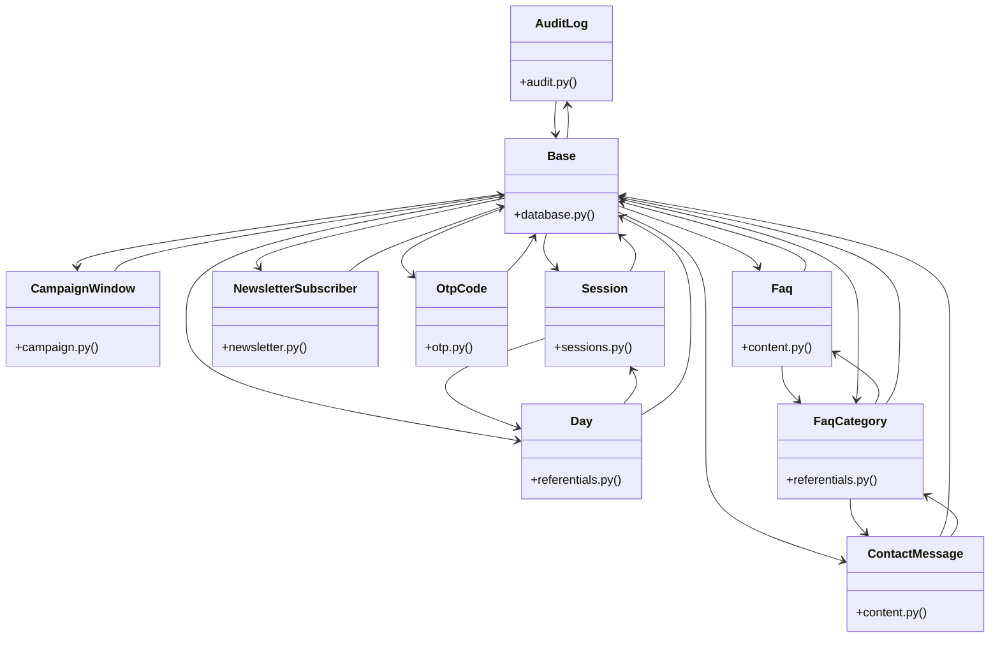

# [create_access_token() & Role] Cluster

> 65 nodes · cohesion 0.05

## Key Concepts

- [Base](file:///Users/kodjododjango/Downloads/dev_projects/synca_conf_back/app/core/database.py#L13) (31 connections)
- **Base** (25 connections)
- [test_schemas.py](file:///Users/kodjododjango/Downloads/dev_projects/synca_conf_back/tests/test_schemas.py#L1) (11 connections)
- [FaqCategory](file:///Users/kodjododjango/Downloads/dev_projects/synca_conf_back/app/models/referentials.py#L43) (10 connections)
- [ContactMessage](file:///Users/kodjododjango/Downloads/dev_projects/synca_conf_back/app/models/content.py#L25) (9 connections)
- [Day](file:///Users/kodjododjango/Downloads/dev_projects/synca_conf_back/app/models/referentials.py#L10) (9 connections)
- [Faq](file:///Users/kodjododjango/Downloads/dev_projects/synca_conf_back/app/models/content.py#L10) (8 connections)
- [Session](file:///Users/kodjododjango/Downloads/dev_projects/synca_conf_back/app/models/sessions.py#L24) (8 connections)
- [OtpCode](file:///Users/kodjododjango/Downloads/dev_projects/synca_conf_back/app/models/otp.py#L9) (6 connections)
- [make_admin()](file:///Users/kodjododjango/Downloads/dev_projects/synca_conf_back/tests/test_admin_contacts.py#L11) (5 connections)
- [test_admin_contacts.py](file:///Users/kodjododjango/Downloads/dev_projects/synca_conf_back/tests/test_admin_contacts.py#L1) (5 connections)
- [test_public_program.py](file:///Users/kodjododjango/Downloads/dev_projects/synca_conf_back/tests/test_public_program.py#L1) (5 connections)
- [AuditLog](file:///Users/kodjododjango/Downloads/dev_projects/synca_conf_back/app/models/audit.py#L9) (4 connections)
- [CampaignWindow](file:///Users/kodjododjango/Downloads/dev_projects/synca_conf_back/app/models/campaign.py#L17) (4 connections)
- [NewsletterSubscriber](file:///Users/kodjododjango/Downloads/dev_projects/synca_conf_back/app/models/newsletter.py#L9) (4 connections)
- [test_any_authenticated_admin_can_list_contacts()](file:///Users/kodjododjango/Downloads/dev_projects/synca_conf_back/tests/test_admin_contacts.py#L37) (4 connections)
- [test_list_contacts_filters_by_is_read()](file:///Users/kodjododjango/Downloads/dev_projects/synca_conf_back/tests/test_admin_contacts.py#L53) (4 connections)
- [env.py](file:///Users/kodjododjango/Downloads/dev_projects/synca_conf_back/alembic/env.py#L1) (4 connections)
- [referentials.py](file:///Users/kodjododjango/Downloads/dev_projects/synca_conf_back/app/models/referentials.py#L1) (4 connections)
- [run_async_migrations()](file:///Users/kodjododjango/Downloads/dev_projects/synca_conf_back/alembic/env.py#L63) (3 connections)
- [run_migrations_online()](file:///Users/kodjododjango/Downloads/dev_projects/synca_conf_back/alembic/env.py#L81) (3 connections)
- [test_faq_crud_basic()](file:///Users/kodjododjango/Downloads/dev_projects/synca_conf_back/tests/test_content.py#L8) (3 connections)
- [test_pagination_limit_actually_limits_results()](file:///Users/kodjododjango/Downloads/dev_projects/synca_conf_back/tests/test_pagination.py#L52) (3 connections)
- [test_faqs_filter_by_category()](file:///Users/kodjododjango/Downloads/dev_projects/synca_conf_back/tests/test_public_faqs.py#L20) (3 connections)
- [test_sessions_filter_by_day_and_category_excludes_private()](file:///Users/kodjododjango/Downloads/dev_projects/synca_conf_back/tests/test_public_program.py#L49) (3 connections)
- *... and 40 more nodes in this community*

## Class Diagram

## Relationships

- No strong cross-community connections detected

## Source Files

- [/Users/kodjododjango/Downloads/dev_projects/synca_conf_back/alembic/env.py](file:///Users/kodjododjango/Downloads/dev_projects/synca_conf_back/alembic/env.py)
- [/Users/kodjododjango/Downloads/dev_projects/synca_conf_back/app/api/forms.py](file:///Users/kodjododjango/Downloads/dev_projects/synca_conf_back/app/api/forms.py)
- [/Users/kodjododjango/Downloads/dev_projects/synca_conf_back/app/core/database.py](file:///Users/kodjododjango/Downloads/dev_projects/synca_conf_back/app/core/database.py)
- [/Users/kodjododjango/Downloads/dev_projects/synca_conf_back/app/models/audit.py](file:///Users/kodjododjango/Downloads/dev_projects/synca_conf_back/app/models/audit.py)
- [/Users/kodjododjango/Downloads/dev_projects/synca_conf_back/app/models/campaign.py](file:///Users/kodjododjango/Downloads/dev_projects/synca_conf_back/app/models/campaign.py)
- [/Users/kodjododjango/Downloads/dev_projects/synca_conf_back/app/models/content.py](file:///Users/kodjododjango/Downloads/dev_projects/synca_conf_back/app/models/content.py)
- [/Users/kodjododjango/Downloads/dev_projects/synca_conf_back/app/models/newsletter.py](file:///Users/kodjododjango/Downloads/dev_projects/synca_conf_back/app/models/newsletter.py)
- [/Users/kodjododjango/Downloads/dev_projects/synca_conf_back/app/models/otp.py](file:///Users/kodjododjango/Downloads/dev_projects/synca_conf_back/app/models/otp.py)
- [/Users/kodjododjango/Downloads/dev_projects/synca_conf_back/app/models/referentials.py](file:///Users/kodjododjango/Downloads/dev_projects/synca_conf_back/app/models/referentials.py)
- [/Users/kodjododjango/Downloads/dev_projects/synca_conf_back/app/models/sessions.py](file:///Users/kodjododjango/Downloads/dev_projects/synca_conf_back/app/models/sessions.py)
- [/Users/kodjododjango/Downloads/dev_projects/synca_conf_back/tests/test_admin_contacts.py](file:///Users/kodjododjango/Downloads/dev_projects/synca_conf_back/tests/test_admin_contacts.py)
- [/Users/kodjododjango/Downloads/dev_projects/synca_conf_back/tests/test_content.py](file:///Users/kodjododjango/Downloads/dev_projects/synca_conf_back/tests/test_content.py)
- [/Users/kodjododjango/Downloads/dev_projects/synca_conf_back/tests/test_pagination.py](file:///Users/kodjododjango/Downloads/dev_projects/synca_conf_back/tests/test_pagination.py)
- [/Users/kodjododjango/Downloads/dev_projects/synca_conf_back/tests/test_public_faqs.py](file:///Users/kodjododjango/Downloads/dev_projects/synca_conf_back/tests/test_public_faqs.py)
- [/Users/kodjododjango/Downloads/dev_projects/synca_conf_back/tests/test_public_program.py](file:///Users/kodjododjango/Downloads/dev_projects/synca_conf_back/tests/test_public_program.py)
- [/Users/kodjododjango/Downloads/dev_projects/synca_conf_back/tests/test_referentials.py](file:///Users/kodjododjango/Downloads/dev_projects/synca_conf_back/tests/test_referentials.py)
- [/Users/kodjododjango/Downloads/dev_projects/synca_conf_back/tests/test_schemas.py](file:///Users/kodjododjango/Downloads/dev_projects/synca_conf_back/tests/test_schemas.py)
- [/Users/kodjododjango/Downloads/dev_projects/synca_conf_back/tests/test_sessions.py](file:///Users/kodjododjango/Downloads/dev_projects/synca_conf_back/tests/test_sessions.py)

## Audit Trail

- EXTRACTED: 140 (57%)
- INFERRED: 107 (43%)
- AMBIGUOUS: 0 (0%)

---

*Part of the graphify knowledge wiki. See [[index]] to navigate.*