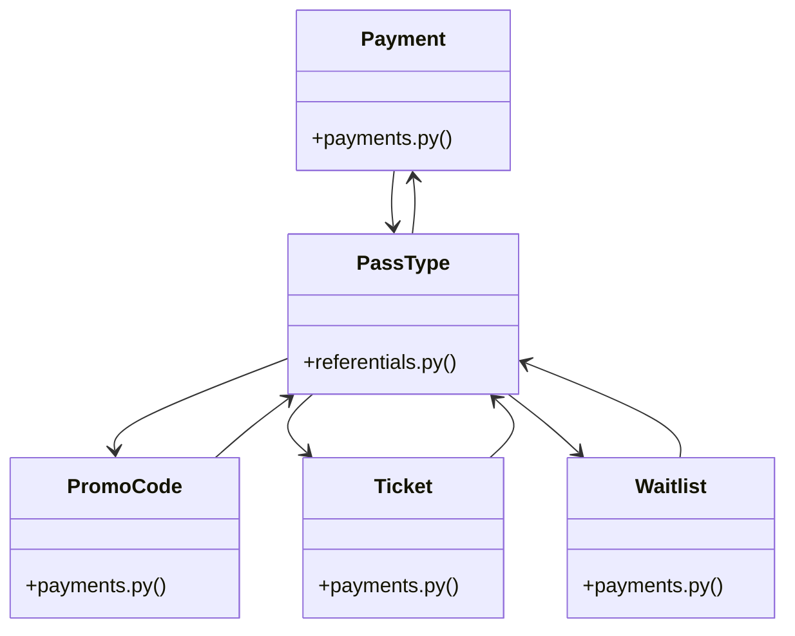

# [create_access_token() & Role] Cluster

> 72 nodes · cohesion 0.05

## Key Concepts

- [PassType](file:///Users/kodjododjango/Downloads/dev_projects/synca_conf_back/app/models/referentials.py#L19) (30 connections)
- [PromoCode](file:///Users/kodjododjango/Downloads/dev_projects/synca_conf_back/app/models/payments.py#L22) (18 connections)
- [Payment](file:///Users/kodjododjango/Downloads/dev_projects/synca_conf_back/app/models/payments.py#L37) (16 connections)
- [test_forms_register.py](file:///Users/kodjododjango/Downloads/dev_projects/synca_conf_back/tests/test_forms_register.py#L1) (12 connections)
- [Ticket](file:///Users/kodjododjango/Downloads/dev_projects/synca_conf_back/app/models/payments.py#L65) (10 connections)
- [register_payload()](file:///Users/kodjododjango/Downloads/dev_projects/synca_conf_back/tests/test_forms_register.py#L33) (10 connections)
- [test_user_me.py](file:///Users/kodjododjango/Downloads/dev_projects/synca_conf_back/tests/test_user_me.py#L1) (10 connections)
- [open_ticketing()](file:///Users/kodjododjango/Downloads/dev_projects/synca_conf_back/tests/test_forms_register.py#L22) (9 connections)
- [make_admin_with_permission()](file:///Users/kodjododjango/Downloads/dev_projects/synca_conf_back/tests/test_admin_stats.py#L24) (8 connections)
- [test_stats_computed_from_payments_tickets_and_applications()](file:///Users/kodjododjango/Downloads/dev_projects/synca_conf_back/tests/test_admin_stats.py#L89) (8 connections)
- [Waitlist](file:///Users/kodjododjango/Downloads/dev_projects/synca_conf_back/app/models/payments.py#L82) (7 connections)
- [make_user()](file:///Users/kodjododjango/Downloads/dev_projects/synca_conf_back/tests/test_user_me.py#L9) (7 connections)
- [test_payments_create.py](file:///Users/kodjododjango/Downloads/dev_projects/synca_conf_back/tests/test_payments_create.py#L1) (7 connections)
- [test_promo_validate.py](file:///Users/kodjododjango/Downloads/dev_projects/synca_conf_back/tests/test_promo_validate.py#L1) (7 connections)
- [make_user()](file:///Users/kodjododjango/Downloads/dev_projects/synca_conf_back/tests/test_payments_create.py#L19) (6 connections)
- [test_admin_stats.py](file:///Users/kodjododjango/Downloads/dev_projects/synca_conf_back/tests/test_admin_stats.py#L1) (6 connections)
- [test_register_duplicate_email_conflict()](file:///Users/kodjododjango/Downloads/dev_projects/synca_conf_back/tests/test_forms_register.py#L172) (5 connections)
- [test_register_valid_promo_code_accepted()](file:///Users/kodjododjango/Downloads/dev_projects/synca_conf_back/tests/test_forms_register.py#L155) (5 connections)
- [make_user_and_pass()](file:///Users/kodjododjango/Downloads/dev_projects/synca_conf_back/tests/test_payments.py#L7) (5 connections)
- [test_promo_code_payment_ticket_waitlist_read()](file:///Users/kodjododjango/Downloads/dev_projects/synca_conf_back/tests/test_schemas.py#L109) (5 connections)
- [make_ticket_for()](file:///Users/kodjododjango/Downloads/dev_projects/synca_conf_back/tests/test_user_me.py#L73) (5 connections)
- [test_payments.py](file:///Users/kodjododjango/Downloads/dev_projects/synca_conf_back/tests/test_payments.py#L1) (5 connections)
- [make_user_and_pass_type()](file:///Users/kodjododjango/Downloads/dev_projects/synca_conf_back/tests/test_admin_stats.py#L60) (4 connections)
- [test_register_inactive_pass_type_400()](file:///Users/kodjododjango/Downloads/dev_projects/synca_conf_back/tests/test_forms_register.py#L124) (4 connections)
- [test_register_invalid_promo_code_400()](file:///Users/kodjododjango/Downloads/dev_projects/synca_conf_back/tests/test_forms_register.py#L139) (4 connections)
- *... and 47 more nodes in this community*

## Class Diagram

## Relationships

- No strong cross-community connections detected

## Source Files

- [/Users/kodjododjango/Downloads/dev_projects/synca_conf_back/app/api/admin_pass_types.py](file:///Users/kodjododjango/Downloads/dev_projects/synca_conf_back/app/api/admin_pass_types.py)
- [/Users/kodjododjango/Downloads/dev_projects/synca_conf_back/app/api/admin_promo_codes.py](file:///Users/kodjododjango/Downloads/dev_projects/synca_conf_back/app/api/admin_promo_codes.py)
- [/Users/kodjododjango/Downloads/dev_projects/synca_conf_back/app/models/payments.py](file:///Users/kodjododjango/Downloads/dev_projects/synca_conf_back/app/models/payments.py)
- [/Users/kodjododjango/Downloads/dev_projects/synca_conf_back/app/models/referentials.py](file:///Users/kodjododjango/Downloads/dev_projects/synca_conf_back/app/models/referentials.py)
- [/Users/kodjododjango/Downloads/dev_projects/synca_conf_back/tests/test_admin_stats.py](file:///Users/kodjododjango/Downloads/dev_projects/synca_conf_back/tests/test_admin_stats.py)
- [/Users/kodjododjango/Downloads/dev_projects/synca_conf_back/tests/test_forms_register.py](file:///Users/kodjododjango/Downloads/dev_projects/synca_conf_back/tests/test_forms_register.py)
- [/Users/kodjododjango/Downloads/dev_projects/synca_conf_back/tests/test_payments.py](file:///Users/kodjododjango/Downloads/dev_projects/synca_conf_back/tests/test_payments.py)
- [/Users/kodjododjango/Downloads/dev_projects/synca_conf_back/tests/test_payments_create.py](file:///Users/kodjododjango/Downloads/dev_projects/synca_conf_back/tests/test_payments_create.py)
- [/Users/kodjododjango/Downloads/dev_projects/synca_conf_back/tests/test_promo_validate.py](file:///Users/kodjododjango/Downloads/dev_projects/synca_conf_back/tests/test_promo_validate.py)
- [/Users/kodjododjango/Downloads/dev_projects/synca_conf_back/tests/test_public_pass_types.py](file:///Users/kodjododjango/Downloads/dev_projects/synca_conf_back/tests/test_public_pass_types.py)
- [/Users/kodjododjango/Downloads/dev_projects/synca_conf_back/tests/test_schemas.py](file:///Users/kodjododjango/Downloads/dev_projects/synca_conf_back/tests/test_schemas.py)
- [/Users/kodjododjango/Downloads/dev_projects/synca_conf_back/tests/test_user_me.py](file:///Users/kodjododjango/Downloads/dev_projects/synca_conf_back/tests/test_user_me.py)

## Audit Trail

- EXTRACTED: 193 (61%)
- INFERRED: 124 (39%)
- AMBIGUOUS: 0 (0%)

---

*Part of the graphify knowledge wiki. See [[index]] to navigate.*