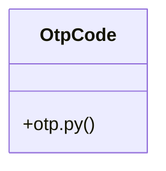

# [form_fields() & make_png_bytes()] Cluster

> 15 nodes · cohesion 0.20

## Key Concepts

- [test_participant_otp.py](file:///Users/kodjododjango/Downloads/dev_projects/synca_conf_back/tests/test_participant_otp.py#L1) (11 connections)
- [make_verified_user()](file:///Users/kodjododjango/Downloads/dev_projects/synca_conf_back/tests/test_participant_otp.py#L13) (9 connections)
- [OtpCode](file:///Users/kodjododjango/Downloads/dev_projects/synca_conf_back/app/models/otp.py#L9) (6 connections)
- [test_verify_otp_expired_code_returns_401()](file:///Users/kodjododjango/Downloads/dev_projects/synca_conf_back/tests/test_participant_otp.py#L117) (4 connections)
- [Login code for the participant OTP flow (app/api/participant_auth.py).      Sepa](file:///Users/kodjododjango/Downloads/dev_projects/synca_conf_back/app/models/otp.py#L10) (2 connections)
- [test_request_otp_only_creates_row_for_known_verified_email()](file:///Users/kodjododjango/Downloads/dev_projects/synca_conf_back/tests/test_participant_otp.py#L62) (2 connections)
- [test_request_otp_rate_limited_after_three_per_15_minutes()](file:///Users/kodjododjango/Downloads/dev_projects/synca_conf_back/tests/test_participant_otp.py#L154) (2 connections)
- [test_request_otp_same_generic_response_known_and_unknown_email()](file:///Users/kodjododjango/Downloads/dev_projects/synca_conf_back/tests/test_participant_otp.py#L47) (2 connections)
- [test_verify_otp_cannot_be_reused()](file:///Users/kodjododjango/Downloads/dev_projects/synca_conf_back/tests/test_participant_otp.py#L137) (2 connections)
- [test_verify_otp_success_grants_access_to_user_me()](file:///Users/kodjododjango/Downloads/dev_projects/synca_conf_back/tests/test_participant_otp.py#L76) (2 connections)
- [test_verify_otp_wrong_code_returns_401()](file:///Users/kodjododjango/Downloads/dev_projects/synca_conf_back/tests/test_participant_otp.py#L94) (2 connections)
- [client()](file:///Users/kodjododjango/Downloads/dev_projects/synca_conf_back/tests/test_participant_otp.py#L31) (1 connections)
- [fixed_code()](file:///Users/kodjododjango/Downloads/dev_projects/synca_conf_back/tests/test_participant_otp.py#L41) (1 connections)
- [test_verify_otp_unknown_email_same_generic_401()](file:///Users/kodjododjango/Downloads/dev_projects/synca_conf_back/tests/test_participant_otp.py#L107) (1 connections)
- [otp.py](file:///Users/kodjododjango/Downloads/dev_projects/synca_conf_back/app/models/otp.py#L1) (1 connections)

## Class Diagram

## Relationships

- No strong cross-community connections detected

## Source Files

- [/Users/kodjododjango/Downloads/dev_projects/synca_conf_back/app/models/otp.py](file:///Users/kodjododjango/Downloads/dev_projects/synca_conf_back/app/models/otp.py)
- [/Users/kodjododjango/Downloads/dev_projects/synca_conf_back/tests/test_participant_otp.py](file:///Users/kodjododjango/Downloads/dev_projects/synca_conf_back/tests/test_participant_otp.py)

## Audit Trail

- EXTRACTED: 41 (85%)
- INFERRED: 7 (15%)
- AMBIGUOUS: 0 (0%)

---

*Part of the graphify knowledge wiki. See [[index]] to navigate.*