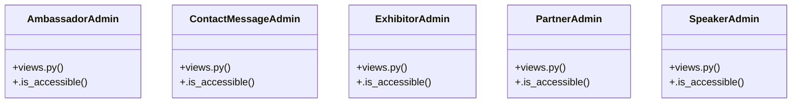

# [form_fields() & open_call_for_partner()] Cluster

> 13 nodes · cohesion 0.26

## Key Concepts

- [views.py](file:///Users/kodjododjango/Downloads/dev_projects/synca_conf_back/app/admin/views.py#L1) (6 connections)
- **ModelView** (5 connections)
- [_has_permission()](file:///Users/kodjododjango/Downloads/dev_projects/synca_conf_back/app/admin/views.py#L7) (5 connections)
- [AmbassadorAdmin](file:///Users/kodjododjango/Downloads/dev_projects/synca_conf_back/app/admin/views.py#L31) (3 connections)
- [ContactMessageAdmin](file:///Users/kodjododjango/Downloads/dev_projects/synca_conf_back/app/admin/views.py#L89) (3 connections)
- [ExhibitorAdmin](file:///Users/kodjododjango/Downloads/dev_projects/synca_conf_back/app/admin/views.py#L70) (3 connections)
- [PartnerAdmin](file:///Users/kodjododjango/Downloads/dev_projects/synca_conf_back/app/admin/views.py#L50) (3 connections)
- [SpeakerAdmin](file:///Users/kodjododjango/Downloads/dev_projects/synca_conf_back/app/admin/views.py#L11) (3 connections)
- [.is_accessible()](file:///Users/kodjododjango/Downloads/dev_projects/synca_conf_back/app/admin/views.py#L46) (2 connections)
- [.is_accessible()](file:///Users/kodjododjango/Downloads/dev_projects/synca_conf_back/app/admin/views.py#L85) (2 connections)
- [.is_accessible()](file:///Users/kodjododjango/Downloads/dev_projects/synca_conf_back/app/admin/views.py#L66) (2 connections)
- [.is_accessible()](file:///Users/kodjododjango/Downloads/dev_projects/synca_conf_back/app/admin/views.py#L27) (2 connections)
- [.is_accessible()](file:///Users/kodjododjango/Downloads/dev_projects/synca_conf_back/app/admin/views.py#L109) (1 connections)

## Class Diagram

## Relationships

- No strong cross-community connections detected

## Source Files

- [/Users/kodjododjango/Downloads/dev_projects/synca_conf_back/app/admin/views.py](file:///Users/kodjododjango/Downloads/dev_projects/synca_conf_back/app/admin/views.py)

## Audit Trail

- EXTRACTED: 40 (100%)
- INFERRED: 0 (0%)
- AMBIGUOUS: 0 (0%)

---

*Part of the graphify knowledge wiki. See [[index]] to navigate.*