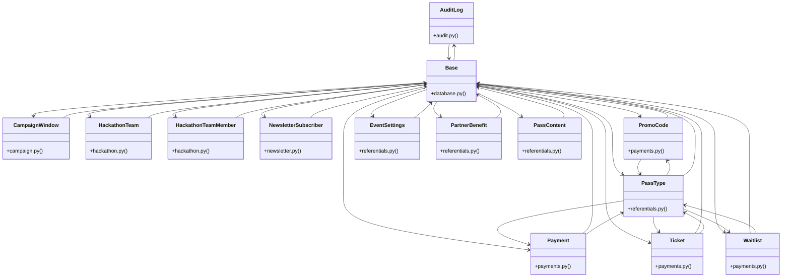

# [get_settings() & upload_file()] Cluster

> 87 nodes · cohesion 0.05

## Key Concepts

- [Base](file:///Users/kodjododjango/Downloads/dev_projects/synca_conf_back/app/core/database.py#L13) (38 connections)
- **Base** (30 connections)
- [PassType](file:///Users/kodjododjango/Downloads/dev_projects/synca_conf_back/app/models/referentials.py#L46) (30 connections)
- [PromoCode](file:///Users/kodjododjango/Downloads/dev_projects/synca_conf_back/app/models/payments.py#L22) (18 connections)
- [Payment](file:///Users/kodjododjango/Downloads/dev_projects/synca_conf_back/app/models/payments.py#L37) (16 connections)
- [test_forms_register.py](file:///Users/kodjododjango/Downloads/dev_projects/synca_conf_back/tests/test_forms_register.py#L1) (12 connections)
- [Ticket](file:///Users/kodjododjango/Downloads/dev_projects/synca_conf_back/app/models/payments.py#L65) (10 connections)
- [register_payload()](file:///Users/kodjododjango/Downloads/dev_projects/synca_conf_back/tests/test_forms_register.py#L33) (10 connections)
- [test_user_me.py](file:///Users/kodjododjango/Downloads/dev_projects/synca_conf_back/tests/test_user_me.py#L1) (10 connections)
- [open_ticketing()](file:///Users/kodjododjango/Downloads/dev_projects/synca_conf_back/tests/test_forms_register.py#L22) (9 connections)
- [Waitlist](file:///Users/kodjododjango/Downloads/dev_projects/synca_conf_back/app/models/payments.py#L82) (7 connections)
- [make_user()](file:///Users/kodjododjango/Downloads/dev_projects/synca_conf_back/tests/test_user_me.py#L9) (7 connections)
- [referentials.py](file:///Users/kodjododjango/Downloads/dev_projects/synca_conf_back/app/models/referentials.py#L1) (7 connections)
- [test_payments_create.py](file:///Users/kodjododjango/Downloads/dev_projects/synca_conf_back/tests/test_payments_create.py#L1) (7 connections)
- [test_promo_validate.py](file:///Users/kodjododjango/Downloads/dev_projects/synca_conf_back/tests/test_promo_validate.py#L1) (7 connections)
- [make_user()](file:///Users/kodjododjango/Downloads/dev_projects/synca_conf_back/tests/test_payments_create.py#L19) (6 connections)
- [CampaignWindow](file:///Users/kodjododjango/Downloads/dev_projects/synca_conf_back/app/models/campaign.py#L20) (5 connections)
- [EventSettings](file:///Users/kodjododjango/Downloads/dev_projects/synca_conf_back/app/models/referentials.py#L113) (5 connections)
- [PartnerBenefit](file:///Users/kodjododjango/Downloads/dev_projects/synca_conf_back/app/models/referentials.py#L62) (5 connections)
- [PassContent](file:///Users/kodjododjango/Downloads/dev_projects/synca_conf_back/app/models/referentials.py#L19) (5 connections)
- [test_register_duplicate_email_conflict()](file:///Users/kodjododjango/Downloads/dev_projects/synca_conf_back/tests/test_forms_register.py#L172) (5 connections)
- [test_register_valid_promo_code_accepted()](file:///Users/kodjododjango/Downloads/dev_projects/synca_conf_back/tests/test_forms_register.py#L155) (5 connections)
- [make_user_and_pass()](file:///Users/kodjododjango/Downloads/dev_projects/synca_conf_back/tests/test_payments.py#L7) (5 connections)
- [test_promo_code_payment_ticket_waitlist_read()](file:///Users/kodjododjango/Downloads/dev_projects/synca_conf_back/tests/test_schemas.py#L109) (5 connections)
- [make_ticket_for()](file:///Users/kodjododjango/Downloads/dev_projects/synca_conf_back/tests/test_user_me.py#L73) (5 connections)
- *... and 62 more nodes in this community*

## Class Diagram

## Relationships

- [[[create_access_token() & Role] Cluster]] (11 shared connections)
- [[[ModelView & _has_permission()] Cluster]] (1 shared connections)
- [[[FaqCategory & ContactMessage] Cluster]] (1 shared connections)

## Source Files

- [/Users/kodjododjango/Downloads/dev_projects/synca_conf_back/alembic/env.py](file:///Users/kodjododjango/Downloads/dev_projects/synca_conf_back/alembic/env.py)
- [/Users/kodjododjango/Downloads/dev_projects/synca_conf_back/app/api/admin_partner_levels.py](file:///Users/kodjododjango/Downloads/dev_projects/synca_conf_back/app/api/admin_partner_levels.py)
- [/Users/kodjododjango/Downloads/dev_projects/synca_conf_back/app/core/database.py](file:///Users/kodjododjango/Downloads/dev_projects/synca_conf_back/app/core/database.py)
- [/Users/kodjododjango/Downloads/dev_projects/synca_conf_back/app/models/audit.py](file:///Users/kodjododjango/Downloads/dev_projects/synca_conf_back/app/models/audit.py)
- [/Users/kodjododjango/Downloads/dev_projects/synca_conf_back/app/models/campaign.py](file:///Users/kodjododjango/Downloads/dev_projects/synca_conf_back/app/models/campaign.py)
- [/Users/kodjododjango/Downloads/dev_projects/synca_conf_back/app/models/hackathon.py](file:///Users/kodjododjango/Downloads/dev_projects/synca_conf_back/app/models/hackathon.py)
- [/Users/kodjododjango/Downloads/dev_projects/synca_conf_back/app/models/newsletter.py](file:///Users/kodjododjango/Downloads/dev_projects/synca_conf_back/app/models/newsletter.py)
- [/Users/kodjododjango/Downloads/dev_projects/synca_conf_back/app/models/payments.py](file:///Users/kodjododjango/Downloads/dev_projects/synca_conf_back/app/models/payments.py)
- [/Users/kodjododjango/Downloads/dev_projects/synca_conf_back/app/models/referentials.py](file:///Users/kodjododjango/Downloads/dev_projects/synca_conf_back/app/models/referentials.py)
- [/Users/kodjododjango/Downloads/dev_projects/synca_conf_back/tests/test_forms_register.py](file:///Users/kodjododjango/Downloads/dev_projects/synca_conf_back/tests/test_forms_register.py)
- [/Users/kodjododjango/Downloads/dev_projects/synca_conf_back/tests/test_payments.py](file:///Users/kodjododjango/Downloads/dev_projects/synca_conf_back/tests/test_payments.py)
- [/Users/kodjododjango/Downloads/dev_projects/synca_conf_back/tests/test_payments_create.py](file:///Users/kodjododjango/Downloads/dev_projects/synca_conf_back/tests/test_payments_create.py)
- [/Users/kodjododjango/Downloads/dev_projects/synca_conf_back/tests/test_promo_validate.py](file:///Users/kodjododjango/Downloads/dev_projects/synca_conf_back/tests/test_promo_validate.py)
- [/Users/kodjododjango/Downloads/dev_projects/synca_conf_back/tests/test_public_pass_types.py](file:///Users/kodjododjango/Downloads/dev_projects/synca_conf_back/tests/test_public_pass_types.py)
- [/Users/kodjododjango/Downloads/dev_projects/synca_conf_back/tests/test_schemas.py](file:///Users/kodjododjango/Downloads/dev_projects/synca_conf_back/tests/test_schemas.py)
- [/Users/kodjododjango/Downloads/dev_projects/synca_conf_back/tests/test_user_me.py](file:///Users/kodjododjango/Downloads/dev_projects/synca_conf_back/tests/test_user_me.py)

## Audit Trail

- EXTRACTED: 247 (59%)
- INFERRED: 173 (41%)
- AMBIGUOUS: 0 (0%)

---

*Part of the graphify knowledge wiki. See [[index]] to navigate.*