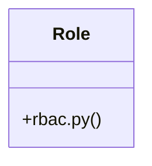

# [get_settings() & upload_file()] Cluster

> 61 nodes · cohesion 0.08

## Key Concepts

- [create_access_token()](file:///Users/kodjododjango/Downloads/dev_projects/synca_conf_back/app/services/auth_service.py#L93) (45 connections)
- [Role](file:///Users/kodjododjango/Downloads/dev_projects/synca_conf_back/app/models/rbac.py#L9) (19 connections)
- [test_admin_applications.py](file:///Users/kodjododjango/Downloads/dev_projects/synca_conf_back/tests/test_admin_applications.py#L1) (19 connections)
- [make_admin_with_permission()](file:///Users/kodjododjango/Downloads/dev_projects/synca_conf_back/tests/test_admin_applications.py#L22) (18 connections)
- [make_admin_with_permission()](file:///Users/kodjododjango/Downloads/dev_projects/synca_conf_back/tests/test_admin_campaign_windows.py#L11) (11 connections)
- [make_admin_with_permission()](file:///Users/kodjododjango/Downloads/dev_projects/synca_conf_back/tests/test_admin_export.py#L15) (10 connections)
- [make_admin_with_permission()](file:///Users/kodjododjango/Downloads/dev_projects/synca_conf_back/tests/test_admin_registrations.py#L13) (9 connections)
- [test_admin_campaign_windows.py](file:///Users/kodjododjango/Downloads/dev_projects/synca_conf_back/tests/test_admin_campaign_windows.py#L1) (8 connections)
- [test_admin_export.py](file:///Users/kodjododjango/Downloads/dev_projects/synca_conf_back/tests/test_admin_export.py#L1) (8 connections)
- [make_payment()](file:///Users/kodjododjango/Downloads/dev_projects/synca_conf_back/tests/test_admin_export.py#L51) (7 connections)
- [make_payment()](file:///Users/kodjododjango/Downloads/dev_projects/synca_conf_back/tests/test_admin_registrations.py#L49) (7 connections)
- [test_admin_registrations.py](file:///Users/kodjododjango/Downloads/dev_projects/synca_conf_back/tests/test_admin_registrations.py#L1) (7 connections)
- [make_partner()](file:///Users/kodjododjango/Downloads/dev_projects/synca_conf_back/tests/test_admin_applications.py#L95) (6 connections)
- [make_speaker()](file:///Users/kodjododjango/Downloads/dev_projects/synca_conf_back/tests/test_admin_applications.py#L58) (6 connections)
- [make_admin_with_role()](file:///Users/kodjododjango/Downloads/dev_projects/synca_conf_back/tests/test_admin_rbac.py#L11) (6 connections)
- [test_admin_rbac.py](file:///Users/kodjododjango/Downloads/dev_projects/synca_conf_back/tests/test_admin_rbac.py#L1) (6 connections)
- [make_ambassador()](file:///Users/kodjododjango/Downloads/dev_projects/synca_conf_back/tests/test_admin_applications.py#L77) (5 connections)
- [make_admin()](file:///Users/kodjododjango/Downloads/dev_projects/synca_conf_back/tests/test_admin_contacts.py#L11) (5 connections)
- [test_admin_contacts.py](file:///Users/kodjododjango/Downloads/dev_projects/synca_conf_back/tests/test_admin_contacts.py#L1) (5 connections)
- [make_exhibitor()](file:///Users/kodjododjango/Downloads/dev_projects/synca_conf_back/tests/test_admin_applications.py#L117) (4 connections)
- [test_ambassador_accepted()](file:///Users/kodjododjango/Downloads/dev_projects/synca_conf_back/tests/test_admin_applications.py#L232) (4 connections)
- [test_ambassador_accepted_twice_does_not_regenerate_promo_code()](file:///Users/kodjododjango/Downloads/dev_projects/synca_conf_back/tests/test_admin_applications.py#L258) (4 connections)
- [test_ambassador_update_forbidden_without_permission()](file:///Users/kodjododjango/Downloads/dev_projects/synca_conf_back/tests/test_admin_applications.py#L288) (4 connections)
- [test_exhibitor_confirmed_publishes_it()](file:///Users/kodjododjango/Downloads/dev_projects/synca_conf_back/tests/test_admin_applications.py#L358) (4 connections)
- [test_exhibitor_update_forbidden_without_permission()](file:///Users/kodjododjango/Downloads/dev_projects/synca_conf_back/tests/test_admin_applications.py#L377) (4 connections)
- *... and 36 more nodes in this community*

## Class Diagram

## Relationships

- No strong cross-community connections detected

## Source Files

- [/Users/kodjododjango/Downloads/dev_projects/synca_conf_back/app/models/rbac.py](file:///Users/kodjododjango/Downloads/dev_projects/synca_conf_back/app/models/rbac.py)
- [/Users/kodjododjango/Downloads/dev_projects/synca_conf_back/app/services/auth_service.py](file:///Users/kodjododjango/Downloads/dev_projects/synca_conf_back/app/services/auth_service.py)
- [/Users/kodjododjango/Downloads/dev_projects/synca_conf_back/tests/test_admin_applications.py](file:///Users/kodjododjango/Downloads/dev_projects/synca_conf_back/tests/test_admin_applications.py)
- [/Users/kodjododjango/Downloads/dev_projects/synca_conf_back/tests/test_admin_campaign_windows.py](file:///Users/kodjododjango/Downloads/dev_projects/synca_conf_back/tests/test_admin_campaign_windows.py)
- [/Users/kodjododjango/Downloads/dev_projects/synca_conf_back/tests/test_admin_contacts.py](file:///Users/kodjododjango/Downloads/dev_projects/synca_conf_back/tests/test_admin_contacts.py)
- [/Users/kodjododjango/Downloads/dev_projects/synca_conf_back/tests/test_admin_export.py](file:///Users/kodjododjango/Downloads/dev_projects/synca_conf_back/tests/test_admin_export.py)
- [/Users/kodjododjango/Downloads/dev_projects/synca_conf_back/tests/test_admin_rbac.py](file:///Users/kodjododjango/Downloads/dev_projects/synca_conf_back/tests/test_admin_rbac.py)
- [/Users/kodjododjango/Downloads/dev_projects/synca_conf_back/tests/test_admin_registrations.py](file:///Users/kodjododjango/Downloads/dev_projects/synca_conf_back/tests/test_admin_registrations.py)

## Audit Trail

- EXTRACTED: 212 (62%)
- INFERRED: 130 (38%)
- AMBIGUOUS: 0 (0%)

---

*Part of the graphify knowledge wiki. See [[index]] to navigate.*