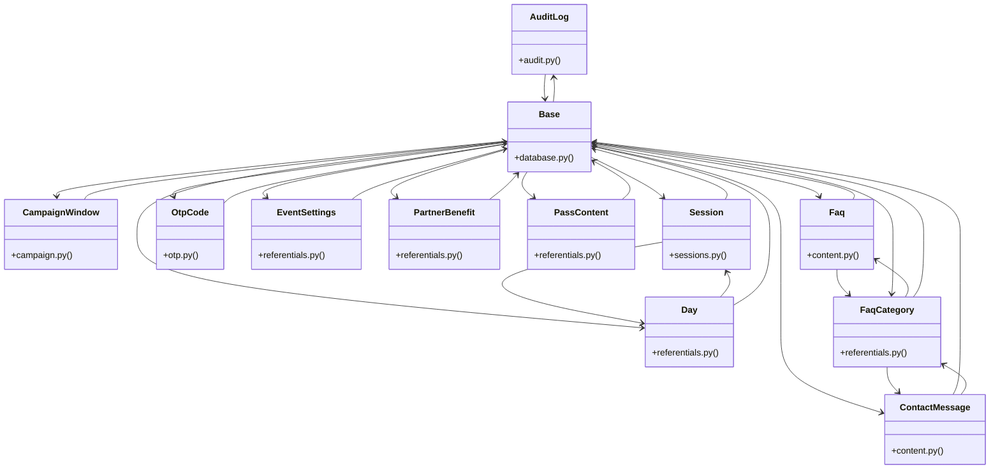

# [get_settings() & upload_file()] Cluster

> 71 nodes · cohesion 0.04

## Key Concepts

- [Base](file:///Users/kodjododjango/Downloads/dev_projects/synca_conf_back/app/core/database.py#L13) (38 connections)
- **Base** (30 connections)
- [FaqCategory](file:///Users/kodjododjango/Downloads/dev_projects/synca_conf_back/app/models/referentials.py#L106) (11 connections)
- [test_schemas.py](file:///Users/kodjododjango/Downloads/dev_projects/synca_conf_back/tests/test_schemas.py#L1) (11 connections)
- [Day](file:///Users/kodjododjango/Downloads/dev_projects/synca_conf_back/app/models/referentials.py#L10) (10 connections)
- [ContactMessage](file:///Users/kodjododjango/Downloads/dev_projects/synca_conf_back/app/models/content.py#L25) (9 connections)
- [Faq](file:///Users/kodjododjango/Downloads/dev_projects/synca_conf_back/app/models/content.py#L10) (9 connections)
- [Session](file:///Users/kodjododjango/Downloads/dev_projects/synca_conf_back/app/models/sessions.py#L24) (9 connections)
- [admin_program.py](file:///Users/kodjododjango/Downloads/dev_projects/synca_conf_back/app/api/admin_program.py#L1) (8 connections)
- [referentials.py](file:///Users/kodjododjango/Downloads/dev_projects/synca_conf_back/app/models/referentials.py#L1) (7 connections)
- [OtpCode](file:///Users/kodjododjango/Downloads/dev_projects/synca_conf_back/app/models/otp.py#L9) (6 connections)
- [CampaignWindow](file:///Users/kodjododjango/Downloads/dev_projects/synca_conf_back/app/models/campaign.py#L20) (5 connections)
- [EventSettings](file:///Users/kodjododjango/Downloads/dev_projects/synca_conf_back/app/models/referentials.py#L113) (5 connections)
- [PartnerBenefit](file:///Users/kodjododjango/Downloads/dev_projects/synca_conf_back/app/models/referentials.py#L62) (5 connections)
- [PassContent](file:///Users/kodjododjango/Downloads/dev_projects/synca_conf_back/app/models/referentials.py#L19) (5 connections)
- [test_public_program.py](file:///Users/kodjododjango/Downloads/dev_projects/synca_conf_back/tests/test_public_program.py#L1) (5 connections)
- [AuditLog](file:///Users/kodjododjango/Downloads/dev_projects/synca_conf_back/app/models/audit.py#L9) (4 connections)
- [test_faq_crud_basic()](file:///Users/kodjododjango/Downloads/dev_projects/synca_conf_back/tests/test_content.py#L8) (4 connections)
- [env.py](file:///Users/kodjododjango/Downloads/dev_projects/synca_conf_back/alembic/env.py#L1) (4 connections)
- [create_partner_benefit()](file:///Users/kodjododjango/Downloads/dev_projects/synca_conf_back/app/api/admin_partner_levels.py#L181) (3 connections)
- [create_day()](file:///Users/kodjododjango/Downloads/dev_projects/synca_conf_back/app/api/admin_program.py#L34) (3 connections)
- [create_session()](file:///Users/kodjododjango/Downloads/dev_projects/synca_conf_back/app/api/admin_program.py#L138) (3 connections)
- [run_async_migrations()](file:///Users/kodjododjango/Downloads/dev_projects/synca_conf_back/alembic/env.py#L63) (3 connections)
- [run_migrations_online()](file:///Users/kodjododjango/Downloads/dev_projects/synca_conf_back/alembic/env.py#L81) (3 connections)
- [test_contact_message_default_unread()](file:///Users/kodjododjango/Downloads/dev_projects/synca_conf_back/tests/test_content.py#L32) (3 connections)
- *... and 46 more nodes in this community*

## Class Diagram

## Relationships

- [[[create_access_token() & Role] Cluster]] (10 shared connections)
- [[[verify_stripe_signature() & payment_webhook()] Cluster]] (2 shared connections)
- [[[send_email() & make_ticket()] Cluster]] (1 shared connections)
- [[[PassType & register_payload()] Cluster]] (1 shared connections)

## Source Files

- [/Users/kodjododjango/Downloads/dev_projects/synca_conf_back/alembic/env.py](file:///Users/kodjododjango/Downloads/dev_projects/synca_conf_back/alembic/env.py)
- [/Users/kodjododjango/Downloads/dev_projects/synca_conf_back/app/api/admin_partner_levels.py](file:///Users/kodjododjango/Downloads/dev_projects/synca_conf_back/app/api/admin_partner_levels.py)
- [/Users/kodjododjango/Downloads/dev_projects/synca_conf_back/app/api/admin_program.py](file:///Users/kodjododjango/Downloads/dev_projects/synca_conf_back/app/api/admin_program.py)
- [/Users/kodjododjango/Downloads/dev_projects/synca_conf_back/app/core/database.py](file:///Users/kodjododjango/Downloads/dev_projects/synca_conf_back/app/core/database.py)
- [/Users/kodjododjango/Downloads/dev_projects/synca_conf_back/app/models/audit.py](file:///Users/kodjododjango/Downloads/dev_projects/synca_conf_back/app/models/audit.py)
- [/Users/kodjododjango/Downloads/dev_projects/synca_conf_back/app/models/campaign.py](file:///Users/kodjododjango/Downloads/dev_projects/synca_conf_back/app/models/campaign.py)
- [/Users/kodjododjango/Downloads/dev_projects/synca_conf_back/app/models/content.py](file:///Users/kodjododjango/Downloads/dev_projects/synca_conf_back/app/models/content.py)
- [/Users/kodjododjango/Downloads/dev_projects/synca_conf_back/app/models/otp.py](file:///Users/kodjododjango/Downloads/dev_projects/synca_conf_back/app/models/otp.py)
- [/Users/kodjododjango/Downloads/dev_projects/synca_conf_back/app/models/referentials.py](file:///Users/kodjododjango/Downloads/dev_projects/synca_conf_back/app/models/referentials.py)
- [/Users/kodjododjango/Downloads/dev_projects/synca_conf_back/app/models/sessions.py](file:///Users/kodjododjango/Downloads/dev_projects/synca_conf_back/app/models/sessions.py)
- [/Users/kodjododjango/Downloads/dev_projects/synca_conf_back/tests/test_content.py](file:///Users/kodjododjango/Downloads/dev_projects/synca_conf_back/tests/test_content.py)
- [/Users/kodjododjango/Downloads/dev_projects/synca_conf_back/tests/test_pagination.py](file:///Users/kodjododjango/Downloads/dev_projects/synca_conf_back/tests/test_pagination.py)
- [/Users/kodjododjango/Downloads/dev_projects/synca_conf_back/tests/test_public_faqs.py](file:///Users/kodjododjango/Downloads/dev_projects/synca_conf_back/tests/test_public_faqs.py)
- [/Users/kodjododjango/Downloads/dev_projects/synca_conf_back/tests/test_public_program.py](file:///Users/kodjododjango/Downloads/dev_projects/synca_conf_back/tests/test_public_program.py)
- [/Users/kodjododjango/Downloads/dev_projects/synca_conf_back/tests/test_referentials.py](file:///Users/kodjododjango/Downloads/dev_projects/synca_conf_back/tests/test_referentials.py)
- [/Users/kodjododjango/Downloads/dev_projects/synca_conf_back/tests/test_schemas.py](file:///Users/kodjododjango/Downloads/dev_projects/synca_conf_back/tests/test_schemas.py)
- [/Users/kodjododjango/Downloads/dev_projects/synca_conf_back/tests/test_sessions.py](file:///Users/kodjododjango/Downloads/dev_projects/synca_conf_back/tests/test_sessions.py)

## Audit Trail

- EXTRACTED: 157 (55%)
- INFERRED: 129 (45%)
- AMBIGUOUS: 0 (0%)

---

*Part of the graphify knowledge wiki. See [[index]] to navigate.*