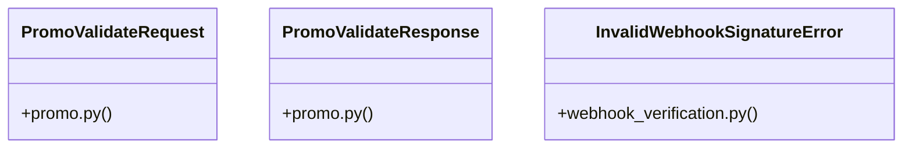

# [make_admin() & hash_password()] Cluster

> 29 nodes · cohesion 0.10

## Key Concepts

- [verify_stripe_signature()](file:///Users/kodjododjango/Downloads/dev_projects/synca_conf_back/app/services/webhook_verification.py#L12) (9 connections)
- [payment_webhook()](file:///Users/kodjododjango/Downloads/dev_projects/synca_conf_back/app/api/payments.py#L93) (8 connections)
- [test_webhook_verification.py](file:///Users/kodjododjango/Downloads/dev_projects/synca_conf_back/tests/test_webhook_verification.py#L1) (8 connections)
- [verify_hmac_signature()](file:///Users/kodjododjango/Downloads/dev_projects/synca_conf_back/app/services/webhook_verification.py#L43) (7 connections)
- [create_payment()](file:///Users/kodjododjango/Downloads/dev_projects/synca_conf_back/app/api/payments.py#L48) (5 connections)
- [get_valid_promo_code()](file:///Users/kodjododjango/Downloads/dev_projects/synca_conf_back/app/services/promo_service.py#L14) (4 connections)
- [InvalidWebhookSignatureError](file:///Users/kodjododjango/Downloads/dev_projects/synca_conf_back/app/services/webhook_verification.py#L8) (4 connections)
- [_validate_promo_code()](file:///Users/kodjododjango/Downloads/dev_projects/synca_conf_back/app/api/forms.py#L60) (3 connections)
- [validate_promo()](file:///Users/kodjododjango/Downloads/dev_projects/synca_conf_back/app/api/payments.py#L31) (3 connections)
- [PromoValidateResponse](file:///Users/kodjododjango/Downloads/dev_projects/synca_conf_back/app/schemas/promo.py#L8) (3 connections)
- [payments.py](file:///Users/kodjododjango/Downloads/dev_projects/synca_conf_back/app/api/payments.py#L1) (3 connections)
- [promo_service.py](file:///Users/kodjododjango/Downloads/dev_projects/synca_conf_back/app/services/promo_service.py#L1) (3 connections)
- [webhook_verification.py](file:///Users/kodjododjango/Downloads/dev_projects/synca_conf_back/app/services/webhook_verification.py#L1) (3 connections)
- [PromoValidateRequest](file:///Users/kodjododjango/Downloads/dev_projects/synca_conf_back/app/schemas/promo.py#L4) (2 connections)
- [compute_discounted_amount()](file:///Users/kodjododjango/Downloads/dev_projects/synca_conf_back/app/services/promo_service.py#L30) (2 connections)
- [test_verify_hmac_signature_accepts_valid()](file:///Users/kodjododjango/Downloads/dev_projects/synca_conf_back/tests/test_webhook_verification.py#L14) (2 connections)
- [test_verify_hmac_signature_rejects_empty_secret_even_with_matching_forged_signature()](file:///Users/kodjododjango/Downloads/dev_projects/synca_conf_back/tests/test_webhook_verification.py#L59) (2 connections)
- [test_verify_hmac_signature_rejects_invalid()](file:///Users/kodjododjango/Downloads/dev_projects/synca_conf_back/tests/test_webhook_verification.py#L21) (2 connections)
- [test_verify_stripe_signature_accepts_valid()](file:///Users/kodjododjango/Downloads/dev_projects/synca_conf_back/tests/test_webhook_verification.py#L26) (2 connections)
- [test_verify_stripe_signature_rejects_bad_signature()](file:///Users/kodjododjango/Downloads/dev_projects/synca_conf_back/tests/test_webhook_verification.py#L36) (2 connections)
- [test_verify_stripe_signature_rejects_empty_secret_even_with_matching_forged_signature()](file:///Users/kodjododjango/Downloads/dev_projects/synca_conf_back/tests/test_webhook_verification.py#L68) (2 connections)
- [test_verify_stripe_signature_rejects_expired_timestamp()](file:///Users/kodjododjango/Downloads/dev_projects/synca_conf_back/tests/test_webhook_verification.py#L43) (2 connections)
- [test_verify_stripe_signature_rejects_malformed_header()](file:///Users/kodjododjango/Downloads/dev_projects/synca_conf_back/tests/test_webhook_verification.py#L54) (2 connections)
- [generate_qr_code_hash()](file:///Users/kodjododjango/Downloads/dev_projects/synca_conf_back/app/services/ticketing.py#L8) (2 connections)
- [generate_ticket_number()](file:///Users/kodjododjango/Downloads/dev_projects/synca_conf_back/app/services/ticketing.py#L4) (2 connections)
- *... and 4 more nodes in this community*

## Class Diagram

## Relationships

- No strong cross-community connections detected

## Source Files

- [/Users/kodjododjango/Downloads/dev_projects/synca_conf_back/app/api/forms.py](file:///Users/kodjododjango/Downloads/dev_projects/synca_conf_back/app/api/forms.py)
- [/Users/kodjododjango/Downloads/dev_projects/synca_conf_back/app/api/payments.py](file:///Users/kodjododjango/Downloads/dev_projects/synca_conf_back/app/api/payments.py)
- [/Users/kodjododjango/Downloads/dev_projects/synca_conf_back/app/schemas/promo.py](file:///Users/kodjododjango/Downloads/dev_projects/synca_conf_back/app/schemas/promo.py)
- [/Users/kodjododjango/Downloads/dev_projects/synca_conf_back/app/services/promo_service.py](file:///Users/kodjododjango/Downloads/dev_projects/synca_conf_back/app/services/promo_service.py)
- [/Users/kodjododjango/Downloads/dev_projects/synca_conf_back/app/services/ticketing.py](file:///Users/kodjododjango/Downloads/dev_projects/synca_conf_back/app/services/ticketing.py)
- [/Users/kodjododjango/Downloads/dev_projects/synca_conf_back/app/services/webhook_verification.py](file:///Users/kodjododjango/Downloads/dev_projects/synca_conf_back/app/services/webhook_verification.py)
- [/Users/kodjododjango/Downloads/dev_projects/synca_conf_back/tests/test_webhook_verification.py](file:///Users/kodjododjango/Downloads/dev_projects/synca_conf_back/tests/test_webhook_verification.py)

## Audit Trail

- EXTRACTED: 54 (58%)
- INFERRED: 39 (42%)
- AMBIGUOUS: 0 (0%)

---

*Part of the graphify knowledge wiki. See [[index]] to navigate.*