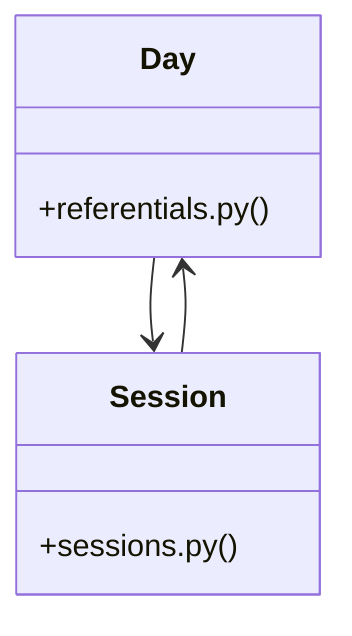

# [make_admin_with_role() & get_current_admin()] Cluster

> 26 nodes · cohesion 0.09

## Key Concepts

- [Day](file:///Users/kodjododjango/Downloads/dev_projects/synca_conf_back/app/models/referentials.py#L10) (10 connections)
- [Session](file:///Users/kodjododjango/Downloads/dev_projects/synca_conf_back/app/models/sessions.py#L24) (9 connections)
- [admin_program.py](file:///Users/kodjododjango/Downloads/dev_projects/synca_conf_back/app/api/admin_program.py#L1) (8 connections)
- [test_public_program.py](file:///Users/kodjododjango/Downloads/dev_projects/synca_conf_back/tests/test_public_program.py#L1) (5 connections)
- [test_sessions_filter_by_day_and_category_excludes_private()](file:///Users/kodjododjango/Downloads/dev_projects/synca_conf_back/tests/test_public_program.py#L49) (3 connections)
- [test_partner_level_and_faq_category()](file:///Users/kodjododjango/Downloads/dev_projects/synca_conf_back/tests/test_referentials.py#L30) (3 connections)
- [test_filter_sessions_by_day_and_category()](file:///Users/kodjododjango/Downloads/dev_projects/synca_conf_back/tests/test_sessions.py#L10) (3 connections)
- [test_referentials.py](file:///Users/kodjododjango/Downloads/dev_projects/synca_conf_back/tests/test_referentials.py#L1) (3 connections)
- [create_day()](file:///Users/kodjododjango/Downloads/dev_projects/synca_conf_back/app/api/admin_program.py#L34) (2 connections)
- [create_session()](file:///Users/kodjododjango/Downloads/dev_projects/synca_conf_back/app/api/admin_program.py#L138) (2 connections)
- [test_list_days_ordered()](file:///Users/kodjododjango/Downloads/dev_projects/synca_conf_back/tests/test_public_program.py#L22) (2 connections)
- [test_day_unique_date()](file:///Users/kodjododjango/Downloads/dev_projects/synca_conf_back/tests/test_referentials.py#L10) (2 connections)
- [test_pass_type_defaults()](file:///Users/kodjododjango/Downloads/dev_projects/synca_conf_back/tests/test_referentials.py#L20) (2 connections)
- [test_day_read()](file:///Users/kodjododjango/Downloads/dev_projects/synca_conf_back/tests/test_schemas.py#L56) (2 connections)
- [test_session_read()](file:///Users/kodjododjango/Downloads/dev_projects/synca_conf_back/tests/test_schemas.py#L99) (2 connections)
- [delete_day()](file:///Users/kodjododjango/Downloads/dev_projects/synca_conf_back/app/api/admin_program.py#L90) (1 connections)
- [delete_session()](file:///Users/kodjododjango/Downloads/dev_projects/synca_conf_back/app/api/admin_program.py#L244) (1 connections)
- [list_days_admin()](file:///Users/kodjododjango/Downloads/dev_projects/synca_conf_back/app/api/admin_program.py#L23) (1 connections)
- [list_sessions_admin()](file:///Users/kodjododjango/Downloads/dev_projects/synca_conf_back/app/api/admin_program.py#L118) (1 connections)
- [update_day()](file:///Users/kodjododjango/Downloads/dev_projects/synca_conf_back/app/api/admin_program.py#L58) (1 connections)
- [update_session()](file:///Users/kodjododjango/Downloads/dev_projects/synca_conf_back/app/api/admin_program.py#L185) (1 connections)
- [client()](file:///Users/kodjododjango/Downloads/dev_projects/synca_conf_back/tests/test_public_program.py#L12) (1 connections)
- [test_list_days_empty()](file:///Users/kodjododjango/Downloads/dev_projects/synca_conf_back/tests/test_public_program.py#L40) (1 connections)
- [test_sessions_empty_result()](file:///Users/kodjododjango/Downloads/dev_projects/synca_conf_back/tests/test_public_program.py#L81) (1 connections)
- [sessions.py](file:///Users/kodjododjango/Downloads/dev_projects/synca_conf_back/app/models/sessions.py#L1) (1 connections)
- *... and 1 more nodes in this community*

## Class Diagram

## Relationships

- No strong cross-community connections detected

## Source Files

- [/Users/kodjododjango/Downloads/dev_projects/synca_conf_back/app/api/admin_program.py](file:///Users/kodjododjango/Downloads/dev_projects/synca_conf_back/app/api/admin_program.py)
- [/Users/kodjododjango/Downloads/dev_projects/synca_conf_back/app/models/referentials.py](file:///Users/kodjododjango/Downloads/dev_projects/synca_conf_back/app/models/referentials.py)
- [/Users/kodjododjango/Downloads/dev_projects/synca_conf_back/app/models/sessions.py](file:///Users/kodjododjango/Downloads/dev_projects/synca_conf_back/app/models/sessions.py)
- [/Users/kodjododjango/Downloads/dev_projects/synca_conf_back/tests/test_public_program.py](file:///Users/kodjododjango/Downloads/dev_projects/synca_conf_back/tests/test_public_program.py)
- [/Users/kodjododjango/Downloads/dev_projects/synca_conf_back/tests/test_referentials.py](file:///Users/kodjododjango/Downloads/dev_projects/synca_conf_back/tests/test_referentials.py)
- [/Users/kodjododjango/Downloads/dev_projects/synca_conf_back/tests/test_schemas.py](file:///Users/kodjododjango/Downloads/dev_projects/synca_conf_back/tests/test_schemas.py)
- [/Users/kodjododjango/Downloads/dev_projects/synca_conf_back/tests/test_sessions.py](file:///Users/kodjododjango/Downloads/dev_projects/synca_conf_back/tests/test_sessions.py)

## Audit Trail

- EXTRACTED: 41 (59%)
- INFERRED: 28 (41%)
- AMBIGUOUS: 0 (0%)

---

*Part of the graphify knowledge wiki. See [[index]] to navigate.*