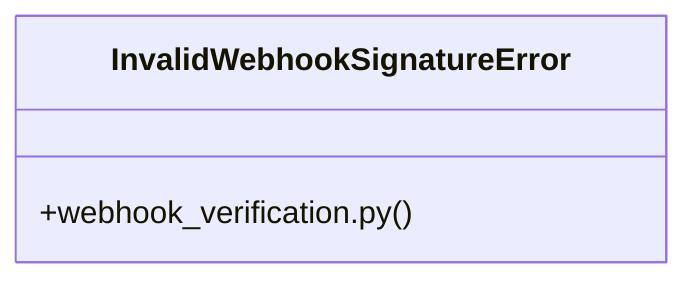

# [make_admin_with_role() & get_current_admin()] Cluster

> 19 nodes · cohesion 0.17

## Key Concepts

- [verify_stripe_signature()](file:///Users/kodjododjango/Downloads/dev_projects/synca_conf_back/app/services/webhook_verification.py#L12) (9 connections)
- [test_webhook_verification.py](file:///Users/kodjododjango/Downloads/dev_projects/synca_conf_back/tests/test_webhook_verification.py#L1) (8 connections)
- [payment_webhook()](file:///Users/kodjododjango/Downloads/dev_projects/synca_conf_back/app/api/payments.py#L93) (7 connections)
- [verify_hmac_signature()](file:///Users/kodjododjango/Downloads/dev_projects/synca_conf_back/app/services/webhook_verification.py#L43) (7 connections)
- [InvalidWebhookSignatureError](file:///Users/kodjododjango/Downloads/dev_projects/synca_conf_back/app/services/webhook_verification.py#L8) (4 connections)
- [webhook_verification.py](file:///Users/kodjododjango/Downloads/dev_projects/synca_conf_back/app/services/webhook_verification.py#L1) (3 connections)
- [test_verify_hmac_signature_accepts_valid()](file:///Users/kodjododjango/Downloads/dev_projects/synca_conf_back/tests/test_webhook_verification.py#L14) (2 connections)
- [test_verify_hmac_signature_rejects_empty_secret_even_with_matching_forged_signature()](file:///Users/kodjododjango/Downloads/dev_projects/synca_conf_back/tests/test_webhook_verification.py#L59) (2 connections)
- [test_verify_hmac_signature_rejects_invalid()](file:///Users/kodjododjango/Downloads/dev_projects/synca_conf_back/tests/test_webhook_verification.py#L21) (2 connections)
- [test_verify_stripe_signature_accepts_valid()](file:///Users/kodjododjango/Downloads/dev_projects/synca_conf_back/tests/test_webhook_verification.py#L26) (2 connections)
- [test_verify_stripe_signature_rejects_bad_signature()](file:///Users/kodjododjango/Downloads/dev_projects/synca_conf_back/tests/test_webhook_verification.py#L36) (2 connections)
- [test_verify_stripe_signature_rejects_empty_secret_even_with_matching_forged_signature()](file:///Users/kodjododjango/Downloads/dev_projects/synca_conf_back/tests/test_webhook_verification.py#L68) (2 connections)
- [test_verify_stripe_signature_rejects_expired_timestamp()](file:///Users/kodjododjango/Downloads/dev_projects/synca_conf_back/tests/test_webhook_verification.py#L43) (2 connections)
- [test_verify_stripe_signature_rejects_malformed_header()](file:///Users/kodjododjango/Downloads/dev_projects/synca_conf_back/tests/test_webhook_verification.py#L54) (2 connections)
- [generate_qr_code_hash()](file:///Users/kodjododjango/Downloads/dev_projects/synca_conf_back/app/services/ticketing.py#L8) (2 connections)
- [generate_ticket_number()](file:///Users/kodjododjango/Downloads/dev_projects/synca_conf_back/app/services/ticketing.py#L4) (2 connections)
- [ticketing.py](file:///Users/kodjododjango/Downloads/dev_projects/synca_conf_back/app/services/ticketing.py#L1) (2 connections)
- [Verify a Stripe webhook using Stripe's documented scheme.      The `Stripe-Signa](file:///Users/kodjododjango/Downloads/dev_projects/synca_conf_back/app/services/webhook_verification.py#L13) (1 connections)
- [Generic HMAC-SHA256 hex-digest verification (Wave / Orange Money).      Assumes](file:///Users/kodjododjango/Downloads/dev_projects/synca_conf_back/app/services/webhook_verification.py#L44) (1 connections)

## Class Diagram

## Relationships

- No strong cross-community connections detected

## Source Files

- [/Users/kodjododjango/Downloads/dev_projects/synca_conf_back/app/api/payments.py](file:///Users/kodjododjango/Downloads/dev_projects/synca_conf_back/app/api/payments.py)
- [/Users/kodjododjango/Downloads/dev_projects/synca_conf_back/app/services/ticketing.py](file:///Users/kodjododjango/Downloads/dev_projects/synca_conf_back/app/services/ticketing.py)
- [/Users/kodjododjango/Downloads/dev_projects/synca_conf_back/app/services/webhook_verification.py](file:///Users/kodjododjango/Downloads/dev_projects/synca_conf_back/app/services/webhook_verification.py)
- [/Users/kodjododjango/Downloads/dev_projects/synca_conf_back/tests/test_webhook_verification.py](file:///Users/kodjododjango/Downloads/dev_projects/synca_conf_back/tests/test_webhook_verification.py)

## Audit Trail

- EXTRACTED: 36 (58%)
- INFERRED: 26 (42%)
- AMBIGUOUS: 0 (0%)

---

*Part of the graphify knowledge wiki. See [[index]] to navigate.*