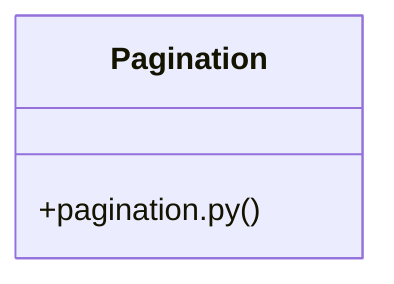

# [require_open_campaign() & set_window()] Cluster

> 8 nodes · cohesion 0.29

## Key Concepts

- [test_pagination.py](file:///Users/kodjododjango/Downloads/dev_projects/synca_conf_back/tests/test_pagination.py#L1) (5 connections)
- [pagination_params()](file:///Users/kodjododjango/Downloads/dev_projects/synca_conf_back/app/deps/pagination.py#L12) (3 connections)
- [Pagination](file:///Users/kodjododjango/Downloads/dev_projects/synca_conf_back/app/deps/pagination.py#L7) (2 connections)
- [test_pagination_custom_values()](file:///Users/kodjododjango/Downloads/dev_projects/synca_conf_back/tests/test_pagination.py#L10) (2 connections)
- [pagination.py](file:///Users/kodjododjango/Downloads/dev_projects/synca_conf_back/app/deps/pagination.py#L1) (2 connections)
- [client()](file:///Users/kodjododjango/Downloads/dev_projects/synca_conf_back/tests/test_pagination.py#L17) (1 connections)
- [test_pagination_defaults_apply_without_query_params()](file:///Users/kodjododjango/Downloads/dev_projects/synca_conf_back/tests/test_pagination.py#L43) (1 connections)
- [test_pagination_rejects_out_of_range_limit()](file:///Users/kodjododjango/Downloads/dev_projects/synca_conf_back/tests/test_pagination.py#L31) (1 connections)

## Class Diagram

## Relationships

- No strong cross-community connections detected

## Source Files

- [/Users/kodjododjango/Downloads/dev_projects/synca_conf_back/app/deps/pagination.py](file:///Users/kodjododjango/Downloads/dev_projects/synca_conf_back/app/deps/pagination.py)
- [/Users/kodjododjango/Downloads/dev_projects/synca_conf_back/tests/test_pagination.py](file:///Users/kodjododjango/Downloads/dev_projects/synca_conf_back/tests/test_pagination.py)

## Audit Trail

- EXTRACTED: 15 (88%)
- INFERRED: 2 (12%)
- AMBIGUOUS: 0 (0%)

---

*Part of the graphify knowledge wiki. See [[index]] to navigate.*