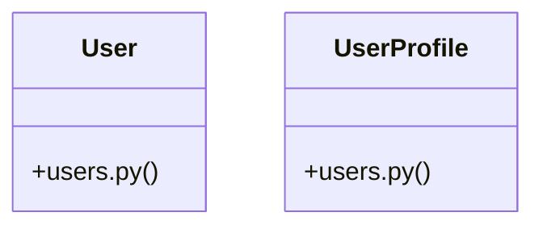

# [send_email() & make_ticket()] Cluster

> 24 nodes · cohesion 0.13

## Key Concepts

- [User](file:///Users/kodjododjango/Downloads/dev_projects/synca_conf_back/app/models/users.py#L24) (20 connections)
- [test_user_me.py](file:///Users/kodjododjango/Downloads/dev_projects/synca_conf_back/tests/test_user_me.py#L1) (10 connections)
- [make_user()](file:///Users/kodjododjango/Downloads/dev_projects/synca_conf_back/tests/test_user_me.py#L9) (7 connections)
- [UserProfile](file:///Users/kodjododjango/Downloads/dev_projects/synca_conf_back/app/models/users.py#L70) (7 connections)
- [make_ticket_for()](file:///Users/kodjododjango/Downloads/dev_projects/synca_conf_back/tests/test_user_me.py#L73) (5 connections)
- [make_user()](file:///Users/kodjododjango/Downloads/dev_projects/synca_conf_back/tests/test_crypto.py#L7) (4 connections)
- [make_user()](file:///Users/kodjododjango/Downloads/dev_projects/synca_conf_back/tests/test_users.py#L7) (4 connections)
- [test_crypto.py](file:///Users/kodjododjango/Downloads/dev_projects/synca_conf_back/tests/test_crypto.py#L1) (4 connections)
- [test_user_and_profile_read()](file:///Users/kodjododjango/Downloads/dev_projects/synca_conf_back/tests/test_schemas.py#L83) (3 connections)
- [test_get_my_tickets_returns_only_own_tickets()](file:///Users/kodjododjango/Downloads/dev_projects/synca_conf_back/tests/test_user_me.py#L103) (3 connections)
- [test_user_profile_unique_pair()](file:///Users/kodjododjango/Downloads/dev_projects/synca_conf_back/tests/test_users.py#L33) (3 connections)
- [test_users.py](file:///Users/kodjododjango/Downloads/dev_projects/synca_conf_back/tests/test_users.py#L1) (3 connections)
- [test_null_special_needs_stays_null()](file:///Users/kodjododjango/Downloads/dev_projects/synca_conf_back/tests/test_crypto.py#L51) (2 connections)
- [test_orm_read_returns_plaintext()](file:///Users/kodjododjango/Downloads/dev_projects/synca_conf_back/tests/test_crypto.py#L26) (2 connections)
- [test_raw_db_row_is_not_plaintext()](file:///Users/kodjododjango/Downloads/dev_projects/synca_conf_back/tests/test_crypto.py#L34) (2 connections)
- [test_delete_me_anonymizes_and_revokes_token()](file:///Users/kodjododjango/Downloads/dev_projects/synca_conf_back/tests/test_user_me.py#L132) (2 connections)
- [test_delete_me_token_cannot_be_reused()](file:///Users/kodjododjango/Downloads/dev_projects/synca_conf_back/tests/test_user_me.py#L149) (2 connections)
- [test_get_me_rejects_invalid_token()](file:///Users/kodjododjango/Downloads/dev_projects/synca_conf_back/tests/test_user_me.py#L54) (2 connections)
- [test_get_me_returns_own_data()](file:///Users/kodjododjango/Downloads/dev_projects/synca_conf_back/tests/test_user_me.py#L39) (2 connections)
- [test_user_email_unique()](file:///Users/kodjododjango/Downloads/dev_projects/synca_conf_back/tests/test_users.py#L23) (2 connections)
- [users.py](file:///Users/kodjododjango/Downloads/dev_projects/synca_conf_back/app/models/users.py#L1) (2 connections)
- [client()](file:///Users/kodjododjango/Downloads/dev_projects/synca_conf_back/tests/test_user_me.py#L29) (1 connections)
- [test_get_me_requires_authorization_header()](file:///Users/kodjododjango/Downloads/dev_projects/synca_conf_back/tests/test_user_me.py#L66) (1 connections)
- [test_get_my_tickets_rejects_invalid_token()](file:///Users/kodjododjango/Downloads/dev_projects/synca_conf_back/tests/test_user_me.py#L122) (1 connections)

## Class Diagram

## Relationships

- No strong cross-community connections detected

## Source Files

- [/Users/kodjododjango/Downloads/dev_projects/synca_conf_back/app/models/users.py](file:///Users/kodjododjango/Downloads/dev_projects/synca_conf_back/app/models/users.py)
- [/Users/kodjododjango/Downloads/dev_projects/synca_conf_back/tests/test_crypto.py](file:///Users/kodjododjango/Downloads/dev_projects/synca_conf_back/tests/test_crypto.py)
- [/Users/kodjododjango/Downloads/dev_projects/synca_conf_back/tests/test_schemas.py](file:///Users/kodjododjango/Downloads/dev_projects/synca_conf_back/tests/test_schemas.py)
- [/Users/kodjododjango/Downloads/dev_projects/synca_conf_back/tests/test_user_me.py](file:///Users/kodjododjango/Downloads/dev_projects/synca_conf_back/tests/test_user_me.py)
- [/Users/kodjododjango/Downloads/dev_projects/synca_conf_back/tests/test_users.py](file:///Users/kodjododjango/Downloads/dev_projects/synca_conf_back/tests/test_users.py)

## Audit Trail

- EXTRACTED: 61 (65%)
- INFERRED: 33 (35%)
- AMBIGUOUS: 0 (0%)

---

*Part of the graphify knowledge wiki. See [[index]] to navigate.*