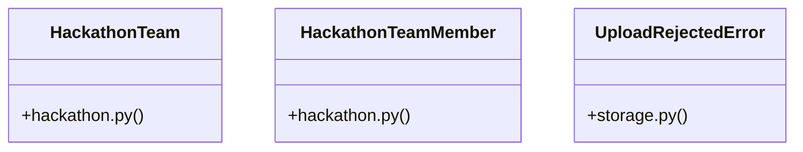

# [send_email() & make_ticket()] Cluster

> 29 nodes · cohesion 0.12

## Key Concepts

- [upload_file()](file:///Users/kodjododjango/Downloads/dev_projects/synca_conf_back/app/services/storage.py#L57) (18 connections)
- [test_storage.py](file:///Users/kodjododjango/Downloads/dev_projects/synca_conf_back/tests/test_storage.py#L1) (10 connections)
- [admin_hackathon.py](file:///Users/kodjododjango/Downloads/dev_projects/synca_conf_back/app/api/admin_hackathon.py#L1) (8 connections)
- [validate_is_real_image()](file:///Users/kodjododjango/Downloads/dev_projects/synca_conf_back/app/services/storage.py#L26) (6 connections)
- [create_team_member()](file:///Users/kodjododjango/Downloads/dev_projects/synca_conf_back/app/api/admin_hackathon.py#L139) (5 connections)
- [_get_team_or_404()](file:///Users/kodjododjango/Downloads/dev_projects/synca_conf_back/app/api/admin_hackathon.py#L27) (5 connections)
- [make_png_bytes()](file:///Users/kodjododjango/Downloads/dev_projects/synca_conf_back/tests/test_storage.py#L16) (5 connections)
- [storage.py](file:///Users/kodjododjango/Downloads/dev_projects/synca_conf_back/app/services/storage.py#L1) (5 connections)
- [HackathonTeam](file:///Users/kodjododjango/Downloads/dev_projects/synca_conf_back/app/models/hackathon.py#L9) (4 connections)
- [HackathonTeamMember](file:///Users/kodjododjango/Downloads/dev_projects/synca_conf_back/app/models/hackathon.py#L24) (4 connections)
- [UploadRejectedError](file:///Users/kodjododjango/Downloads/dev_projects/synca_conf_back/app/services/storage.py#L22) (4 connections)
- [create_team()](file:///Users/kodjododjango/Downloads/dev_projects/synca_conf_back/app/api/admin_hackathon.py#L68) (3 connections)
- [update_team_member()](file:///Users/kodjododjango/Downloads/dev_projects/synca_conf_back/app/api/admin_hackathon.py#L185) (3 connections)
- [test_upload_file_rejects_disallowed_content_type()](file:///Users/kodjododjango/Downloads/dev_projects/synca_conf_back/tests/test_storage.py#L32) (3 connections)
- [test_upload_file_respects_custom_max_bytes()](file:///Users/kodjododjango/Downloads/dev_projects/synca_conf_back/tests/test_storage.py#L96) (3 connections)
- [test_upload_file_success_never_uses_original_filename()](file:///Users/kodjododjango/Downloads/dev_projects/synca_conf_back/tests/test_storage.py#L54) (3 connections)
- [test_validate_is_real_image_accepts_real_image()](file:///Users/kodjododjango/Downloads/dev_projects/synca_conf_back/tests/test_storage.py#L22) (3 connections)
- [delete_team()](file:///Users/kodjododjango/Downloads/dev_projects/synca_conf_back/app/api/admin_hackathon.py#L113) (2 connections)
- [update_team()](file:///Users/kodjododjango/Downloads/dev_projects/synca_conf_back/app/api/admin_hackathon.py#L88) (2 connections)
- [_generate_key()](file:///Users/kodjododjango/Downloads/dev_projects/synca_conf_back/app/services/storage.py#L50) (2 connections)
- [test_upload_file_pdf_skips_image_validation()](file:///Users/kodjododjango/Downloads/dev_projects/synca_conf_back/tests/test_storage.py#L76) (2 connections)
- [test_upload_file_rejects_fake_image_bytes()](file:///Users/kodjododjango/Downloads/dev_projects/synca_conf_back/tests/test_storage.py#L48) (2 connections)
- [test_upload_file_rejects_oversized_file()](file:///Users/kodjododjango/Downloads/dev_projects/synca_conf_back/tests/test_storage.py#L41) (2 connections)
- [test_validate_is_real_image_rejects_fake_image()](file:///Users/kodjododjango/Downloads/dev_projects/synca_conf_back/tests/test_storage.py#L26) (2 connections)
- [hackathon.py](file:///Users/kodjododjango/Downloads/dev_projects/synca_conf_back/app/models/hackathon.py#L1) (2 connections)
- *... and 4 more nodes in this community*

## Class Diagram

## Relationships

- [[[PassType & register_payload()] Cluster]] (1 shared connections)

## Source Files

- [/Users/kodjododjango/Downloads/dev_projects/synca_conf_back/app/api/admin_hackathon.py](file:///Users/kodjododjango/Downloads/dev_projects/synca_conf_back/app/api/admin_hackathon.py)
- [/Users/kodjododjango/Downloads/dev_projects/synca_conf_back/app/models/hackathon.py](file:///Users/kodjododjango/Downloads/dev_projects/synca_conf_back/app/models/hackathon.py)
- [/Users/kodjododjango/Downloads/dev_projects/synca_conf_back/app/services/storage.py](file:///Users/kodjododjango/Downloads/dev_projects/synca_conf_back/app/services/storage.py)
- [/Users/kodjododjango/Downloads/dev_projects/synca_conf_back/tests/test_storage.py](file:///Users/kodjododjango/Downloads/dev_projects/synca_conf_back/tests/test_storage.py)

## Audit Trail

- EXTRACTED: 78 (70%)
- INFERRED: 34 (30%)
- AMBIGUOUS: 0 (0%)

---

*Part of the graphify knowledge wiki. See [[index]] to navigate.*