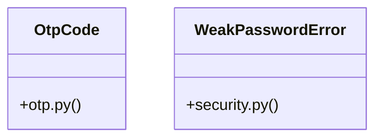

# [verify_stripe_signature() & payment_webhook()] Cluster

> 42 nodes · cohesion 0.08

## Key Concepts

- [test_participant_otp.py](file:///Users/kodjododjango/Downloads/dev_projects/synca_conf_back/tests/test_participant_otp.py#L1) (11 connections)
- [hash_password()](file:///Users/kodjododjango/Downloads/dev_projects/synca_conf_back/app/core/security.py#L37) (10 connections)
- [make_verified_user()](file:///Users/kodjododjango/Downloads/dev_projects/synca_conf_back/tests/test_participant_otp.py#L13) (9 connections)
- [test_admin_panel.py](file:///Users/kodjododjango/Downloads/dev_projects/synca_conf_back/tests/test_admin_panel.py#L1) (9 connections)
- [make_admin()](file:///Users/kodjododjango/Downloads/dev_projects/synca_conf_back/tests/test_admin_panel.py#L16) (8 connections)
- [validate_password_strength()](file:///Users/kodjododjango/Downloads/dev_projects/synca_conf_back/app/core/security.py#L20) (7 connections)
- [create_admin_user()](file:///Users/kodjododjango/Downloads/dev_projects/synca_conf_back/app/api/admin_users.py#L59) (6 connections)
- [OtpCode](file:///Users/kodjododjango/Downloads/dev_projects/synca_conf_back/app/models/otp.py#L9) (6 connections)
- [_to_read()](file:///Users/kodjododjango/Downloads/dev_projects/synca_conf_back/app/api/admin_users.py#L21) (5 connections)
- [update_admin_user()](file:///Users/kodjododjango/Downloads/dev_projects/synca_conf_back/app/api/admin_users.py#L100) (5 connections)
- [main()](file:///Users/kodjododjango/Downloads/dev_projects/synca_conf_back/app/cli/create_admin.py#L16) (5 connections)
- [verify_password()](file:///Users/kodjododjango/Downloads/dev_projects/synca_conf_back/app/core/security.py#L41) (5 connections)
- [grant_permission()](file:///Users/kodjododjango/Downloads/dev_projects/synca_conf_back/tests/test_admin_panel.py#L31) (4 connections)
- [test_verify_otp_expired_code_returns_401()](file:///Users/kodjododjango/Downloads/dev_projects/synca_conf_back/tests/test_participant_otp.py#L117) (4 connections)
- [admin_users.py](file:///Users/kodjododjango/Downloads/dev_projects/synca_conf_back/app/api/admin_users.py#L1) (4 connections)
- [security.py](file:///Users/kodjododjango/Downloads/dev_projects/synca_conf_back/app/core/security.py#L1) (4 connections)
- [test_security.py](file:///Users/kodjododjango/Downloads/dev_projects/synca_conf_back/tests/test_security.py#L1) (4 connections)
- [WeakPasswordError](file:///Users/kodjododjango/Downloads/dev_projects/synca_conf_back/app/core/security.py#L16) (3 connections)
- [test_login_success_grants_access_to_a_permitted_view()](file:///Users/kodjododjango/Downloads/dev_projects/synca_conf_back/tests/test_admin_panel.py#L88) (3 connections)
- [test_hash_and_verify_roundtrip()](file:///Users/kodjododjango/Downloads/dev_projects/synca_conf_back/tests/test_security.py#L11) (3 connections)
- [test_verify_wrong_password_fails()](file:///Users/kodjododjango/Downloads/dev_projects/synca_conf_back/tests/test_security.py#L17) (3 connections)
- [list_admin_users()](file:///Users/kodjododjango/Downloads/dev_projects/synca_conf_back/app/api/admin_users.py#L36) (2 connections)
- [Login code for the participant OTP flow (app/api/participant_auth.py).      Sepa](file:///Users/kodjododjango/Downloads/dev_projects/synca_conf_back/app/models/otp.py#L10) (2 connections)
- [test_any_authenticated_admin_can_read_contact_messages()](file:///Users/kodjododjango/Downloads/dev_projects/synca_conf_back/tests/test_admin_panel.py#L138) (2 connections)
- [test_login_wrong_password_is_rejected()](file:///Users/kodjododjango/Downloads/dev_projects/synca_conf_back/tests/test_admin_panel.py#L105) (2 connections)
- *... and 17 more nodes in this community*

## Class Diagram

## Relationships

- [[[create_access_token() & Role] Cluster]] (1 shared connections)

## Source Files

- [/Users/kodjododjango/Downloads/dev_projects/synca_conf_back/app/api/admin_users.py](file:///Users/kodjododjango/Downloads/dev_projects/synca_conf_back/app/api/admin_users.py)
- [/Users/kodjododjango/Downloads/dev_projects/synca_conf_back/app/cli/create_admin.py](file:///Users/kodjododjango/Downloads/dev_projects/synca_conf_back/app/cli/create_admin.py)
- [/Users/kodjododjango/Downloads/dev_projects/synca_conf_back/app/core/security.py](file:///Users/kodjododjango/Downloads/dev_projects/synca_conf_back/app/core/security.py)
- [/Users/kodjododjango/Downloads/dev_projects/synca_conf_back/app/models/otp.py](file:///Users/kodjododjango/Downloads/dev_projects/synca_conf_back/app/models/otp.py)
- [/Users/kodjododjango/Downloads/dev_projects/synca_conf_back/tests/test_admin_panel.py](file:///Users/kodjododjango/Downloads/dev_projects/synca_conf_back/tests/test_admin_panel.py)
- [/Users/kodjododjango/Downloads/dev_projects/synca_conf_back/tests/test_participant_otp.py](file:///Users/kodjododjango/Downloads/dev_projects/synca_conf_back/tests/test_participant_otp.py)
- [/Users/kodjododjango/Downloads/dev_projects/synca_conf_back/tests/test_security.py](file:///Users/kodjododjango/Downloads/dev_projects/synca_conf_back/tests/test_security.py)

## Audit Trail

- EXTRACTED: 104 (68%)
- INFERRED: 48 (32%)
- AMBIGUOUS: 0 (0%)

---

*Part of the graphify knowledge wiki. See [[index]] to navigate.*