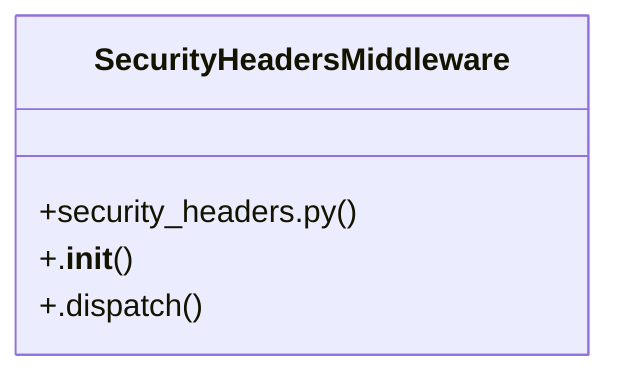

# [verify_stripe_signature() & payment_webhook()] Cluster

> 42 nodes · cohesion 0.06

## Key Concepts

- [send_email()](file:///Users/kodjododjango/Downloads/dev_projects/synca_conf_back/app/services/email_service.py#L9) (10 connections)
- [finalize_ticket()](file:///Users/kodjododjango/Downloads/dev_projects/synca_conf_back/app/services/ticket_finalization.py#L10) (8 connections)
- [make_ticket()](file:///Users/kodjododjango/Downloads/dev_projects/synca_conf_back/tests/test_ticket_finalization.py#L9) (7 connections)
- [SecurityHeadersMiddleware](file:///Users/kodjododjango/Downloads/dev_projects/synca_conf_back/app/core/security_headers.py#L20) (6 connections)
- [_waitlist_reminder_loop()](file:///Users/kodjododjango/Downloads/dev_projects/synca_conf_back/app/main.py#L47) (5 connections)
- [test_ticket_finalization.py](file:///Users/kodjododjango/Downloads/dev_projects/synca_conf_back/tests/test_ticket_finalization.py#L1) (5 connections)
- [send_waitlist_reminders()](file:///Users/kodjododjango/Downloads/dev_projects/synca_conf_back/app/services/waitlist_reminder.py#L36) (5 connections)
- [generate_and_upload_ticket_pdf()](file:///Users/kodjododjango/Downloads/dev_projects/synca_conf_back/app/services/ticket_pdf.py#L93) (4 connections)
- [_render_ticket_pdf()](file:///Users/kodjododjango/Downloads/dev_projects/synca_conf_back/app/services/ticket_pdf.py#L35) (4 connections)
- [admin_campaign_windows.py](file:///Users/kodjododjango/Downloads/dev_projects/synca_conf_back/app/api/admin_campaign_windows.py#L1) (4 connections)
- [main.py](file:///Users/kodjododjango/Downloads/dev_projects/synca_conf_back/app/main.py#L1) (4 connections)
- [test_email_service.py](file:///Users/kodjododjango/Downloads/dev_projects/synca_conf_back/tests/test_email_service.py#L1) (4 connections)
- [_notify_waitlist()](file:///Users/kodjododjango/Downloads/dev_projects/synca_conf_back/app/api/admin_campaign_windows.py#L26) (3 connections)
- [_mock_response()](file:///Users/kodjododjango/Downloads/dev_projects/synca_conf_back/tests/test_email_service.py#L15) (3 connections)
- [test_send_email_calls_resend_when_key_configured()](file:///Users/kodjododjango/Downloads/dev_projects/synca_conf_back/tests/test_email_service.py#L20) (3 connections)
- [test_send_email_raises_on_resend_error()](file:///Users/kodjododjango/Downloads/dev_projects/synca_conf_back/tests/test_email_service.py#L39) (3 connections)
- [test_finalize_ticket_is_idempotent_when_already_finalized()](file:///Users/kodjododjango/Downloads/dev_projects/synca_conf_back/tests/test_ticket_finalization.py#L92) (3 connections)
- [test_finalize_ticket_sets_pdf_url_and_sends_email()](file:///Users/kodjododjango/Downloads/dev_projects/synca_conf_back/tests/test_ticket_finalization.py#L62) (3 connections)
- [ticket_pdf.py](file:///Users/kodjododjango/Downloads/dev_projects/synca_conf_back/app/services/ticket_pdf.py#L1) (3 connections)
- [waitlist_reminder.py](file:///Users/kodjododjango/Downloads/dev_projects/synca_conf_back/app/services/waitlist_reminder.py#L1) (3 connections)
- [_is_open()](file:///Users/kodjododjango/Downloads/dev_projects/synca_conf_back/app/api/admin_campaign_windows.py#L19) (2 connections)
- [update_campaign_window()](file:///Users/kodjododjango/Downloads/dev_projects/synca_conf_back/app/api/admin_campaign_windows.py#L59) (2 connections)
- [lifespan()](file:///Users/kodjododjango/Downloads/dev_projects/synca_conf_back/app/main.py#L63) (2 connections)
- [Pas de cron dans le projet : boucle asyncio en tâche de fond,     voir app/servi](file:///Users/kodjododjango/Downloads/dev_projects/synca_conf_back/app/main.py#L48) (2 connections)
- [test_send_email_logs_in_dev_without_key()](file:///Users/kodjododjango/Downloads/dev_projects/synca_conf_back/tests/test_email_service.py#L10) (2 connections)
- *... and 17 more nodes in this community*

## Class Diagram

## Relationships

- [[[PassType & register_payload()] Cluster]] (3 shared connections)
- [[Community 15]] (1 shared connections)

## Source Files

- [/Users/kodjododjango/Downloads/dev_projects/synca_conf_back/app/api/admin_campaign_windows.py](file:///Users/kodjododjango/Downloads/dev_projects/synca_conf_back/app/api/admin_campaign_windows.py)
- [/Users/kodjododjango/Downloads/dev_projects/synca_conf_back/app/core/security_headers.py](file:///Users/kodjododjango/Downloads/dev_projects/synca_conf_back/app/core/security_headers.py)
- [/Users/kodjododjango/Downloads/dev_projects/synca_conf_back/app/main.py](file:///Users/kodjododjango/Downloads/dev_projects/synca_conf_back/app/main.py)
- [/Users/kodjododjango/Downloads/dev_projects/synca_conf_back/app/services/email_service.py](file:///Users/kodjododjango/Downloads/dev_projects/synca_conf_back/app/services/email_service.py)
- [/Users/kodjododjango/Downloads/dev_projects/synca_conf_back/app/services/ticket_finalization.py](file:///Users/kodjododjango/Downloads/dev_projects/synca_conf_back/app/services/ticket_finalization.py)
- [/Users/kodjododjango/Downloads/dev_projects/synca_conf_back/app/services/ticket_pdf.py](file:///Users/kodjododjango/Downloads/dev_projects/synca_conf_back/app/services/ticket_pdf.py)
- [/Users/kodjododjango/Downloads/dev_projects/synca_conf_back/app/services/waitlist_reminder.py](file:///Users/kodjododjango/Downloads/dev_projects/synca_conf_back/app/services/waitlist_reminder.py)
- [/Users/kodjododjango/Downloads/dev_projects/synca_conf_back/tests/test_email_service.py](file:///Users/kodjododjango/Downloads/dev_projects/synca_conf_back/tests/test_email_service.py)
- [/Users/kodjododjango/Downloads/dev_projects/synca_conf_back/tests/test_ticket_finalization.py](file:///Users/kodjododjango/Downloads/dev_projects/synca_conf_back/tests/test_ticket_finalization.py)

## Audit Trail

- EXTRACTED: 82 (68%)
- INFERRED: 39 (32%)
- AMBIGUOUS: 0 (0%)

---

*Part of the graphify knowledge wiki. See [[index]] to navigate.*