# create_access_token()

> God node · 47 connections · [/Users/kodjododjango/Downloads/dev_projects/synca_conf_back/app/services/auth_service.py](file:///Users/kodjododjango/Downloads/dev_projects/synca_conf_back/app/services/auth_service.py#L104)

## Call Trace Diagram

```mermaid
sequenceDiagram
    participant P0 as create_access_token()
    participant P1 as refresh()
    participant P2 as make_admin_with_permission()
    participant P3 as Role
    participant P4 as AdminUser
    participant P5 as RolePermission
    participant P6 as Permission
    participant P7 as test_speaker_accepted_publishes_it()
    participant P8 as test_speaker_rejected_stays_unpublished()
    participant P9 as test_speaker_update_forbidden_without_permission()
    participant P10 as test_speaker_update_rejects_invalid_status()
    participant P11 as test_ambassador_accepted()
    participant P12 as test_ambassador_accepted_twice_does_not_regenerate_promo_code()
    participant P13 as test_ambassador_update_forbidden_without_permission()
    participant P14 as test_partner_confirmed_publishes_it()
    participant P15 as test_partner_negotiating_stays_unpublished()
    participant P16 as test_partner_update_forbidden_without_permission()
    participant P17 as test_exhibitor_confirmed_publishes_it()
    participant P18 as test_exhibitor_update_forbidden_without_permission()
    participant P19 as test_speaker_update_404_for_unknown_id()
    participant P20 as authenticate_admin()
    participant P21 as make_admin_with_permission()
    participant P22 as decode_token()
    participant P23 as make_admin_with_permission()
    participant P24 as make_admin_with_permission()
    participant P25 as make_ticket()
    participant P26 as make_admin_with_permission()
    participant P27 as payment_webhook()
    participant P28 as make_admin_with_role()
    participant P29 as make_admin_with_permissions()
    participant P30 as test_admin_endpoint_limited_to_30_per_minute()
    participant P31 as test_webhook_increments_promo_usage_count_on_completion()
    participant P32 as make_admin_with_role()
    participant P33 as create_admin_user()
    participant P34 as register()
    participant P35 as apply_as_speaker()
    participant P36 as apply_as_ambassador()
    participant P37 as apply_as_partner()
    participant P38 as apply_as_exhibitor()
    participant P39 as create_team_member()
    participant P40 as make_admin()
    participant P41 as TokenPair
    participant P42 as create_refresh_token()
    participant P43 as create_payment()
    participant P44 as update_admin_user()
    participant P45 as make_user()
    participant P46 as create_ambassador_admin()
    participant P47 as contact()
    participant P48 as update_team_member()
    participant P49 as update_campaign_window()
    participant P50 as test_finalize_ticket_sets_pdf_url_and_sends_email()
    participant P51 as test_update_campaign_window_rejects_end_before_start()
    participant P52 as test_webhook_completes_payment_and_creates_ticket()
    participant P53 as test_webhook_failed_status_marks_payment_failed()
    participant P54 as test_webhook_rejects_transaction_ref_reused_on_other_payment()
    participant P55 as test_payment_default_status_pending()
    participant P56 as test_partner_negotiation_workflow()
    participant P57 as test_faq_crud_basic()
    participant P58 as create_day()
    participant P59 as create_session()
    participant P60 as create_speaker_admin()
    participant P61 as update_ambassador_status()
    participant P62 as create_partner_admin()
    participant P63 as create_exhibitor_admin()
    participant P64 as join_waitlist()
    participant P65 as subscribe_newsletter()
    participant P66 as create_faq_category()
    participant P67 as create_faq()
    participant P68 as create_partner_benefit()
    participant P69 as create_promo_code()
    participant P70 as create_pass_content()
    participant P71 as test_null_special_needs_stays_null()
    participant P72 as test_get_ambassador_detail()
    participant P73 as test_get_ambassador_detail_404_when_not_public()
    participant P74 as test_delete_me_anonymizes_and_revokes_token()
    participant P75 as test_get_speaker_detail()
    participant P76 as test_get_speaker_detail_404_when_not_public()
    participant P77 as test_speaker_default_status_pending_and_not_public()
    participant P78 as test_speaker_status_workflow_transition()
    participant P79 as test_ambassador_social_handles_json()
    participant P80 as test_exhibitor_default_status_and_public()
    participant P81 as test_contact_message_default_unread()
    participant P82 as update_day()
    participant P83 as update_session()
    participant P84 as update_speaker_status()
    participant P85 as update_partner_status()
    participant P86 as update_exhibitor_status()
    participant P87 as update_contact_read_status()
    participant P88 as update_faq_category()
    participant P89 as update_faq()
    participant P90 as update_partner_benefit()
    participant P91 as update_event_settings()
    participant P92 as update_promo_code()
    participant P93 as update_pass_content()
    participant P94 as test_stats_computed_from_payments_tickets_and_applications()
    participant P95 as login()
    participant P96 as _create_token()
    participant P97 as test_get_current_admin_valid_token()
    participant P98 as test_export_registrations_csv()
    participant P99 as test_export_payments_csv()
    participant P100 as test_export_registrations_neutralizes_csv_formula_injection()
    participant P101 as test_any_authenticated_admin_can_list_contacts()
    participant P102 as test_list_contacts_filters_by_is_read()
    participant P103 as test_superadmin_can_update_role_permissions()
    participant P104 as test_non_superadmin_forbidden()
    participant P105 as test_unknown_permission_code_rejected()
    participant P106 as test_list_registrations_returns_all_by_default()
    participant P107 as test_list_registrations_filters_by_status()
    participant P108 as test_list_registrations_respects_pagination_limit()
    participant P109 as .login()
    participant P110 as test_me_returns_identity_role_and_permissions()
    participant P111 as test_list_campaign_windows_admin()
    participant P112 as test_list_campaign_windows_forbidden_without_permission()
    participant P113 as test_update_campaign_window_dates_and_is_active()
    participant P114 as test_update_campaign_window_unknown_key_404()
    participant P115 as test_update_campaign_window_forbidden_without_permission()
    participant P116 as test_export_registrations_forbidden_without_permission()
    participant P117 as test_export_payments_forbidden_without_permission()
    participant P118 as test_stats_forbidden_without_permission()
    participant P119 as test_stats_handles_no_completed_payments()
    participant P120 as test_access_token_round_trip()
    participant P121 as test_wrong_token_type_rejected()
    participant P122 as test_invalid_signature_rejected()
    participant P123 as test_list_registrations_forbidden_without_permission()
    P0->>+ P1: calls
    P1-->>- P0: return
    P1->>+ P0: calls
    P0-->>- P1: return
    P1->>+ P2: calls
    P2-->>- P1: return
    P2->>+ P1: calls
    P1-->>- P2: return
    P2->>+ P3: calls
    P3-->>- P2: return
    P2->>+ P4: calls
    P4-->>- P2: return
    P2->>+ P5: calls
    P5-->>- P2: return
    P2->>+ P6: calls
    P6-->>- P2: return
    P2->>+ P7: calls
    P7-->>- P2: return
    P2->>+ P8: calls
    P8-->>- P2: return
    P2->>+ P9: calls
    P9-->>- P2: return
    P2->>+ P10: calls
    P10-->>- P2: return
    P2->>+ P11: calls
    P11-->>- P2: return
    P2->>+ P12: calls
    P12-->>- P2: return
    P2->>+ P13: calls
    P13-->>- P2: return
    P2->>+ P14: calls
    P14-->>- P2: return
    P2->>+ P15: calls
    P15-->>- P2: return
    P2->>+ P16: calls
    P16-->>- P2: return
    P2->>+ P17: calls
    P17-->>- P2: return
    P2->>+ P18: calls
    P18-->>- P2: return
    P2->>+ P19: calls
    P19-->>- P2: return
    P1->>+ P20: calls
    P20-->>- P1: return
    P1->>+ P21: calls
    P21-->>- P1: return
    P1->>+ P22: calls
    P22-->>- P1: return
    P1->>+ P23: calls
    P23-->>- P1: return
    P1->>+ P24: calls
    P24-->>- P1: return
    P1->>+ P25: calls
    P25-->>- P1: return
    P1->>+ P26: calls
    P26-->>- P1: return
    P1->>+ P27: calls
    P27-->>- P1: return
    P1->>+ P28: calls
    P28-->>- P1: return
    P1->>+ P29: calls
    P29-->>- P1: return
    P1->>+ P30: calls
    P30-->>- P1: return
    P1->>+ P31: calls
    P31-->>- P1: return
    P1->>+ P32: calls
    P32-->>- P1: return
    P1->>+ P33: calls
    P33-->>- P1: return
    P1->>+ P34: calls
    P34-->>- P1: return
    P1->>+ P35: calls
    P35-->>- P1: return
    P1->>+ P36: calls
    P36-->>- P1: return
    P1->>+ P37: calls
    P37-->>- P1: return
    P1->>+ P38: calls
    P38-->>- P1: return
    P1->>+ P39: calls
    P39-->>- P1: return
    P1->>+ P40: calls
    P40-->>- P1: return
    P1->>+ P41: calls
    P41-->>- P1: return
    P1->>+ P42: calls
    P42-->>- P1: return
    P1->>+ P43: calls
    P43-->>- P1: return
    P1->>+ P44: calls
    P44-->>- P1: return
    P1->>+ P45: calls
    P45-->>- P1: return
    P1->>+ P46: calls
    P46-->>- P1: return
    P1->>+ P47: calls
    P47-->>- P1: return
    P1->>+ P48: calls
    P48-->>- P1: return
    P1->>+ P49: calls
    P49-->>- P1: return
    P1->>+ P50: calls
    P50-->>- P1: return
    P1->>+ P51: calls
    P51-->>- P1: return
    P1->>+ P52: calls
    P52-->>- P1: return
    P1->>+ P53: calls
    P53-->>- P1: return
    P1->>+ P54: calls
    P54-->>- P1: return
    P1->>+ P55: calls
    P55-->>- P1: return
    P1->>+ P56: calls
    P56-->>- P1: return
    P1->>+ P57: calls
    P57-->>- P1: return
    P1->>+ P58: calls
    P58-->>- P1: return
    P1->>+ P59: calls
    P59-->>- P1: return
    P1->>+ P60: calls
    P60-->>- P1: return
    P1->>+ P61: calls
    P61-->>- P1: return
    P1->>+ P62: calls
    P62-->>- P1: return
    P1->>+ P63: calls
    P63-->>- P1: return
    P1->>+ P64: calls
    P64-->>- P1: return
    P1->>+ P65: calls
    P65-->>- P1: return
    P1->>+ P66: calls
    P66-->>- P1: return
    P1->>+ P67: calls
    P67-->>- P1: return
    P1->>+ P68: calls
    P68-->>- P1: return
    P1->>+ P69: calls
    P69-->>- P1: return
    P1->>+ P70: calls
    P70-->>- P1: return
    P1->>+ P71: calls
    P71-->>- P1: return
    P1->>+ P72: calls
    P72-->>- P1: return
    P1->>+ P73: calls
    P73-->>- P1: return
    P1->>+ P74: calls
    P74-->>- P1: return
    P1->>+ P75: calls
    P75-->>- P1: return
    P1->>+ P76: calls
    P76-->>- P1: return
    P1->>+ P77: calls
    P77-->>- P1: return
    P1->>+ P78: calls
    P78-->>- P1: return
    P1->>+ P79: calls
    P79-->>- P1: return
    P1->>+ P80: calls
    P80-->>- P1: return
    P1->>+ P81: calls
    P81-->>- P1: return
    P1->>+ P82: calls
    P82-->>- P1: return
    P1->>+ P83: calls
    P83-->>- P1: return
    P1->>+ P84: calls
    P84-->>- P1: return
    P1->>+ P85: calls
    P85-->>- P1: return
    P1->>+ P86: calls
    P86-->>- P1: return
    P1->>+ P87: calls
    P87-->>- P1: return
    P1->>+ P88: calls
    P88-->>- P1: return
    P1->>+ P89: calls
    P89-->>- P1: return
    P1->>+ P90: calls
    P90-->>- P1: return
    P1->>+ P91: calls
    P91-->>- P1: return
    P1->>+ P92: calls
    P92-->>- P1: return
    P1->>+ P93: calls
    P93-->>- P1: return
    P0->>+ P94: calls
    P94-->>- P0: return
    P0->>+ P30: calls
    P30-->>- P0: return
    P0->>+ P95: calls
    P95-->>- P0: return
    P0->>+ P96: calls
    P96-->>- P0: return
    P0->>+ P97: calls
    P97-->>- P0: return
    P0->>+ P51: calls
    P51-->>- P0: return
    P0->>+ P98: calls
    P98-->>- P0: return
    P0->>+ P99: calls
    P99-->>- P0: return
    P0->>+ P100: calls
    P100-->>- P0: return
    P0->>+ P101: calls
    P101-->>- P0: return
    P0->>+ P102: calls
    P102-->>- P0: return
    P0->>+ P103: calls
    P103-->>- P0: return
    P0->>+ P104: calls
    P104-->>- P0: return
    P0->>+ P105: calls
    P105-->>- P0: return
    P0->>+ P7: calls
    P7-->>- P0: return
    P0->>+ P8: calls
    P8-->>- P0: return
    P0->>+ P9: calls
    P9-->>- P0: return
    P0->>+ P10: calls
    P10-->>- P0: return
    P0->>+ P11: calls
    P11-->>- P0: return
    P0->>+ P12: calls
    P12-->>- P0: return
    P0->>+ P13: calls
    P13-->>- P0: return
    P0->>+ P14: calls
    P14-->>- P0: return
    P0->>+ P15: calls
    P15-->>- P0: return
    P0->>+ P16: calls
    P16-->>- P0: return
    P0->>+ P17: calls
    P17-->>- P0: return
    P0->>+ P18: calls
    P18-->>- P0: return
    P0->>+ P106: calls
    P106-->>- P0: return
    P0->>+ P107: calls
    P107-->>- P0: return
    P0->>+ P108: calls
    P108-->>- P0: return
    P0->>+ P109: calls
    P109-->>- P0: return
    P0->>+ P110: calls
    P110-->>- P0: return
    P0->>+ P111: calls
    P111-->>- P0: return
    P0->>+ P112: calls
    P112-->>- P0: return
    P0->>+ P113: calls
    P113-->>- P0: return
    P0->>+ P114: calls
    P114-->>- P0: return
    P0->>+ P115: calls
    P115-->>- P0: return
    P0->>+ P116: calls
    P116-->>- P0: return
    P0->>+ P117: calls
    P117-->>- P0: return
    P0->>+ P118: calls
    P118-->>- P0: return
    P0->>+ P119: calls
    P119-->>- P0: return
    P0->>+ P19: calls
    P19-->>- P0: return
    P0->>+ P120: calls
    P120-->>- P0: return
    P0->>+ P121: calls
    P121-->>- P0: return
    P0->>+ P122: calls
    P122-->>- P0: return
    P0->>+ P123: calls
    P123-->>- P0: return
```

## Connections by Relation

### calls
- [[refresh()]] `INFERRED`
- [[test_stats_computed_from_payments_tickets_and_applications()]] `INFERRED`
- [[test_admin_endpoint_limited_to_30_per_minute()]] `INFERRED`
- [[login()]] `INFERRED`
- [[_create_token()]] `EXTRACTED`
- [[test_get_current_admin_valid_token()]] `INFERRED`
- [[test_update_campaign_window_rejects_end_before_start()]] `INFERRED`
- [[test_export_registrations_csv()]] `INFERRED`
- [[test_export_payments_csv()]] `INFERRED`
- [[test_export_registrations_neutralizes_csv_formula_injection()]] `INFERRED`
- [[test_any_authenticated_admin_can_list_contacts()]] `INFERRED`
- [[test_list_contacts_filters_by_is_read()]] `INFERRED`
- [[test_superadmin_can_update_role_permissions()]] `INFERRED`
- [[test_non_superadmin_forbidden()]] `INFERRED`
- [[test_unknown_permission_code_rejected()]] `INFERRED`
- [[test_speaker_accepted_publishes_it()]] `INFERRED`
- [[test_speaker_rejected_stays_unpublished()]] `INFERRED`
- [[test_speaker_update_forbidden_without_permission()]] `INFERRED`
- [[test_speaker_update_rejects_invalid_status()]] `INFERRED`
- [[test_ambassador_accepted()]] `INFERRED`

### contains
- [[auth_service.py]] `EXTRACTED`

---

*Part of the graphify knowledge wiki. See [[index]] to navigate.*