# create_access_token()

> God node · 46 connections · [/Users/kodjododjango/Downloads/dev_projects/synca_conf_back/app/services/auth_service.py](file:///Users/kodjododjango/Downloads/dev_projects/synca_conf_back/app/services/auth_service.py#L104)

## Call Trace Diagram

```mermaid
sequenceDiagram
    participant P0 as create_access_token()
    participant P1 as test_stats_computed_from_payments_tickets_and_applications()
    participant P2 as PromoCode
    participant P3 as Base
    participant P4 as PassType
    participant P5 as test_webhook_increments_promo_usage_count_on_completion()
    participant P6 as generate_ambassador_promo_code()
    participant P7 as test_register_valid_promo_code_accepted()
    participant P8 as test_promo_code_payment_ticket_waitlist_read()
    participant P9 as test_create_payment_applies_percent_discount()
    participant P10 as test_create_payment_applies_fixed_discount()
    participant P11 as test_promo_code_and_waitlist_unique()
    participant P12 as test_promo_validate_success()
    participant P13 as test_promo_validate_inactive_400()
    participant P14 as test_promo_validate_expired_400()
    participant P15 as test_promo_validate_exhausted_400()
    participant P16 as test_promo_validate_fixed_discount()
    participant P17 as Payment
    participant P18 as Speaker
    participant P19 as Ticket
    participant P20 as make_admin_with_permission()
    participant P21 as make_user_and_pass_type()
    participant P22 as test_admin_endpoint_limited_to_30_per_minute()
    participant P23 as login()
    participant P24 as _create_token()
    participant P25 as test_get_current_admin_valid_token()
    participant P26 as test_export_registrations_csv()
    participant P27 as test_export_payments_csv()
    participant P28 as test_export_registrations_neutralizes_csv_formula_injection()
    participant P29 as test_any_authenticated_admin_can_list_contacts()
    participant P30 as test_list_contacts_filters_by_is_read()
    participant P31 as test_superadmin_can_update_role_permissions()
    participant P32 as test_non_superadmin_forbidden()
    participant P33 as test_unknown_permission_code_rejected()
    participant P34 as test_speaker_accepted_publishes_it()
    participant P35 as test_speaker_rejected_stays_unpublished()
    participant P36 as test_speaker_update_forbidden_without_permission()
    participant P37 as test_speaker_update_rejects_invalid_status()
    participant P38 as test_ambassador_accepted()
    participant P39 as test_ambassador_accepted_twice_does_not_regenerate_promo_code()
    participant P40 as test_ambassador_update_forbidden_without_permission()
    participant P41 as test_partner_confirmed_publishes_it()
    participant P42 as test_partner_negotiating_stays_unpublished()
    participant P43 as test_partner_update_forbidden_without_permission()
    participant P44 as test_exhibitor_confirmed_publishes_it()
    participant P45 as test_exhibitor_update_forbidden_without_permission()
    participant P46 as test_list_registrations_returns_all_by_default()
    participant P47 as test_list_registrations_filters_by_status()
    participant P48 as test_list_registrations_respects_pagination_limit()
    participant P49 as .login()
    participant P50 as test_me_returns_identity_role_and_permissions()
    participant P51 as test_list_campaign_windows_admin()
    participant P52 as test_list_campaign_windows_forbidden_without_permission()
    participant P53 as test_update_campaign_window_dates_and_is_active()
    participant P54 as test_update_campaign_window_rejects_end_before_start()
    participant P55 as test_update_campaign_window_unknown_key_404()
    participant P56 as test_update_campaign_window_forbidden_without_permission()
    participant P57 as test_export_registrations_forbidden_without_permission()
    participant P58 as test_export_payments_forbidden_without_permission()
    participant P59 as test_stats_forbidden_without_permission()
    participant P60 as test_stats_handles_no_completed_payments()
    participant P61 as test_speaker_update_404_for_unknown_id()
    participant P62 as test_access_token_round_trip()
    participant P63 as test_wrong_token_type_rejected()
    participant P64 as test_invalid_signature_rejected()
    participant P65 as test_list_registrations_forbidden_without_permission()
    P0->>+ P1: calls
    P1-->>- P0: return
    P1->>+ P0: calls
    P0-->>- P1: return
    P1->>+ P2: calls
    P2-->>- P1: return
    P2->>+ P3: uses
    P3-->>- P2: return
    P2->>+ P4: uses
    P4-->>- P2: return
    P2->>+ P1: calls
    P1-->>- P2: return
    P2->>+ P5: calls
    P5-->>- P2: return
    P2->>+ P6: calls
    P6-->>- P2: return
    P2->>+ P7: calls
    P7-->>- P2: return
    P2->>+ P8: calls
    P8-->>- P2: return
    P2->>+ P9: calls
    P9-->>- P2: return
    P2->>+ P10: calls
    P10-->>- P2: return
    P2->>+ P11: calls
    P11-->>- P2: return
    P2->>+ P12: calls
    P12-->>- P2: return
    P2->>+ P13: calls
    P13-->>- P2: return
    P2->>+ P14: calls
    P14-->>- P2: return
    P2->>+ P15: calls
    P15-->>- P2: return
    P2->>+ P16: calls
    P16-->>- P2: return
    P1->>+ P17: calls
    P17-->>- P1: return
    P1->>+ P18: calls
    P18-->>- P1: return
    P1->>+ P19: calls
    P19-->>- P1: return
    P1->>+ P20: calls
    P20-->>- P1: return
    P1->>+ P21: calls
    P21-->>- P1: return
    P0->>+ P22: calls
    P22-->>- P0: return
    P0->>+ P23: calls
    P23-->>- P0: return
    P0->>+ P24: calls
    P24-->>- P0: return
    P0->>+ P25: calls
    P25-->>- P0: return
    P0->>+ P26: calls
    P26-->>- P0: return
    P0->>+ P27: calls
    P27-->>- P0: return
    P0->>+ P28: calls
    P28-->>- P0: return
    P0->>+ P29: calls
    P29-->>- P0: return
    P0->>+ P30: calls
    P30-->>- P0: return
    P0->>+ P31: calls
    P31-->>- P0: return
    P0->>+ P32: calls
    P32-->>- P0: return
    P0->>+ P33: calls
    P33-->>- P0: return
    P0->>+ P34: calls
    P34-->>- P0: return
    P0->>+ P35: calls
    P35-->>- P0: return
    P0->>+ P36: calls
    P36-->>- P0: return
    P0->>+ P37: calls
    P37-->>- P0: return
    P0->>+ P38: calls
    P38-->>- P0: return
    P0->>+ P39: calls
    P39-->>- P0: return
    P0->>+ P40: calls
    P40-->>- P0: return
    P0->>+ P41: calls
    P41-->>- P0: return
    P0->>+ P42: calls
    P42-->>- P0: return
    P0->>+ P43: calls
    P43-->>- P0: return
    P0->>+ P44: calls
    P44-->>- P0: return
    P0->>+ P45: calls
    P45-->>- P0: return
    P0->>+ P46: calls
    P46-->>- P0: return
    P0->>+ P47: calls
    P47-->>- P0: return
    P0->>+ P48: calls
    P48-->>- P0: return
    P0->>+ P49: calls
    P49-->>- P0: return
    P0->>+ P50: calls
    P50-->>- P0: return
    P0->>+ P51: calls
    P51-->>- P0: return
    P0->>+ P52: calls
    P52-->>- P0: return
    P0->>+ P53: calls
    P53-->>- P0: return
    P0->>+ P54: calls
    P54-->>- P0: return
    P0->>+ P55: calls
    P55-->>- P0: return
    P0->>+ P56: calls
    P56-->>- P0: return
    P0->>+ P57: calls
    P57-->>- P0: return
    P0->>+ P58: calls
    P58-->>- P0: return
    P0->>+ P59: calls
    P59-->>- P0: return
    P0->>+ P60: calls
    P60-->>- P0: return
    P0->>+ P61: calls
    P61-->>- P0: return
    P0->>+ P62: calls
    P62-->>- P0: return
    P0->>+ P63: calls
    P63-->>- P0: return
    P0->>+ P64: calls
    P64-->>- P0: return
    P0->>+ P65: calls
    P65-->>- P0: return
```

## Connections by Relation

### calls
- [[test_stats_computed_from_payments_tickets_and_applications()]] `INFERRED`
- [[test_admin_endpoint_limited_to_30_per_minute()]] `INFERRED`
- [[login()]] `INFERRED`
- [[_create_token()]] `EXTRACTED`
- [[test_get_current_admin_valid_token()]] `INFERRED`
- [[test_export_registrations_csv()]] `INFERRED`
- [[test_export_payments_csv()]] `INFERRED`
- [[test_export_registrations_neutralizes_csv_formula_injection()]] `INFERRED`
- [[test_any_authenticated_admin_can_list_contacts()]] `INFERRED`
- [[test_list_contacts_filters_by_is_read()]] `INFERRED`
- [[test_superadmin_can_update_role_permissions()]] `INFERRED`
- [[test_non_superadmin_forbidden()]] `INFERRED`
- [[test_unknown_permission_code_rejected()]] `INFERRED`
- [[test_speaker_accepted_publishes_it()]] `INFERRED`
- [[test_speaker_rejected_stays_unpublished()]] `INFERRED`
- [[test_speaker_update_forbidden_without_permission()]] `INFERRED`
- [[test_speaker_update_rejects_invalid_status()]] `INFERRED`
- [[test_ambassador_accepted()]] `INFERRED`
- [[test_ambassador_accepted_twice_does_not_regenerate_promo_code()]] `INFERRED`
- [[test_ambassador_update_forbidden_without_permission()]] `INFERRED`

### contains
- [[auth_service.py]] `EXTRACTED`

---

*Part of the graphify knowledge wiki. See [[index]] to navigate.*