# get_settings()

> God node · 18 connections · [/Users/kodjododjango/Downloads/dev_projects/synca_conf_back/app/core/config.py](file:///Users/kodjododjango/Downloads/dev_projects/synca_conf_back/app/core/config.py#L140)

## Call Trace Diagram

```mermaid
sequenceDiagram
    participant P0 as get_settings()
    participant P1 as upload_file()
    participant P2 as validate_is_real_image()
    participant P3 as UploadRejectedError
    participant P4 as test_validate_is_real_image_accepts_real_image()
    participant P5 as test_validate_is_real_image_rejects_fake_image()
    participant P6 as apply_as_speaker()
    participant P7 as refresh()
    participant P8 as Speaker
    participant P9 as parse_multipart_form()
    participant P10 as application_received_email()
    participant P11 as apply_as_ambassador()
    participant P12 as Ambassador
    participant P13 as apply_as_partner()
    participant P14 as apply_as_exhibitor()
    participant P15 as create_team_member()
    participant P16 as StorageUnavailableError
    participant P17 as _upload_local()
    participant P18 as update_team_member()
    participant P19 as generate_and_upload_ticket_pdf()
    participant P20 as _optimize_image()
    participant P21 as test_upload_file_rejects_disallowed_content_type()
    participant P22 as test_upload_file_success_never_uses_original_filename()
    participant P23 as test_upload_file_respects_custom_max_bytes()
    participant P24 as test_upload_file_resizes_oversized_image()
    participant P25 as test_upload_file_does_not_upscale_small_image()
    participant P26 as _generate_key()
    participant P27 as test_upload_file_rejects_oversized_file()
    participant P28 as test_upload_file_rejects_fake_image_bytes()
    participant P29 as test_upload_file_pdf_skips_image_validation()
    participant P30 as send_email()
    participant P31 as payment_webhook()
    participant P32 as verify_recaptcha()
    participant P33 as main()
    participant P34 as _client()
    participant P35 as ensure_minio_bucket_ready()
    participant P36 as configure_logging()
    participant P37 as build_admin_auth()
    participant P38 as _render_ticket_pdf()
    participant P39 as Settings
    participant P40 as test_expired_token_rejected()
    participant P41 as .process_bind_param()
    participant P42 as .process_result_value()
    participant P43 as db_session()
    participant P44 as upgrade()
    participant P45 as downgrade()
    P0->>+ P1: calls
    P1-->>- P0: return
    P1->>+ P0: calls
    P0-->>- P1: return
    P1->>+ P2: calls
    P2-->>- P1: return
    P2->>+ P1: calls
    P1-->>- P2: return
    P2->>+ P3: calls
    P3-->>- P2: return
    P2->>+ P4: calls
    P4-->>- P2: return
    P2->>+ P5: calls
    P5-->>- P2: return
    P1->>+ P6: calls
    P6-->>- P1: return
    P6->>+ P7: calls
    P7-->>- P6: return
    P6->>+ P1: calls
    P1-->>- P6: return
    P6->>+ P8: calls
    P8-->>- P6: return
    P6->>+ P9: calls
    P9-->>- P6: return
    P6->>+ P10: calls
    P10-->>- P6: return
    P1->>+ P11: calls
    P11-->>- P1: return
    P11->>+ P7: calls
    P7-->>- P11: return
    P11->>+ P1: calls
    P1-->>- P11: return
    P11->>+ P9: calls
    P9-->>- P11: return
    P11->>+ P12: calls
    P12-->>- P11: return
    P11->>+ P10: calls
    P10-->>- P11: return
    P1->>+ P13: calls
    P13-->>- P1: return
    P1->>+ P14: calls
    P14-->>- P1: return
    P1->>+ P15: calls
    P15-->>- P1: return
    P1->>+ P16: calls
    P16-->>- P1: return
    P1->>+ P3: calls
    P3-->>- P1: return
    P1->>+ P17: calls
    P17-->>- P1: return
    P1->>+ P18: calls
    P18-->>- P1: return
    P1->>+ P19: calls
    P19-->>- P1: return
    P1->>+ P20: calls
    P20-->>- P1: return
    P1->>+ P21: calls
    P21-->>- P1: return
    P1->>+ P22: calls
    P22-->>- P1: return
    P1->>+ P23: calls
    P23-->>- P1: return
    P1->>+ P24: calls
    P24-->>- P1: return
    P1->>+ P25: calls
    P25-->>- P1: return
    P1->>+ P26: calls
    P26-->>- P1: return
    P1->>+ P27: calls
    P27-->>- P1: return
    P1->>+ P28: calls
    P28-->>- P1: return
    P1->>+ P29: calls
    P29-->>- P1: return
    P0->>+ P30: calls
    P30-->>- P0: return
    P0->>+ P31: calls
    P31-->>- P0: return
    P0->>+ P32: calls
    P32-->>- P0: return
    P0->>+ P33: calls
    P33-->>- P0: return
    P0->>+ P34: calls
    P34-->>- P0: return
    P0->>+ P35: calls
    P35-->>- P0: return
    P0->>+ P36: calls
    P36-->>- P0: return
    P0->>+ P37: calls
    P37-->>- P0: return
    P0->>+ P38: calls
    P38-->>- P0: return
    P0->>+ P39: calls
    P39-->>- P0: return
    P0->>+ P40: calls
    P40-->>- P0: return
    P0->>+ P41: calls
    P41-->>- P0: return
    P0->>+ P42: calls
    P42-->>- P0: return
    P0->>+ P43: calls
    P43-->>- P0: return
    P0->>+ P44: calls
    P44-->>- P0: return
    P0->>+ P45: calls
    P45-->>- P0: return
```

## Connections by Relation

### calls
- [[upload_file()]] `INFERRED`
- [[send_email()]] `INFERRED`
- [[payment_webhook()]] `INFERRED`
- [[verify_recaptcha()]] `INFERRED`
- [[main()]] `INFERRED`
- [[_client()]] `INFERRED`
- [[ensure_minio_bucket_ready()]] `INFERRED`
- [[configure_logging()]] `INFERRED`
- [[build_admin_auth()]] `INFERRED`
- [[_render_ticket_pdf()]] `INFERRED`
- [[Settings]] `EXTRACTED`
- [[test_expired_token_rejected()]] `INFERRED`
- [[.process_bind_param()]] `INFERRED`
- [[.process_result_value()]] `INFERRED`
- [[db_session()]] `INFERRED`
- [[upgrade()]] `INFERRED`
- [[downgrade()]] `INFERRED`

### contains
- [[config.py]] `EXTRACTED`

---

*Part of the graphify knowledge wiki. See [[index]] to navigate.*