# Knowledge Graph Index

> Auto-generated by graphify. Start here — read community articles for context, then drill into god nodes for detail.

**1038 nodes · 1797 edges · 84 communities**

---

## System Architecture Flowchart

```mermaid
flowchart TD
    C0["[Base & Base] Cluster (128 nodes)"]
    C1["[BaseModel & ValueError] Cluster (88 nodes)"]
    C2["[create_access_token() & Role] Cluster (87 nodes)"]
    C3["[get_settings() & upload_file()] Cluster (71 nodes)"]
    C4["[PromoCode & Payment] Cluster (68 nodes)"]
    C5["[authenticate_admin() & make_admin()] Cluster (66 nodes)"]
    C6["[FaqCategory & ContactMessage] Cluster (62 nodes)"]
    C7["[verify_stripe_signature() & payment_webhook()] Cluster (45 nodes)"]
    C8["[PassType & register_payload()] Cluster (36 nodes)"]
    C9["[send_email() & make_ticket()] Cluster (34 nodes)"]
    C10["[make_admin() & hash_password()] Cluster (26 nodes)"]
    C11["[ModelView & _has_permission()] Cluster (26 nodes)"]
    C12["[make_admin_with_role() & get_current_admin()] Cluster (19 nodes)"]
    C13["[form_fields() & open_call_for_partner()] Cluster (16 nodes)"]
    C14["[form_fields() & make_png_bytes()] Cluster (13 nodes)"]
    C15["Community 15 (11 nodes)"]
    C16["[payload() & open_call_for_ambassador()] Cluster (11 nodes)"]
    C17["[require_open_campaign() & set_window()] Cluster (11 nodes)"]
    C18["[payload() & open_call_for_exhibitor()] Cluster (10 nodes)"]
    C19["[make_user() & test_delete_me_anonymizes_and_revokes_token()] Cluster (10 nodes)"]
    C20["[run_async_migrations() & run_migrations_online()] Cluster (9 nodes)"]
    C21["[_make_test_app() & test_common_headers_always_present()] Cluster (8 nodes)"]
    C22["SecurityHeadersMiddleware & BaseHTTPMiddleware (6 nodes)"]
    C23["[_csv_response() & export_payments_csv()] Cluster (5 nodes)"]
    C24["Community 24 (5 nodes)"]
    C25["Community 25 (5 nodes)"]
    C26["make_speaker() & test_speakers_filter_by_theme_and_format_excludes_private() (5 nodes)"]
    C27["make_exhibitor() & test_exhibitors_excludes_private() (5 nodes)"]
    C28["Community 28 (4 nodes)"]
    C29["admin_users lockout columns  Revision ID: 5a30c6996bc8 Revises: 2c2d07493eb5 Cre (4 nodes)"]
    C30["referentials (days, pass_types, partner_levels, faq_categories)  Revision ID: e1 (4 nodes)"]
    C31["newsletter_subscribers table  Revision ID: c375ad4fa2bb Revises: 866edbae2931 Cr (4 nodes)"]
    C32["promo_codes, payments, tickets, waitlist  Revision ID: a3f8aaae2d58 Revises: 9dd (4 nodes)"]
    C33["users and user_profiles  Revision ID: 86b8fb32827d Revises: e15b192c81f5 Create (4 nodes)"]
    C34["campaign_windows  Revision ID: 2c2d07493eb5 Revises: a9e9ba5fc6f7 Create Date: 2 (4 nodes)"]
    C35["rbac (roles, permissions, role_permissions, admin_users)  Revision ID: a9e9ba5fc (4 nodes)"]
    C36["faqs, contact_messages  Revision ID: 3f306df50f16 Revises: 7b6712058249 Create D (4 nodes)"]
    C37["initial (empty)  Revision ID: 5e965f30353e Revises:  Create Date: 2026-08-25 21: (4 nodes)"]
    C38["speakers, ambassadors, partners, exhibitors  Revision ID: 7b6712058249 Revises: (4 nodes)"]
    C39["audit_logs table  Revision ID: 866edbae2931 Revises: 5a30c6996bc8 Create Date: 2 (4 nodes)"]
    C40["sessions  Revision ID: 9dd893772cc0 Revises: 86b8fb32827d Create Date: 2026-08-2 (4 nodes)"]
    C41["Community 41 (4 nodes)"]
    C42["Community 42 (4 nodes)"]
    C43["Community 43 (4 nodes)"]
    C44["Community 44 (4 nodes)"]
    C45["Community 45 (4 nodes)"]
    C46["Community 46 (4 nodes)"]
    C47["Community 47 (4 nodes)"]
    C48["Community 48 (4 nodes)"]
    C49["Community 49 (4 nodes)"]
    C50["Community 50 (4 nodes)"]
    C51["Community 51 (4 nodes)"]
    C52["Community 52 (4 nodes)"]
    C53["Community 53 (4 nodes)"]
    C54["Community 54 (4 nodes)"]
    C55["Community 55 (4 nodes)"]
    C56["Community 56 (4 nodes)"]
    C57["Community 57 (3 nodes)"]
    C58["Generate the ticket's PDF+QR, upload it, and email it.      Runs as a Background (3 nodes)"]
    C59["Generate the ticket's PDF+QR, upload it, and email it.      Runs as a Background (3 nodes)"]
    C60["Community 60 (2 nodes)"]
    C61["Generate the ticket's PDF+QR, upload it, and email it.      Runs as a Background (2 nodes)"]
    C62["Generate the ticket's PDF+QR, upload it, and email it.      Runs as a Background (2 nodes)"]
    C63["Community 63 (1 nodes)"]
    C64["Community 64 (1 nodes)"]
    C65["Community 65 (1 nodes)"]
    C66["Community 66 (1 nodes)"]
    C67["Verify admin credentials, enforcing the account-lockout policy.      Always take (1 nodes)"]
    C68["Issued after a successful OTP verify (app/api/participant_auth.py).      Distinc (1 nodes)"]
    C69["Generate the ticket's PDF+QR, upload it, and email it.      Runs as a Background (1 nodes)"]
    C70["Verify admin credentials, enforcing the account-lockout policy.      Always take (1 nodes)"]
    C71["Issued after a successful OTP verify (app/api/participant_auth.py).      Distinc (1 nodes)"]
    C72["Generate the ticket's PDF+QR, upload it, and email it.      Runs as a Background (1 nodes)"]
    C73["Generate the ticket's PDF+QR, upload it, and email it.      Runs as a Background (1 nodes)"]
    C74["Verify admin credentials, enforcing the account-lockout policy.      Always take (1 nodes)"]
    C75["Issued after a successful OTP verify (app/api/participant_auth.py).      Distinc (1 nodes)"]
    C76["Generate the ticket's PDF+QR, upload it, and email it.      Runs as a Background (1 nodes)"]
    C77["Generate the ticket's PDF+QR, upload it, and email it.      Runs as a Background (1 nodes)"]
    C78["Generate the ticket's PDF+QR, upload it, and email it.      Runs as a Background (1 nodes)"]
    C79["Generate the ticket's PDF+QR, upload it, and email it.      Runs as a Background (1 nodes)"]
    C80["Validate a multipart form's non-file fields against a Pydantic model.      Works (1 nodes)"]
    C81["Verify admin credentials, enforcing the account-lockout policy.      Always take (1 nodes)"]
    C82["Issued after a successful OTP verify (app/api/participant_auth.py).      Distinc (1 nodes)"]
    C83["Generate the ticket's PDF+QR, upload it, and email it.      Runs as a Background (1 nodes)"]
    C1 -->|16 edges| C2
    C3 -->|15 edges| C1
    C3 -->|12 edges| C6
    C3 -->|11 edges| C2
    C0 -->|9 edges| C4
    C1 -->|8 edges| C7
    C6 -->|8 edges| C2
    C1 -->|7 edges| C3
    C1 -->|7 edges| C6
    C3 -->|6 edges| C8
    C1 -->|6 edges| C11
    C8 -->|5 edges| C6
    C2 -->|5 edges| C18
    C2 -->|5 edges| C10
    C2 -->|5 edges| C4
    C3 -->|4 edges| C7
    C4 -->|4 edges| C2
    C3 -->|4 edges| C5
    C1 -->|4 edges| C4
    C1 -->|4 edges| C5
    C9 -->|3 edges| C7
    C3 -->|3 edges| C11
    C6 -->|3 edges| C1
    C6 -->|3 edges| C5
    C6 -->|3 edges| C8
    C8 -->|3 edges| C2
    C11 -->|3 edges| C3
    C1 -->|3 edges| C8
    C5 -->|2 edges| C4
    C5 -->|2 edges| C7
    C9 -->|2 edges| C4
    C9 -->|2 edges| C5
    C10 -->|2 edges| C5
    C10 -->|2 edges| C4
    C9 -->|2 edges| C8
    C8 -->|2 edges| C1
    C6 -->|2 edges| C3
    C4 -->|2 edges| C5
    C4 -->|2 edges| C1
    C1 -->|2 edges| C12
    C1 -->|2 edges| C10
    C1 -->|2 edges| C15
    C5 -->|2 edges| C1
    C9 -->|1 edges| C10
    C9 -->|1 edges| C12
    C10 -->|1 edges| C0
    C0 -->|1 edges| C7
    C10 -->|1 edges| C8
    C6 -->|1 edges| C12
    C3 -->|1 edges| C4
    C8 -->|1 edges| C5
    C1 -->|1 edges| C26
    C2 -->|1 edges| C0
    C3 -->|1 edges| C15
    C6 -->|1 edges| C15
    C11 -->|1 edges| C1
    C11 -->|1 edges| C2
    C0 -->|1 edges| C5
    C0 -->|1 edges| C1
    C0 -->|1 edges| C10
    C1 -->|1 edges| C18
    C1 -->|1 edges| C9
    C18 -->|1 edges| C4
    C4 -->|1 edges| C12
    C7 -->|1 edges| C1
    C21 -->|1 edges| C3
    C10 -->|1 edges| C2
    C4 -->|1 edges| C7
```

## Communities
(sorted by size, largest first)

- [[[Base & Base] Cluster]] — 128 nodes
- [[[BaseModel & ValueError] Cluster]] — 88 nodes
- [[[create_access_token() & Role] Cluster]] — 87 nodes
- [[[get_settings() & upload_file()] Cluster]] — 71 nodes
- [[[PromoCode & Payment] Cluster]] — 68 nodes
- [[[authenticate_admin() & make_admin()] Cluster]] — 66 nodes
- [[[FaqCategory & ContactMessage] Cluster]] — 62 nodes
- [[[verify_stripe_signature() & payment_webhook()] Cluster]] — 45 nodes
- [[[PassType & register_payload()] Cluster]] — 36 nodes
- [[[send_email() & make_ticket()] Cluster]] — 34 nodes
- [[[make_admin() & hash_password()] Cluster]] — 26 nodes
- [[[ModelView & _has_permission()] Cluster]] — 26 nodes
- [[[make_admin_with_role() & get_current_admin()] Cluster]] — 19 nodes
- [[[form_fields() & open_call_for_partner()] Cluster]] — 16 nodes
- [[[form_fields() & make_png_bytes()] Cluster]] — 13 nodes
- [[Community 15]] — 11 nodes
- [[[payload() & open_call_for_ambassador()] Cluster]] — 11 nodes
- [[[require_open_campaign() & set_window()] Cluster]] — 11 nodes
- [[[payload() & open_call_for_exhibitor()] Cluster]] — 10 nodes
- [[[make_user() & test_delete_me_anonymizes_and_revokes_token()] Cluster]] — 10 nodes
- [[[run_async_migrations() & run_migrations_online()] Cluster]] — 9 nodes
- [[[_make_test_app() & test_common_headers_always_present()] Cluster]] — 8 nodes
- [[SecurityHeadersMiddleware & BaseHTTPMiddleware]] — 6 nodes
- [[[_csv_response() & export_payments_csv()] Cluster]] — 5 nodes
- [[Community 24]] — 5 nodes
- [[Community 25]] — 5 nodes
- [[make_speaker() & test_speakers_filter_by_theme_and_format_excludes_private()]] — 5 nodes
- [[make_exhibitor() & test_exhibitors_excludes_private()]] — 5 nodes
- [[Community 28]] — 4 nodes
- [[admin_users lockout columns  Revision ID: 5a30c6996bc8 Revises: 2c2d07493eb5 Cre]] — 4 nodes
- [[referentials (days, pass_types, partner_levels, faq_categories)  Revision ID: e1]] — 4 nodes
- [[newsletter_subscribers table  Revision ID: c375ad4fa2bb Revises: 866edbae2931 Cr]] — 4 nodes
- [[promo_codes, payments, tickets, waitlist  Revision ID: a3f8aaae2d58 Revises: 9dd]] — 4 nodes
- [[users and user_profiles  Revision ID: 86b8fb32827d Revises: e15b192c81f5 Create]] — 4 nodes
- [[campaign_windows  Revision ID: 2c2d07493eb5 Revises: a9e9ba5fc6f7 Create Date: 2]] — 4 nodes
- [[rbac (roles, permissions, role_permissions, admin_users)  Revision ID: a9e9ba5fc]] — 4 nodes
- [[faqs, contact_messages  Revision ID: 3f306df50f16 Revises: 7b6712058249 Create D]] — 4 nodes
- [[initial (empty)  Revision ID: 5e965f30353e Revises:  Create Date: 2026-08-25 21:]] — 4 nodes
- [[speakers, ambassadors, partners, exhibitors  Revision ID: 7b6712058249 Revises:]] — 4 nodes
- [[audit_logs table  Revision ID: 866edbae2931 Revises: 5a30c6996bc8 Create Date: 2]] — 4 nodes
- [[sessions  Revision ID: 9dd893772cc0 Revises: 86b8fb32827d Create Date: 2026-08-2]] — 4 nodes
- [[Community 41]] — 4 nodes
- [[Community 42]] — 4 nodes
- [[Community 43]] — 4 nodes
- [[Community 44]] — 4 nodes
- [[Community 45]] — 4 nodes
- [[Community 46]] — 4 nodes
- [[Community 47]] — 4 nodes
- [[Community 48]] — 4 nodes
- [[Community 49]] — 4 nodes
- [[Community 50]] — 4 nodes
- [[Community 51]] — 4 nodes
- [[Community 52]] — 4 nodes
- [[Community 53]] — 4 nodes
- [[Community 54]] — 4 nodes
- [[Community 55]] — 4 nodes
- [[Community 56]] — 4 nodes
- [[Community 57]] — 3 nodes
- [[Generate the ticket's PDF+QR, upload it, and email it.      Runs as a Background]] — 3 nodes
- [[Generate the ticket's PDF+QR, upload it, and email it.      Runs as a Background]] — 3 nodes
- [[Community 60]] — 2 nodes
- [[Generate the ticket's PDF+QR, upload it, and email it.      Runs as a Background]] — 2 nodes
- [[Generate the ticket's PDF+QR, upload it, and email it.      Runs as a Background]] — 2 nodes
- [[Community 63]] — 1 nodes
- [[Community 64]] — 1 nodes
- [[Community 65]] — 1 nodes
- [[Community 66]] — 1 nodes
- [[Verify admin credentials, enforcing the account-lockout policy.      Always take]] — 1 nodes
- [[Issued after a successful OTP verify (app/api/participant_auth.py).      Distinc]] — 1 nodes
- [[Generate the ticket's PDF+QR, upload it, and email it.      Runs as a Background]] — 1 nodes
- [[Verify admin credentials, enforcing the account-lockout policy.      Always take]] — 1 nodes
- [[Issued after a successful OTP verify (app/api/participant_auth.py).      Distinc]] — 1 nodes
- [[Generate the ticket's PDF+QR, upload it, and email it.      Runs as a Background]] — 1 nodes
- [[Generate the ticket's PDF+QR, upload it, and email it.      Runs as a Background]] — 1 nodes
- [[Verify admin credentials, enforcing the account-lockout policy.      Always take]] — 1 nodes
- [[Issued after a successful OTP verify (app/api/participant_auth.py).      Distinc]] — 1 nodes
- [[Generate the ticket's PDF+QR, upload it, and email it.      Runs as a Background]] — 1 nodes
- [[Generate the ticket's PDF+QR, upload it, and email it.      Runs as a Background]] — 1 nodes
- [[Generate the ticket's PDF+QR, upload it, and email it.      Runs as a Background]] — 1 nodes
- [[Generate the ticket's PDF+QR, upload it, and email it.      Runs as a Background]] — 1 nodes
- [[Validate a multipart form's non-file fields against a Pydantic model.      Works]] — 1 nodes
- [[Verify admin credentials, enforcing the account-lockout policy.      Always take]] — 1 nodes
- [[Issued after a successful OTP verify (app/api/participant_auth.py).      Distinc]] — 1 nodes
- [[Generate the ticket's PDF+QR, upload it, and email it.      Runs as a Background]] — 1 nodes

## God Nodes
(most connected concepts — the load-bearing abstractions)

- [[refresh()]] — 78 connections
- [[create_access_token()]] — 47 connections
- [[Base]] — 38 connections
- [[PassType]] — 30 connections
- [[upload_file()]] — 23 connections
- [[User]] — 20 connections
- [[Role]] — 20 connections
- [[AdminUser]] — 19 connections
- [[make_admin_with_permission()]] — 19 connections
- [[get_settings()]] — 18 connections

---

*Generated by [graphify](https://github.com/safishamsi/graphify)*